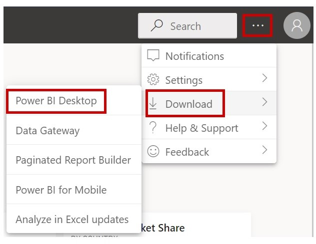
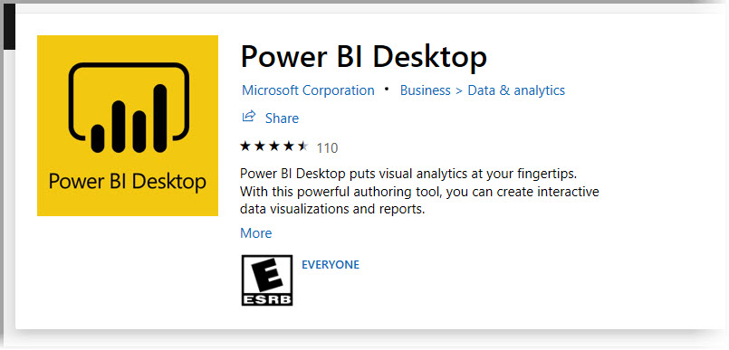
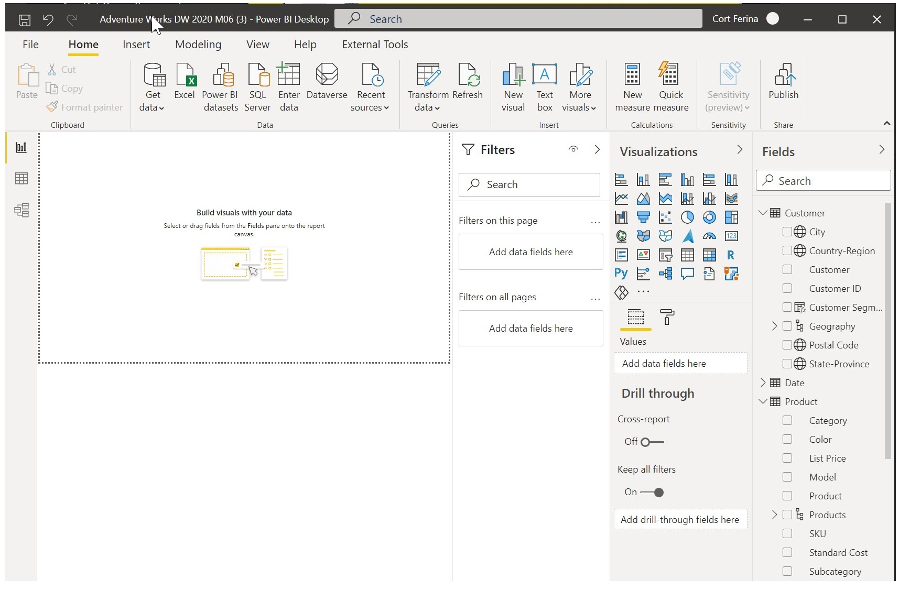

Welcome to the learning module designed to get you up and running with **Microsoft Power BI Desktop**. In this module, you'll learn how to get around in Power BI Desktop, connect to data, create visuals and reports, and publish those reports to the **Power BI service**.

Power BI Desktop lets you create a collection of queries, data connections, and reports that can easily be shared with others. Power BI Desktop integrates proven Microsoft technologies—the powerful Microsoft Power Query for Excel engine, data modeling, and visualizations—and works seamlessly with the online [**Power BI service**](https://app.powerbi.com/).

Through the combination of **Power BI Desktop** (where analysts and others can create powerful data connections, models, and reports) and the [**Power BI service**](https://app.powerbi.com/) (where Power BI Desktop reports can be shared, so that users can view and interact with them), new insights from the world of data are easier to model, build, share, and extend.

Data analysts will find Power BI Desktop a powerful, flexible, and a highly accessible tool for connecting with and shaping the world of data, building robust models, and crafting well-structured reports.

## How Power BI Desktop works
With Power BI Desktop, you *connect to data* (usually multiple data sources), *shape that data* (through queries that build insightful, compelling data models), and use that model to *create reports* (which others can use, build upon, and share).

When these steps—connect, shape, and report—are finished to your satisfaction, you can save your work in the Power BI Desktop file format, which uses the .pbix extension. Power BI Desktop files can be shared like any other file, but the most compelling way to share them is to upload them to the [**Power BI service**](https://preview.powerbi.com/). 

Power BI Desktop centralizes, simplifies, and streamlines what can otherwise be a scattered, disconnected, and arduous process of designing and creating business intelligence repositories and reports.

Ready to give it a try? Then let's get started.

## Install and run Power BI Desktop
You can download Power BI Desktop from the **Power BI service** by selecting the three dots, then download and then selecting **Power BI Desktop**.

You can also install **Power BI Desktop** as an app from **Microsoft Store**.

Power BI Desktop is installed as an application and runs on your desktop. When you start Power BI Desktop, a **Welcome** screen is shown.

You can **get data**, see **recent sources**, or **open other reports** directly from the **Welcome** screen, by using the links in the left pane. If you close the **Welcome** screen (by selecting the **X** in the upper-right corner), the **Report** view of Power BI Desktop is shown.

Three icons along the left edge of the window correspond to the three views that are available in Power BI Desktop: **Report**, **Data**, and **Model** (from top to bottom) views. You can change views by selecting the icons. The current view is indicated by a yellow bar to the left of the icon. For example, in the following image, the **Report** view is currently shown.

Power BI Desktop also includes **Power Query Editor**, which starts in a separate window. In **Power Query Editor**, you can build queries and transform data, load that refined data model into Power BI Desktop, and create reports.

Now that Power BI Desktop is installed, you're ready to connect to data, shape data, and build reports (usually in that order). In the following units, we'll take a tour through each of those activities in turn.
