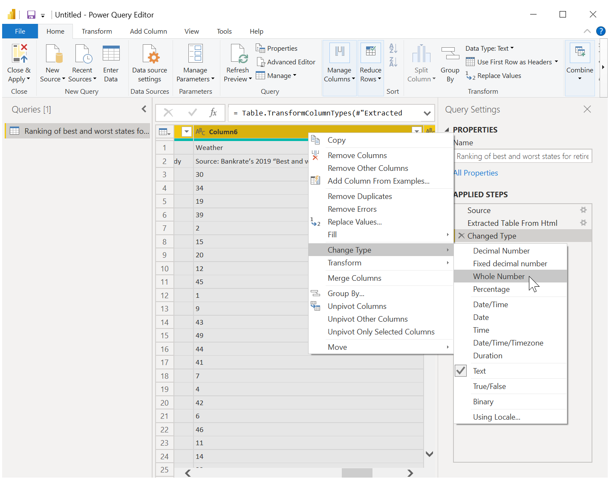
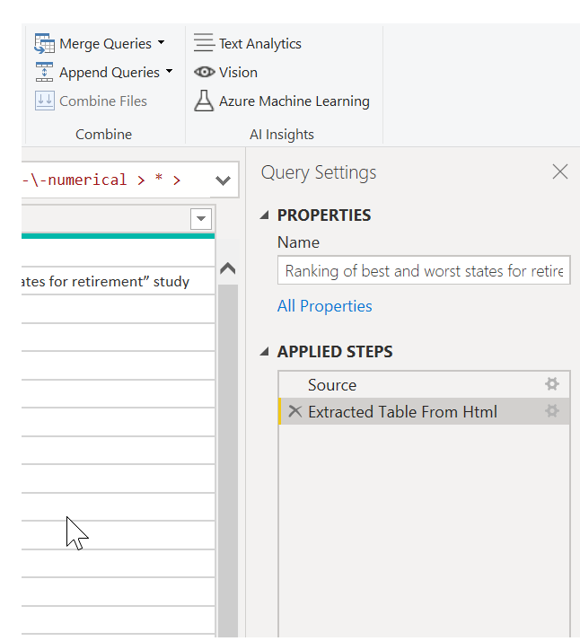
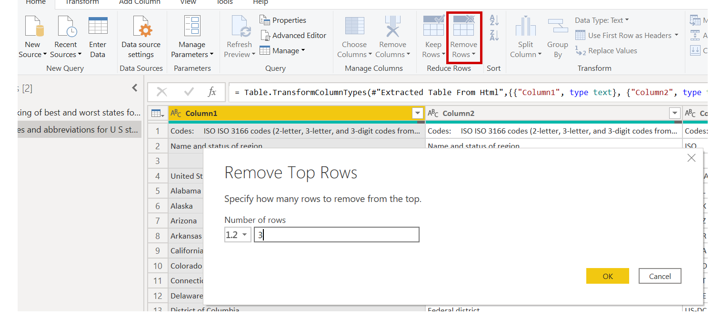
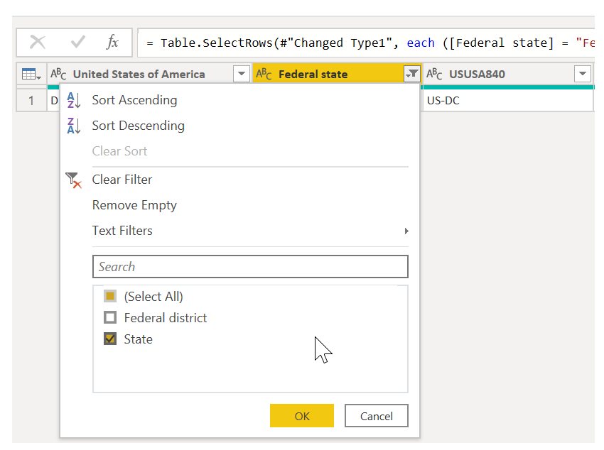
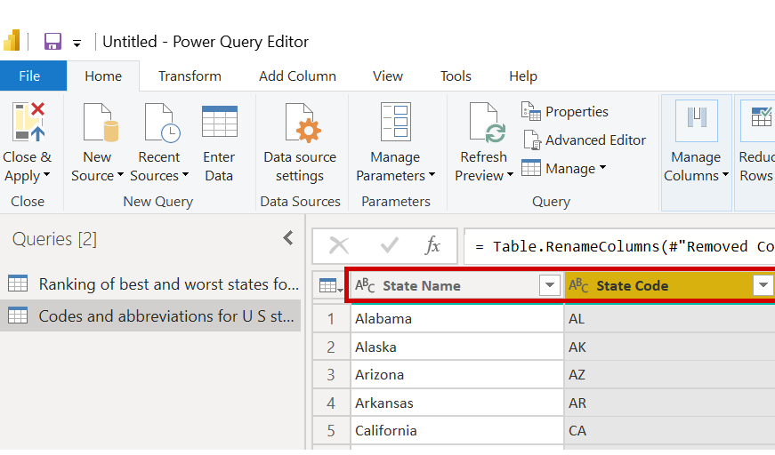
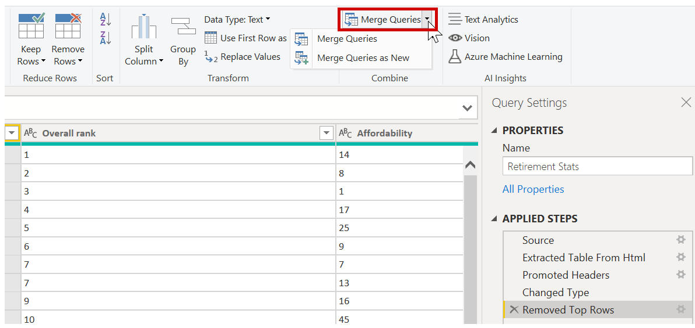
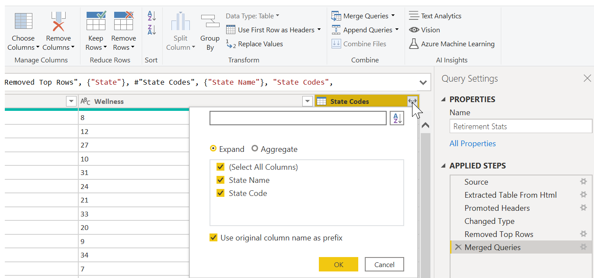

Now that we've connected to a data source by using **Microsoft Power BI Desktop**, we must adjust the data to meet our needs. Sometimes, adjusting means *transforming* the data by, for example, renaming columns or tables, changing text to numbers, removing rows, or setting the first row as a header.

**Power Query Editor** in Power BI Desktop makes extensive use of shortcut menus (also known as right-click or context menus), in addition to having tasks available on the ribbon. Most of what you can select on the **Transform** tab on the ribbon is also available by right-clicking an item (like a column) and then selecting a command on the shortcut menu that appears.

## Shape data
When you *shape* data in **Power Query Editor**, you're providing step-by-step instructions that **Power Query Editor** will carry out to adjust the data as it loads and presents it. The original data source isn't affected. Only this particular view of the data is adjusted, or *shaped*.

The steps you specify (for example, rename a table, transform a data type, or delete columns) are recorded by **Power Query Editor**. Those steps are then carried out each time the query connects to the data source, so that the data is always shaped the way you specify. This process occurs whenever you use the query in Power BI Desktop, or whenever anyone else uses your shared query (for example, in the **Power BI service**). The steps are captured sequentially under **Applied Steps** in the **Power Query Settings** pane.

The following image shows the **Query Settings** pane for a query that has been shaped. We'll go through each of the steps in the next few paragraphs.

Let's return to the retirement data that we found by connecting to a **Web** data source, and let's shape that data to fit our needs.

For starters, most of the ratings were brought into **Power Query Editor** as whole numbers, but some weren't. Because one column had text and numbers, it wasn't automatically converted. Power BI often detects these changes and automatically changes the data type. 

We need the data to be numbers. No problem: just right-click the column header, and then select **Change Type \> Whole Number** to change the data type. If you must change more than one column, select one of them, and then hold down the **Shift** key while you select additional adjacent columns. Then right-click a column header to change all the selected columns. You can also use the **Ctrl** key to select non-adjacent columns.

> [!NOTE]
> Often, Power Query will detect that a column of text should be numbers, and will automatically change the data type when it brings the table into Power Query Editor. In this case, a step under **Applied steps** identifies what Power Query did for you.

You can also change, or *transform,* those columns from text to header by using the **Transform** tab on the ribbon. The following image shows the **Transform** tab. The arrow points to the **Data Type** button, which lets you transform the current data type to another.

Notice that the **Applied Steps** list in the **Query Settings** pane reflects all the changes that were made. To remove any step from the shaping process, just select it, and then select the **X** to the left of it.

## Connect to data
That data about different states is interesting, and will be useful for building additional analysis efforts and queries. But there's one problem: most data out there uses a two-letter abbreviation for state codes, not the full name of the state. Therefore, we need some way to associate state names with their abbreviations.

We're in luck: there's another public data source that does just that, but it needs a fair amount of shaping before we can connect it to our retirement table. Here's the web resource for state abbreviations:

<http://en.wikipedia.org/wiki/List_of_U.S._state_abbreviations>

In **Power Query Editor**, on the **Home** tab on the ribbon, select **New Source \> Web**. Then enter the address, and select **OK**. The **Navigator** window shows what it found on that webpage.

Select the **Codes and abbreviations...** table, because it includes the data we want, although it's going to take quite a bit of shaping to pare down that data. 

Select **OK** to bring the data into **Power Query Editor** so that we can shape it. Then follow these steps:

* **Remove the top three rows** – Those rows are a result of the way the webpage's table was created, and we don't need them. To remove them, on the **Home** tab on the ribbon, select **Remove rows \> Remove Top Rows**. In the dialog box that appears, enter *3* as the number of rows to remove.

    

* **Remove the bottom 26 rows** – Those rows are all for territories, which we don't need to include. The process is the same, but this time, select **Remove rows \> Remove Bottom Rows**, and enter *26* as the number of rows to remove.

    

* **Filter out Washington, DC** – The retirement stats table doesn't include Washington, DC, so we'll exclude it from our list. Select the drop-down arrow beside the **Name and status of region2** column, and then clear the **Federal district** check box. 

    

* **Remove a few unneeded columns** – We just need the mapping of each state to its official two-letter abbreviation, and that information is given in the second and fifth columns. Therefore, we just need to keep those two columns and can remove all the others. Select the first column to remove, and then hold down the Ctrl key while you select the other columns to remove (this lets you select multiple, non-adjacent columns). Then, on the **Home** tab on the ribbon, select **Remove Columns \> Remove Columns**.

    

* **Use the first row as headers** – Because we removed the top three rows, the current top row is the header we want. Select the **Use first row as headers** button.

    

    > [!NOTE]
    > This is a good time to point out that the *sequence* of applied steps in **Power Query Editor** is important and can affect how the data is shaped. It's also important to consider how one step might affect another subsequent step. If you remove a step from the **Applied Steps** list, subsequent steps might not behave as originally intended, because of the impact of the query's sequence of steps.

* **Rename the columns and the table itself** – As usual, there are a couple ways to rename a column. You can use whichever way you prefer. Let's rename them *State Name* and *State Code*. To rename the table, just enter the name in the **Name** field in the **Query Settings** pane. Let's call this table *StateCodes*.

    

## Combine data

Now that the **StateCodes** table is shaped, we can combine our two tables into one. Because the tables that we now have are a result of the queries we applied to the data, they're often referred to as *queries*.

There are two primary ways of combining queries: *merging* and *appending*.

When you have one or more columns that you want to add to another query, you **merge** the queries. When you have additional rows of data to add to an existing query, you **append** the query.

In this case, we want to merge the queries. To get started, select the query to merge the other query *into*. Then, on the **Home** tab on the ribbon, select **Merge Queries**. We want to select our retirement query first. While we're at it, let's rename that query *RetirementStats*.

The **Merge** dialog box appears, prompting us to select the table to merge into the selected table, and the matching columns to use for the merge. 

Select **State** from the **RetirementStats** table (query), and then select the **StateCodes** query. (In this case, the choice is easy, because there's only one other query. But when you connect to many data sources, there will be many queries to choose from.) After you select the correct matching columns—**State** from **RetirementStats** and **State Name** from **StateCodes**—the **Merge** dialog box will look like this, and the **OK** button will become available.

A **NewColumn** is created at the end of the query and is the contents of the table (query) that was merged with the existing query. All columns from the merged query are condensed into the **NewColumn**, but you can **expand** the table and include whichever columns you want. To expand the merged table and select the columns to include, select the expand icon (). The **Expand** dialog box appears.

In this case, we just want the **State Code** column. Therefore, select only that column, and then select **OK**. You can also clear the **Use original column name as prefix** check box. If you leave it selected, the merged column will be named *NewColumn.State Code* (the original column name, or *NewColumn*, then a dot, and then the name of the column that's being brought into the query).

> [!NOTE]
> If you want, you can play around with how the **NewColumn** table is brought in. If you don't like the results, just delete the **Expand** step from the **Applied Steps** list in the **Query Settings** pane. Your query will return to the state it was in before you applied that step. It's like a free do-over that you can do as many times as you want, until the expand process looks the way you want.

We now have a single query (table) that combines two data sources, each of which has been shaped to meet our needs. This query can serve as a basis for lots of additional, interesting data connections, like housing cost statistics, demographics, or job opportunities in any state.

To apply the changes in **Power Query Editor** and load them into Power BI Desktop, select **Close & Apply** on the **Home** tab on the ribbon.

The data in your model is now ready to work with. Next, we'll create some visuals for your report.

For now, we have enough data to create a few interesting reports, all in Power BI Desktop. Because this is a milestone, let's save this Power BI Desktop file. Select **File \> Save** on the **Home** tab on the ribbon to save the report—we'll call it **Getting Started with Power BI Desktop**.

Great! Now on to the next unit, where we'll create some interesting visuals.
