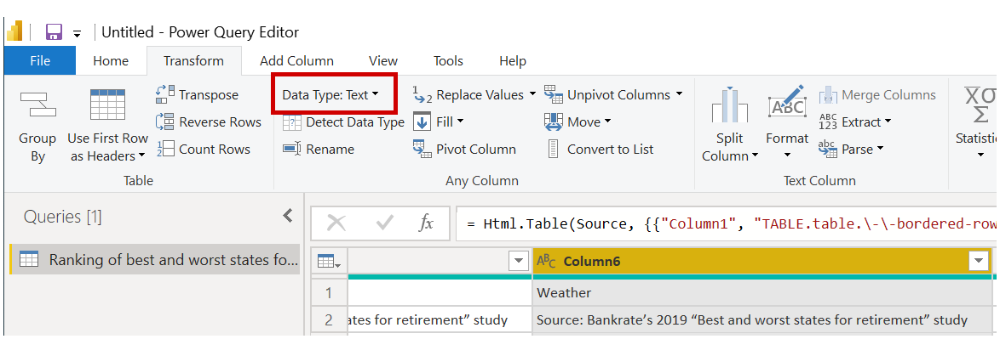
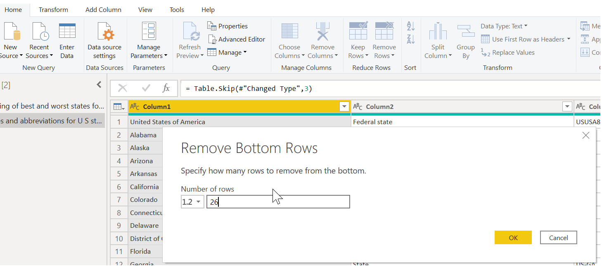
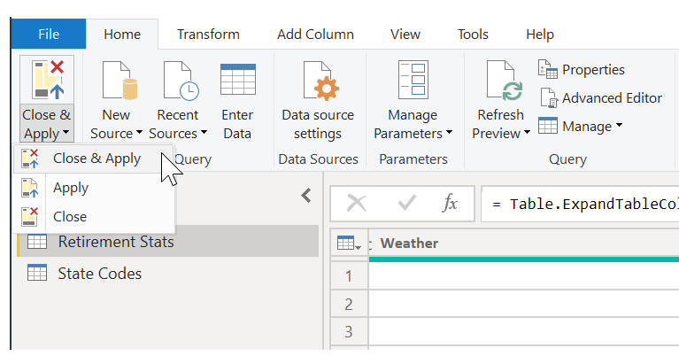

Now that we’ve connected to a data source using **Power BI Desktop**, we need to adjust the data to meet our needs. Sometimes adjusting means *transforming* the data – such as renaming columns or tables, changing text to numbers, removing rows, setting the first row as headers, and so on.

The **Power Query Editor** in Power BI Desktop makes ample use of right-click menus, in addition to having tasks available on the ribbon. Most of what you can select in the **Transform** ribbon is also available by right-clicking an item (such as a column) and choosing from the menu that appears.

## Shape data
When you shape data in the **Power Query Editor**, you’re providing step-by-step instructions (that **Power Query Editor** carries out for you) to adjust the data as **Power Query Editor** loads and presents it. The original data source is not affected; only this particular view of the data is adjusted, or *shaped*.

The steps you specify (such as rename a table, transform a data type, or delete columns) are recorded by **Power Query Editor**, and each time this query connects to the data source those steps are carried out so that the data is always shaped the way you specify. This process occurs whenever you use the query in Power BI Desktop, or for anyone who uses your shared query, such as in the **Power BI** service. Those steps are captured, sequentially, in the **Power Query Settings** pane under **Applied Steps**.

The following image shows the **Query Settings** pane for a query that has been shaped – we’ll go through each of those steps in the next few paragraphs.

Let’s get back to our retirement data, which we found by connecting to a Web data source, and now let's shape that data to fit our needs.

For starters, most ratings were brought into **Power Query Editor** as whole numbers, but not all of them (one column contained text and numbers, so it wasn't automatically converted). Power BI often detects these changes and automatically performs the step of changing the data type. 

We need the data to be numbers. No problem – just right-click the column header, and select **Change Type > Whole Number** to change the data type. If we needed to choose more than one column, we could first select a column then hold down **SHIFT**, select additional adjacent columns, and then right-click a column header to change all selected columns. You can also use **CTRL** to select non-adjacent columns.

> Note: Power Query often detects that a column of text should be numbers, and automatically changes the type for you upon bringing the table into Power Query Editor. If it does so, there will be a set in **Applied steps** that identifies what Power Query did for you.

You can also change, or *transform,* those columns from text to header by using the **Transform** ribbon. Here’s the **Transform** ribbon, with an arrow pointing toward the **Data Type** button, which lets you transform the current data type to another.

Note that in **Query Settings**, the **Applied Steps** reflect the changes that were made. If I want to remove any step from the shaping process, I simply select that step, and then select the **X** to the left of the step.

## Connect to data
That data about various states is interesting, and will be useful for building additional analysis efforts and queries. But there’s one problem: most data out there uses a two-letter abbreviation for state codes, not the full name of the state. We need some way to associate state names with their abbreviations.

We’re in luck: there’s another public data source that does just that, but it needs a fair amount of shaping before we can connect it to our retirement table. Here’s the Web resource for state abbreviations:

<http://en.wikipedia.org/wiki/List_of_U.S._state_abbreviations>

From the **Home** ribbon in **Power Query Editor**, we select **New Source > Web** and type the address, select **OK**, and the **Navigator** window shows what it found on that Web page.

We select the **Codes and abbreviations...** table because it includes the data we want, but it’s going to take quite a bit of shaping to pare that table’s data down. Here's what we need to do:

We select **OK** to bring the data into **Power Query Editor** so we can shape it, then:

* *Remove the top three rows* – they’re a result of the way that Web page’s table was created, and we don’t need them. To accomplish that, select **Remove rows** from the **Home** ribbon, and select **Remove Top Rows** from the button menu. In the dialog that appears, type **3** when prompted how many rows to remove.

    

* *Remove the bottom 26 rows* – they’re all the territories, which we don’t need to include. The process is the same, but this time we **Remove bottom rows** and put in 26 as the number of rows to remove.

    
<!-- -->
* *Filter out Washington DC* – the retirement stats table doesn't include DC, so we'll exclude it from our list. To do that, select the drop-down arrow beside the *Name and status of region2* column, then clear the checkbox beside Federal district. 

    
<!-- -->

* *Remove a few unneeded columns* – we only need the mapping of state to its official two-letter abbreviation, so we can remove the other columns: we'll keep only the second and fifth columns. To do this, select the first column to be deleted, then hold down the CTRL key and select the other columns to be removed (this lets you select multiple, non-contiguous columns). From the Home tab on the ribbon, select Remove Columns > Remove Columns.

    
<!-- -->

* *Use the first row as headers* – since we removed the top three rows, the current top row is the header we want. Just select the **Use first row as headers** button.

    

    >[!NOTE]
    >This is a good time to point out that the *sequence* of applied steps in **Power Query Editor** is important, and can affect how the data is shaped. It’s also important to consider how one step may impact another subsequent step; if you remove a step from the **Applied Steps**, subsequent steps may not behave as originally intended, because of the impact of the query’s sequence of steps.

* *Rename the columns, and the table itself* – as usual, there are a couple ways to rename a column, you can choose whichever you prefer. Let’s rename them to *State Name* and *State Code*. To rename the table, just type the name into the **Name** box in the **Query Settings** pane. Let’s call this table **StateCodes**.

    

## Combine data

With the *StateCodes* table shaped, we can combine these two tables, or queries, into one; since the tables we now have are a result of the queries we applied to the data, they’re often referred to as *queries*.

There are two primary ways of combining queries – *merging* and *appending*.

When you have one or more columns that you’d like to add to another query, you **merge** the queries. When you have additional rows of data that you’d like to add to an existing query, you **append** the query.

In this case we want to merge queries. To get started, we select the query *into which* we want the other query to merge, then select **Merge Queries** from the **Home** tab on the ribbon. We want to select our retirement query first. While we're at it, we'll rename that query **RetirementStats**.

The **Merge** window appears, prompting us to select which table we’d like merged into the selected table, and then, the matching columns to use for the merge. 

Select *State* from the *RetirementStats* table (query), then select the *StateCodes* query (easy in this case, since there’s only one other query – when you connect to many data sources, there are many queries to choose from). When we select the correct matching columns – *State* from *RetirementStats*, and *State Name* from *StateCodes* – the **Merge** window looks like the following, and the **OK** button is enabled.

A **NewColumn** is created at the end of the query, which is the contents of the table (query) that was merged with the existing query. All columns from the merged query are condensed into the **NewColumn**, but you can select to **Expand** the table, and include whichever columns you want. To expand the merged table, and select which columns to include, select the expand icon (). The **Expand** window appears.

In this case, we only want the *State Code* column, so we select only that column and then select **OK**. We clear the checkbox from **Use original column name as prefix** because we don’t need or want that; if we leave that selected, the merged column would be named *NewColumn.State Code* (the original column name, or *NewColumn*, then a dot, then the name of the column being brought into the query).

>[!NOTE]
>Want to play around with how to bring in that *NewColumn* table? You can experiment a bit, and if you don’t like the results, just delete that step from the **Applied Steps** list in the **Query Settings** pane; your query returns to the state prior to applying that **Expand** step. It’s like a free do-over, which you can do as many times as you like until the expand process looks the way you want it.

We now have a single query (table) that combined two data sources, each of which has been shaped to meet our needs. This query can serve as a basis for lots of additional, interesting data connections – such as housing cost statistics, demographics, or job opportunities in any state.

To apply the changes in **Power Query Editor** and load them into Power BI Desktop, select **Close & Apply** from the **Home** ribbon.

Now the data in your model is ready to work with. Next, let's see about creating some visuals for your report.

For now, we have enough data to create a few interesting reports, all within Power BI Desktop. Since this is a milestone let’s save this Power BI Desktop file – we’ll call it **Getting Started with Power BI Desktop**. Select **File > Save** from the **Home** ribbon to save the report.

Great! On to the next unit then, where we create some interesting visuals.
