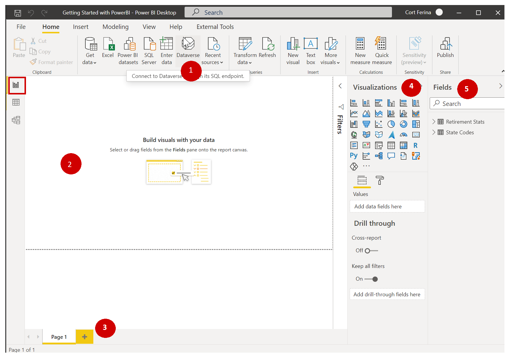
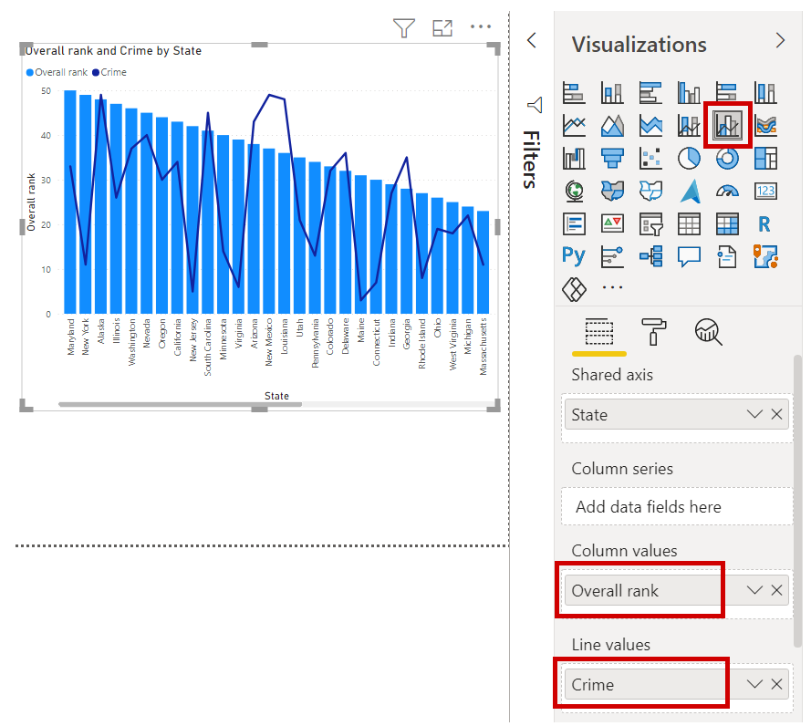
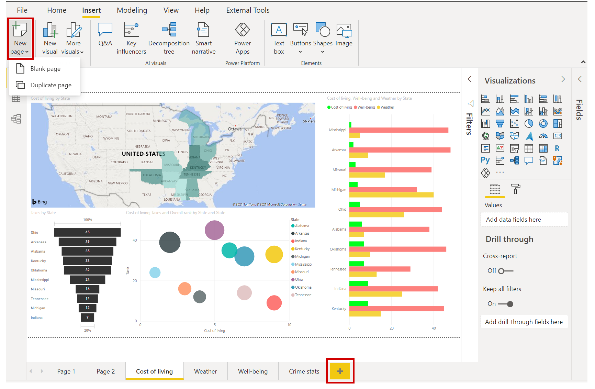

Previously, we connected two separate data sources and then shaped and combined those data sources. As a result, we now have a **data model** that we can use as a basis for creating reports. 

That doesn't mean we're stuck with that data model. You can make additional changes in Power Query Editor after the model is loaded. You can also reload a model to apply any changes you make. 

To get started creating a report with the data model we created, open the **Report** view in Microsoft Power BI Desktop.

The **Report** view has five main areas:

1. The ribbon, which shows common tasks associated with reports and visualizations
2. The **Report** view, or canvas, where visualizations are created and arranged
3. The **Pages** tab area along the bottom, which lets you select or add report pages
4. The **Visualizations** pane, where you can change visualizations, customize colors or axes, apply filters, drag fields, and more
5. The **Fields** pane, from which query elements and filters can be dragged either onto the **Report** view or into the **Filters** area of the **Visualizations** pane

The **Visualizations** and **Fields** pane can be collapsed by selecting the small arrow along the edge, providing more space in the **Report** view to build cool visualizations.

## Create visuals
To create a visualization, just drag a field from the **Fields** list onto the **Report** view. In this case, let's drag the **State** field from **Ranking of best and worst states for retirement** and see what happens.

Look at that: Power BI Desktop automatically created a map-based visualization, because it recognized that the **State** field has geolocation data.

Notice that you can select different types of visualizations in the **Visualizations** pane. Then, in the area below those icons, you can drag fields to different areas to apply a legend or change the visualization in other ways. 

Let's create a few visuals on this first report page and see what happens.

You can change the type of any visual by selecting it on the canvas and then selecting a different tile in the **Visualizations** pane. Let's do that. Instead of **Map** (the tile with a globe icon), select **Filled Map** (the next tile, which looks like states in different colors).

**First visual**

You can adjust the size of a visual by dragging its corners or sides. Let's move this visual to the upper left before creating the next visual.

Select any blank area of the canvas, so that no visual is selected. You're now ready to drag fields and create the next visual.

**Second visual**

Drag **State** from **Ranking of best and worst states for retirement** onto a blank area of the canvas. Then drag the **Overall rank** field and then the **Crime** field onto that visual. Now let's change the visual to a **Line and clustered column chart** visual by selecting the appropriate tile in the **Visualizations** pane.

We're almost done. On the **Fields** tab, move the **Crime** field to the **Line values** well. The following image shows how your visual should now look. 

You can experiment with these visuals as much as you want: change the visual type, add fields, change the colors, or arrange the visual on the canvas. All these changes are fun to do, easy to undo, and quick to take effect.

Let's fast-forward a bit and see what the **Report** view looks like after a handful of visualizations and a few report pages have been added. Don't worry: you can see this report first-hand. The summary unit for this module includes a link to download the final .pbix file. You can then load the report into your local version of Power BI Desktop and see exactly how things came together. 

The first report page provides a perspective of the data that's based on *overall rank*. When you select one of the visualizations, the **Fields and Filters** pane shows which fields are selected and the structure of the visualization (that is, which fields are applied to **Shared Axis**, **Column Values**, and **Line Values**).

There are six **pages** in this report, each visualizing specific elements of our data:

1. The first page, shown in the preceding image, shows all states, based on *overall rank*.
2. The second page shows on the top 10 states, based on *overall rank*.
3. The third page shows the top 10 states for affordability (and associated data).
4. The fourth page focuses on weather and is filtered to show the 15 sunniest states.
5. The fifth page shows the top 15 states for community well-being.
6. The sixth page focuses on crime statistics, showing the 10 best and 10 worst states.

Here's what the page that focuses on affordability looks like.

There are all sorts of interesting reports and visualizations you can create. But what's best about creating reports is sharing them with others. In the next unit, we'll see just how easy it is to share Power BI reports.

## Adding report pages

All reports have at least one blank page to begin with. Pages appear in the navigation pane just to the left of the canvas. 

You can add all sorts of visualizations to a page, but it's important not to overdo it. Too many visualizations on a page will make it look busy and will also make the correct information difficult to find.

To add a page to your report, just select **New Page** on the ribbon, or select the plus sign (**+**) next to the last report page.

Okay, even with just a couple of visuals, you have a report. Let's move on to the next unit and learn how we can share these insight-filled reports with others.