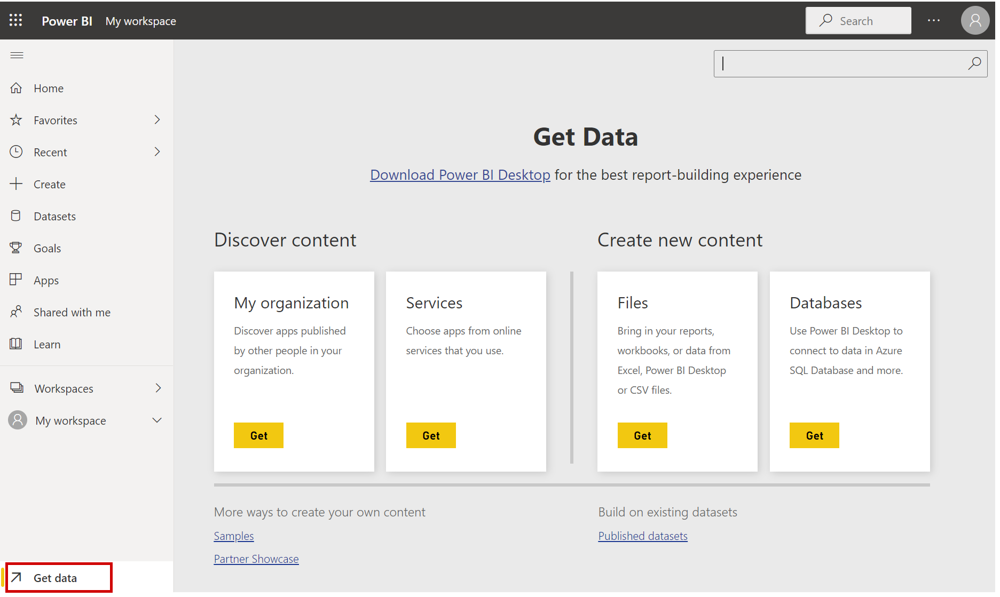
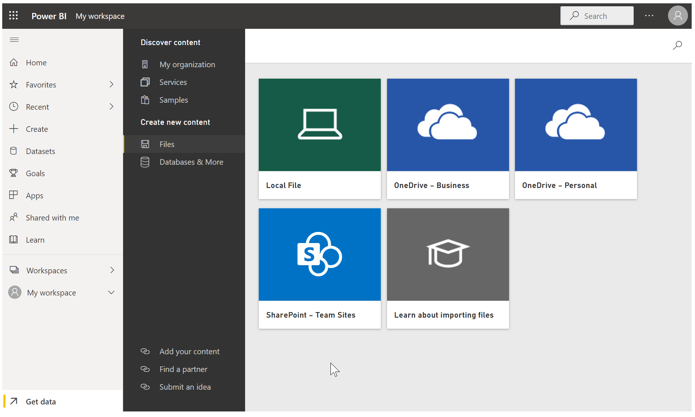

Now that we have a Power BI Desktop report that’s reasonably complete (or at least ready to move ahead with), we can share it with others using the **Power BI** service. There are a few ways to share your work in Power BI Desktop. You can publish to the **Power BI** service, you can upload the .pbix file directly from the Power BI service, or you can save the .pbix file and send it like any other file. You can also export a report to a PowerPoint file, and even create a PDF file of your report.

## Publish to the Power BI service
First, let's look at publishing to the **Power BI** service directly from Power BI Desktop. On the **Home** ribbon, select **Publish**.

You may be prompted to sign in to Power BI.

The next window that appears asks for a destination for your published report. You can choose to publish a report to a workspace that's accessible from your entire organization (and thus share your report with everyone in your organzation), or you can share to other available workspaces. The workspaces you see will be based on which are available to you, and your organization.

You can also simply share the report in your own workspace (called *My workspace*) and then do more with it in the Power BI service (including sharing it more broadly) from there. In our case, we'll select *My Workspace*.

When you've signed in and the publish process is complete, you see the following dialog.

When you sign in to Power BI, you'll see Power BI Desktop file you just loaded in the **Dashboards**, **Reports**, and **Datasets** sections of the service.

Another way to share your work is to load it from within the **Power BI** service. The following link brings up the **Power BI** service in a browser:

`https://app.powerbi.com`

Select **Get Data** to start the process of loading your Power BI Desktop report.

The **Get Data** page appears, from which you can select where to get your data from. In this case, we select **Get** from the **Files** box.

The **Files** view appears. In this case, we select **Local File**.

When you select the file, Power BI uploads the file.

Once the file is uploaded, you can select the file from the **My Workspace** from the left pane in the Power BI service, and then select **Reports** from the canvas to display all your reports.

When you select the report (by clicking on its name) the **Power BI** service displays the first page of the report. Along the bottom of the page, you can select any tab to display that page of the report.

You can make changes to a report in the **Power BI** service by selecting **Edit Report** from the top of the report canvas.

To save your report, select **File > Save As** from the service. 

## Save as PowerPoint file

You can also export your Power BI Desktop report as a PowerPoint deck, and share your report with others during a PowerPoint presentation. 

From the Power BI service, with the report loaded, select **File > Export to PowerPoint (Preview)**.

Once Power BI is done with the export process, it lets you know where the PowerPoint file was saved, and is ready to share with others.

Now that you know how to create and share reports, you can use your imagination to tell stories with data and share them with your entire organization.

Let's head to the next unit, where we wrap things up for this module.