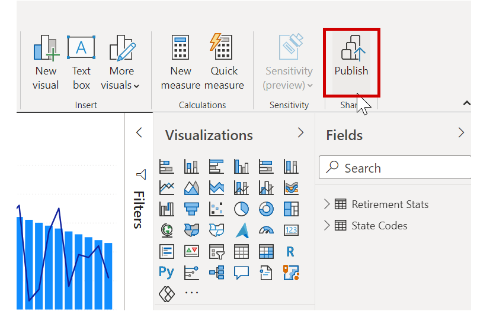

Congratulations! You've just gone through the process of creating a Power BI report from scratch, and learned how to share your work with others. To review, let's take a look at what you learned.

In **Power BI Desktop** you can connect to all sorts of different data sources. All you have to do in Power BI Desktop is select **Get Data** from the ribbon, and a multitude of connector options appears. 

You also learned that connecting to more than one data source is as easy as making a second **Get Data** connection, or from within **Power Query Editor**, using the **New Source** button. The **Navigator** in **Power Query Editor** provides a preview of the data.

Once you selected data, you could shape it how you wanted by removing columns, rows, or merging connections into a single **data model** that you could use in your report.

You created visuals by just dragging fields onto the report canvas - it was that easy. Then you could modify those visuals however you wanted, experimenting until you got them looking just how you wanted.

And once it was all done, you were able to share your report with others in your organization by publishing your report to the Power BI service.

Great work! As you might remember, we went through a few visuals but then had to move on, promising that the completed report would be available from a link in this summary. Well, here we are, and here it is. To download the completed Power BI Desktop report, use the following link:

* Completed Power BI Desktop report - [Getting Started with Power BI Desktop](https://go.microsoft.com/fwlink/?linkid=2021059)

Great work! There's more to learn about Power BI, and Power BI Desktop, so look for more modules that take your learning even further. 
