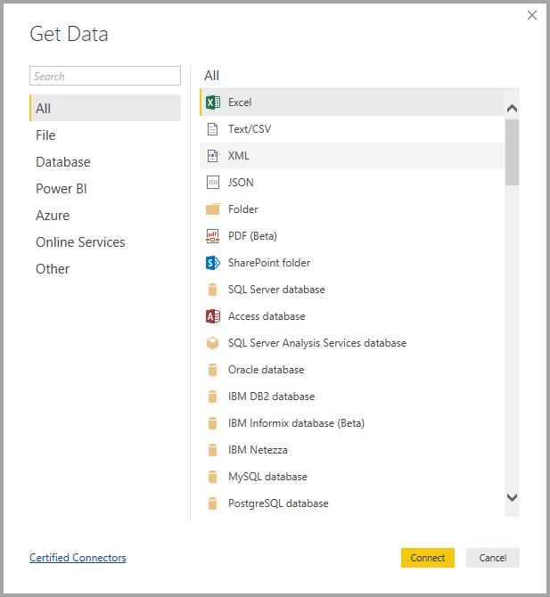
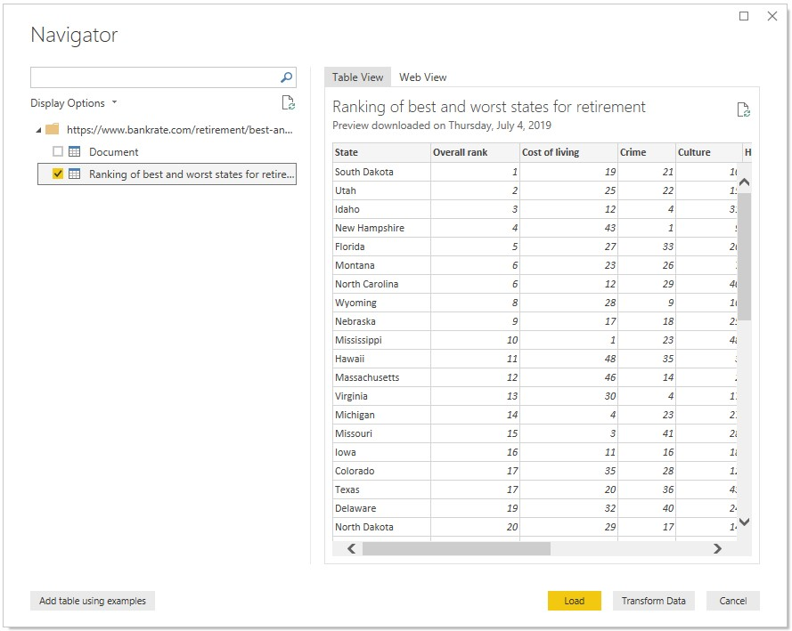

Congratulations! You've just gone through the process of creating a Microsoft Power BI report from scratch and sharing your work with others. To review, let's take a look at what you learned.

In **Power BI Desktop**, you can connect to all sorts of data sources. You just have to select **Get Data** on the ribbon, and then a multitude of connector options appears. 

You also learned that connecting to more than one data source is as easy as making a second **Get Data** connection. You can also use the **New Source** button in **Power Query Editor**. The **Navigator** window in **Power Query Editor** provides a preview of the data.

After you select data, you can shape it the way you want by removing columns and rows, or by merging connections into a single **data model** that you can use in your report.

You learned that creating visuals is as easy as dragging fields onto the report canvas. You can then change those visuals however you want, experimenting until you get them looking just the way you want.

And after your report is all done, you can share it with others in your organization by publishing it to the Power BI service.

Great work! As you might remember, we went through a few visuals but then had to move on, promising that the finished report would be available from a link in this summary. Well, here we are, and here it is. To download the finished Power BI Desktop report, use the following link:

* Completed Power BI Desktop report - [Getting Started with Power BI Desktop](https://go.microsoft.com/fwlink/?linkid=2021059)

Great work! There's more to learn about Power BI, and Power BI Desktop, so look for more modules that will take your learning even further. 
