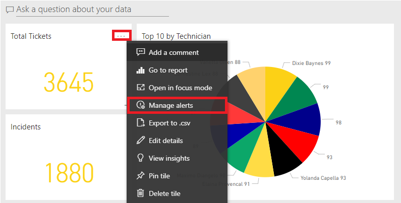
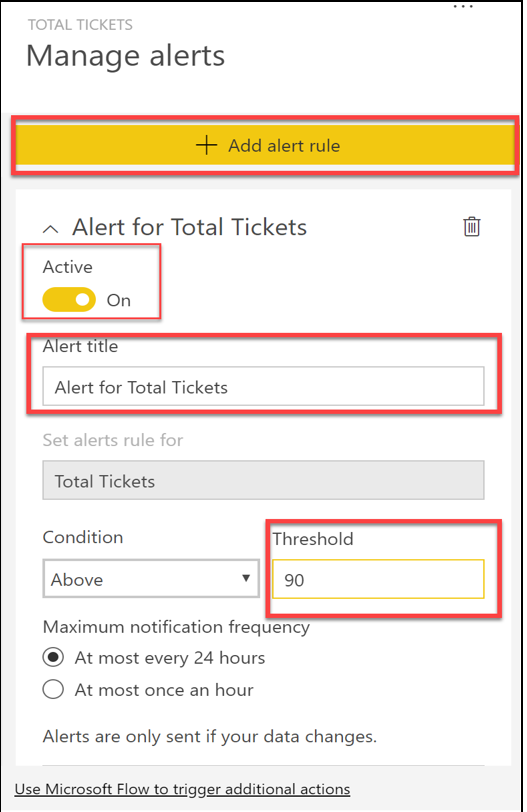

Configuring data alerts is a simple process to complete on a dashboard in Power BI. Data alerts can be used to notify you or a user that a specific data point is above, below, or at a specific threshold that you can set. These alerts are features that are only available on Power BI service and they are available on such report elements as KPI visuals, gauges, and cards.

To continue with the previous scenario, you've begun putting together dashboards for the Sales team at Tailwind Traders. The sales data includes customer help ticket data that is focused around payment processes on the website. The company has a requirement that they want to be notified when the **Total Tickets** metric on the **Tickets** dashboard goes above a threshold so they can escalate to the appropriate customer service team. They also want to make sure that this alert is user-friendly so that anyone on the team can set up, view, and configure such alerts.

## Configure alerts

After you have uploaded your reports to Power BI service and have pinned your chosen visuals to a dashboard, select the ellipsis (**...**) in the corner of the tile you want to set an alert for and then select **Manage Alerts**.

> [!div class="mx-imgBorder"]
> 

In the resulting window, select **+ Add Alert Rule**, which will add a new alert. Ensure that the **Active** toggle switch is turned **On**, name the alert (in this case, use the name **Alert for Total Tickets**), and then set the condition. At this point, you can choose the threshold that you want to create the alert for, which includes options for **Above** or **Below** a specific threshold. In this scenario, you want to create a threshold that notifies if the total number of tickets goes above 90. Then, select at which frequency that you want the alerts to be sent. These alerts will be sent directly to your Notification Center in Power BI, but you can also configure emails to be sent to you if the threshold is crossed.

> [!div class="mx-imgBorder"]
> 

After selecting **Save and Close**, you will have successfully created a data alert in Power BI service.

This feature is available to whomever has access to the dashboard, not just the dashboard owner. Consequently, when the Sales team begins configuring the data alerts, they can personalize them so that whoever uses the report can have their own set of alerts. Additionally, you can enable or disable the alert by using the toggle switch.

For more information, see [Data Alerts in Power BI service](/power-bi/create-reports/service-set-data-alerts/?azure-portal=true).
