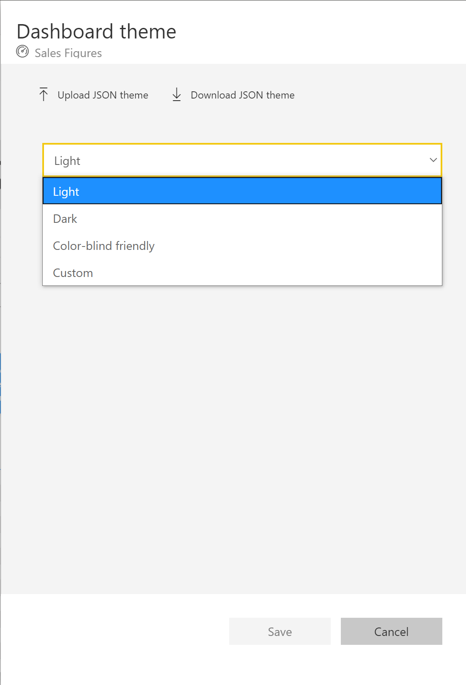
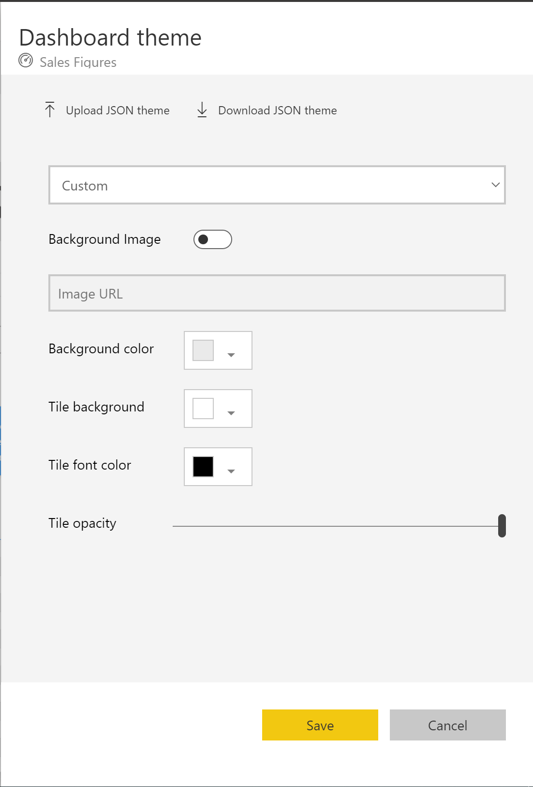

When building dashboards, you should consider ensuring that the same theme is applied to your dashboards to create a cohesive picture. You could also apply a specific theme to reports and dashboards so that all report elements or tiles are uniform. This consideration is particularly important when you are building multiple dashboards. Power BI has the functionality to apply a theme directly to all visuals of a report.

## Themes in Power BI 

A variety of themes are available for use in Power BI service. Go to a dashboard, select the edit drowpdown arrow, and then select **Dashboard theme**.

> [!div class="mx-imgBorder"]
> 

This selection will open a window, where you can choose from a variety of themes, including **Light** (the default theme), **Dark**, **Color-blind friendly**, and **Custom**, where you can create your own theme. You can also upload your own JSON theme or download the current theme.

> [!div class="mx-imgBorder"]
> 

For instance, if you select **Custom**, you can add your own background image, or you can change the background color, tile color, the opacity, or even the font color, as shown in the following figure.

> [!div class="mx-imgBorder"]
> 

Now, you can customize your report to cater specifically to your needs.
