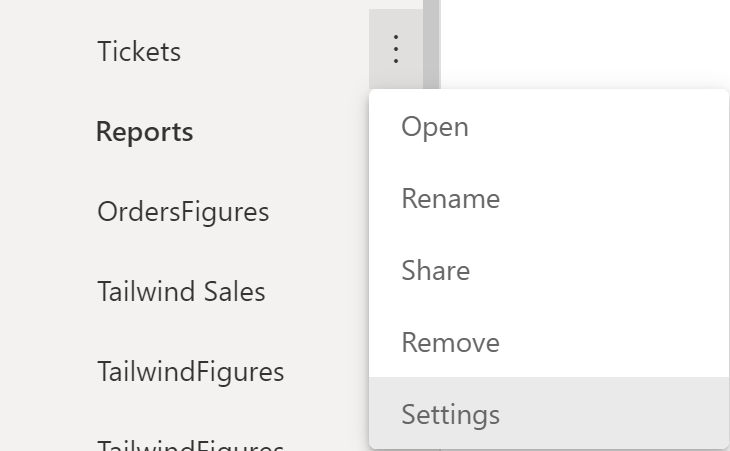
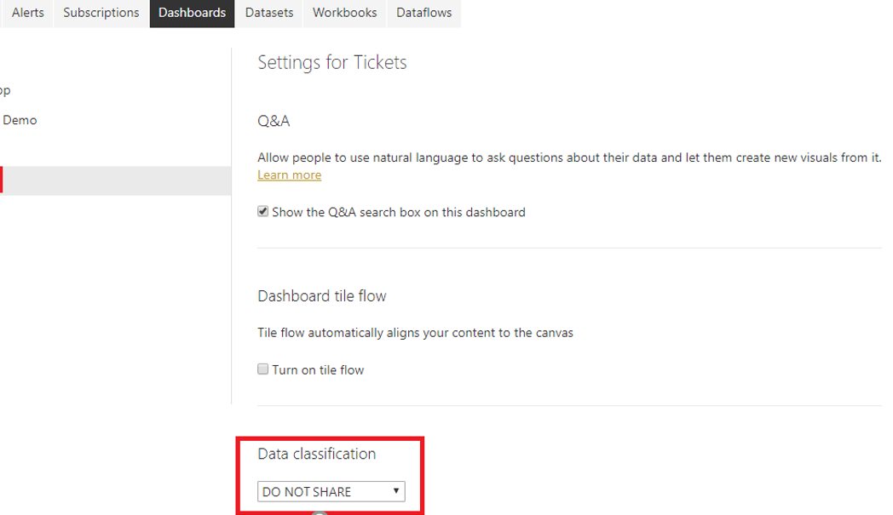

Power BI dashboards are an effective and visually pleasing way to disseminate information. They allow you to share business insights and concisely tell you the story of the data. However, because they can be seen by anyone who has been given access or a link, an important concern is security.

For instance, consider that you have built a few dashboards for the Sales team at your organization. You want to make sure that the users who have been given access know how the data within these dashboards is classified. Your organization has multiple ways to classify the data, and you want to incorporate and customize the data classification so that the dashboards have these custom classifications. Data classification in Power BI service allows you to complete this task.

## Set up data classification on dashboards

Data classification helps the dashboard owner raise security awareness to viewers of a dashboard so that they know what level of security should be considered when viewing or sharing a dashboard. Data classification does not enforce policies because data protection does.

Data classification is a feature that can be turned on and off in accordance with your organization's business needs. All dashboards are defaulted to a certain classification type; however, the dashboard owner can manually make changes to the classification. To manually make changes, admin rights are required in Power BI service.

To continue with the module scenario, you are working on the **Tickets** dashboard and want to add data classification to it. The first action that you will need to take is to ensure that your organization's custom data classification settings are added into the Power BI system. Data classification is done by an administrator.

Next, you will have three classifications to choose from: **High Impact**, **Low Impact**, and **Medium Impact**, which can be added directly as well as the shorthand versions of these classifications. To access data classification on a dashboard, go to a specific dashboard in Power BI service. Hover over the ellipsis (**...**) by the name of the dashboard and then select **Settings**.

> [!div class="mx-imgBorder"]
> 

In the resulting window, under **Dashboards**, you can use the drop-down menu under **Data classification** to choose how you want the data to be classified. The **Tickets** dashboard contains highly sensitive information, so it must be marked as **High Impact.** After you have made this selection, the dashboard will follow the default data rules or the rules that you have established under **Tenant settings**.

> [!div class="mx-imgBorder"]
> 

When you open the dashboard, it will now be marked by this new data classification, as shown in the following screenshot.

> [!div class="mx-imgBorder"]
> 

You have now added custom data classification to your dashboards and the Sales team is pleased. Data classification is an important feature because it allows you to add a level of security to your Power BI dashboards. Additionally, because you can personalize them in any way that your organization requires, data classification also adds a layer of personalization to your dashboards.

For more information, see [Dashboard data classification](/power-bi/create-reports/service-data-classification/?azure-portal=true).
