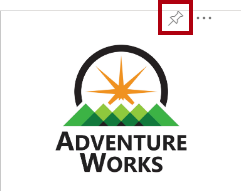
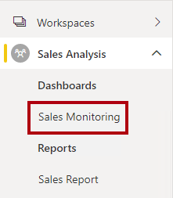
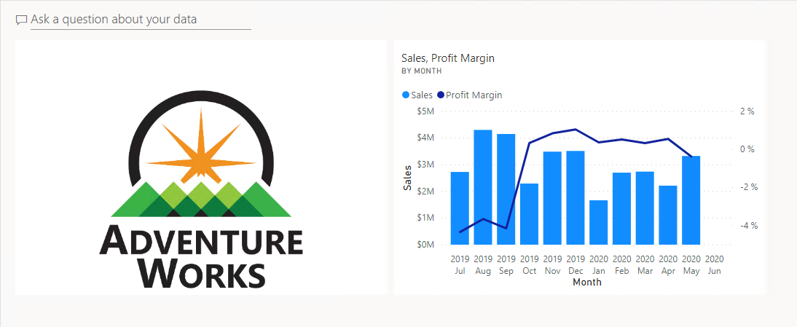
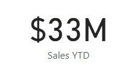
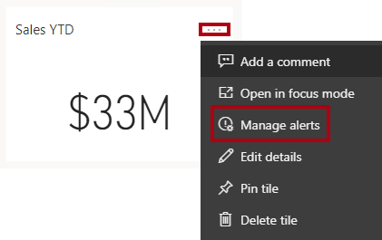

In this lab, you will create the **Sales Monitoring** dashboard.

In this lab, you learn how to:

-   Pin visuals to a dashboard

-   Use Q&A to create dashboard tiles

-   Configure a dashboard tile alert

## Create a sales monitoring dashboard

In this exercise, you will create the **Sales Monitoring** dashboard. The completed dashboard will look like the following:

> [!div class="mx-imgBorder"]
> 

### Create a dashboard

In this task, you will create the **Sales Monitoring** dashboard.

1.  In Edge, in the Power BI service, open the **Sales Report** report.

1.  To create a dashboard and pin the logo image, hover the cursor over the Adventure Works logo.

1.  At the top-right corner, click the pushpin.

	> [!div class="mx-imgBorder"]
	> 

1.  In the **Pin to Dashboard** window, in the **Dashboard Name** box, enter **Sales Monitoring**.

1.  Click **Pin**.

1.  Set the **Year** slicer to **FY2020**.

1.  Set the **Region** slicer to **Select All**.

	When pinning visuals to a dashboard, they will use the current filter context. Once pinned, the filter context cannot be changed. For time-based filters, it's a better idea to use a relative date slicer (or, Q&A using a relative time-based question).

1.  Pin the **Sales and Profit Margin by Month** (column/line) visual to the **Sales Monitoring** dashboard.

1.  Open the **Navigation** pane, and then open the **Sales Monitoring** dashboard.

	> [!div class="mx-imgBorder"]
	> 

1. Notice that the dashboard has two tiles.

	> [!div class="mx-imgBorder"]
	> 

1. To resize the logo tile, drag the bottom-right corner, and resize the tile to become one unit wide, and two units high.

	Tile sizes are constrained into a rectangular shape. It's only possible to resize into multiples of the rectangular shape.

1. To add a tile based on a question, at the top-left of the dashboard, click **Ask a Question About Your Data**.

1. You can use the Q&A feature to ask a question, and Power BI will respond will a visual.

1. Click any one of the suggested questions beneath the Q&A box, in gray boxes.

1. Review the response.

1. Remove all text from the Q&A box.

1. In the Q&A box, enter the following: **Sales YTD**

1. Notice the response of **(Blank)**.

	> [!div class="mx-imgBorder"]
	> 

	Recall you added the **Sales YTD** measure in **Lab 06B**. This measure is Time Intelligence expression and it requires a filter on the **Date** table to produce a result.

1. Extend the question with: **in year FY2020**.

	> [!div class="mx-imgBorder"]
	> 

1. Notice the response is now **$33M**.

	> [!div class="mx-imgBorder"]
	> 

1. To pin the response to the dashboard, at the top-right corner, click **Pin Visual**.

	> [!div class="mx-imgBorder"]
	> 

1. When prompted to pin the tile to the dashboard, click **Pin**.

	> [!div class="mx-imgBorder"]
	> 

	There's a possible bug that will only allow you to pin to a new dashboard. It's because your Power BI session has reverted to your "My Workspace". If this happens, do not pin to a new dashboard. Return to your **Sales Analysis** workspace, open the dashboard again, and recreate the Q&A question.

1. To return to the dashboard, at the top-left corner, click **Exit Q&A**.

### Edit tile details

In this task, you will edit the details of two tiles.

1. Hover the cursor over the **Sales YTD** tile, and then at the top-right of the tile, click the ellipsis, and then select **Edit Details**.

	> [!div class="mx-imgBorder"]
	> 

1. In the **Tile Details** pane (located at the right), in the **Subtitle** box, enter **FY2020**.

	> [!div class="mx-imgBorder"]
	> 

1. At the bottom of the pane, click **Apply**.

1. Notice that the **Sales YTD** tile displays a subtitle.

	> [!div class="mx-imgBorder"]
	> 

1. Edit the tile details for the **Sales, Profit Margin** tile.

1. In the **Tile Details** pane, in the **Functionality** section, check **Display Last Refresh Time**.

	> [!div class="mx-imgBorder"]
	> 

1. Click **Apply**.

1. Notice that the tile describes the last refresh time (which you did when refreshing the data model in Power BI Desktop).

	Later in this lab, you'll simulate a data refresh, and notice that the refresh time updates.

### Configure an alert

In this task, you will configure a data alert.

1. Hover the cursor over the **Sales YTD** tile, click the ellipsis, and then select **Manage Alerts**.

	> [!div class="mx-imgBorder"]
	> 

1. In the **Manage Alerts** pane (located at the right), click **Add Alert Rule**.

	> [!div class="mx-imgBorder"]
	>  

1. In the **Threshold** box, replace the value with **35000000** (35 million).

	> [!div class="mx-imgBorder"]
	> 

	This configuration will ensure you're notified whenever the tile updates to a value above 35 million.

1. At the bottom of the pane, click **Save and Close**.

In the next exercise, you'll refresh the dataset. Typically, this should be done by using scheduled refresh, and Power BI could use a gateway to connect to the SQL Server database. However, due to constraints in the classroom setup, there is no gateway. So, you'll opening Power BI Desktop, perform a manual data refresh, and the upload the file.

## Refresh the Dataset

In this exercise, you will first load sales order data for June 2020 into the **AdventureWorksDW2020** database, and then add your classroom partner's account to the database.. You will then open your Power BI Desktop file, perform a data refresh, and then upload the file to your **Sales Analysis** workspace.

### Update the lab database

In this task, you will run a PowerShell script to update data in the **AdventureWorksDW2020** database.

1. In File Explorer, inside the **D:\DA100\Setup** folder, right-click the **UpdateDatabase-2-AddSales.ps1** file, and then select **Run with PowerShell**.

	> [!div class="mx-imgBorder"]
	> 

1. When prompted to press any key to continue, press **Enter** again.

	The **AdventureWorksDW2020** database now includes sales orders June 2020.

1. Inside the **D:\DA100\Setup** folder, right-click the **UpdateDatabase-3-AddPartnerAccount.ps1** file, and then select **Run with PowerShell**.

1. When prompted, enter the account name of your classroom partner, and then press **Enter**.

	You only need to enter their account name (all characters before the @ symbol). Choose somebody sitting near you, you will work together in pairs to complete **Lab 12A**, which covers sharing Power BI content.

	Their account name is added so you can test the row-level security. You partner is now Pamela Ansam-Wolfe, whose sales performance is measured by the sales of two sales territory regions: US Northwest and US Southwest.

### Refresh the Power BI Desktop file

In this task, you will open the Sales Analysis Power BI Desktop file, perform a data refresh, and then upload the file to your **Sales Analysis** workspace.

1. Open your **Sales Analysis** Power BI Desktop file, stored in the **D:\DA100\MySolution** folder.

	When the file was published in **Lab 06B**, if you weren't confident you completed the lab successfully you were advised to upload the solution file instead. If you uploaded the solution file, be sure now to open the solution file again now. It's located in the **D:\DA100\Lab06B\Solution** folder.

1. On the **Home** ribbon, from inside the **Queries** group, click **Refresh**.

1. When the refresh completes, save the Power BI Desktop file.

1. Publish the file to your **Sales Analysis** workspace.

1. When prompted to replace the dataset, click **Replace**.

	The dataset in the Power BI service now has June 2020 sales data.

1. Close Power BI Desktop.

1. In Edge, in the Power BI service, in your **Sales Analysis** workspace, notice that the **Sales Analysis** report was also published.

	This report was used to test the model a you developed it in **Lab 05A** and **Lab 06A**.

1. Remove the **Sales Analysis** report (not dataset).

## Review the Dashboard

In this exercise, you will review the dashboard to notice updated sales, and that the alert was triggered.

### Review the dashboard

In this task, you will review the dashboard to notice updated sales, and that the alert was triggered.

1. In Edge, in the Power BI service, open the **Sales Monitoring** dashboard.

1. In the **Sales, Profit Margin** tile, in the subtitle, notice that the data was refreshed **NOW**.

1. Notice also that there is now a column for **2020 Jun**.

	> [!div class="mx-imgBorder"]
	> 

	The alert on the **Sales YTD** tile should have triggered also. After a short while, the alert should notify you that sales now exceeds the configured threshold value.

1. Notice that the **Sales YTD** tile has updated to **$37M**.

1. Verify that the **Sales YTD** tile displays an alert notification icon.

	If you don't see the notification, you might need to press **F5** to reload the browser. If you still don't see the notification, wait some minutes longer.

	> [!div class="mx-imgBorder"]
	> 

Alert notifications appear on the dashboard tile, and can be delivered by email, and push notifications to mobile apps including the Apple Watch.
