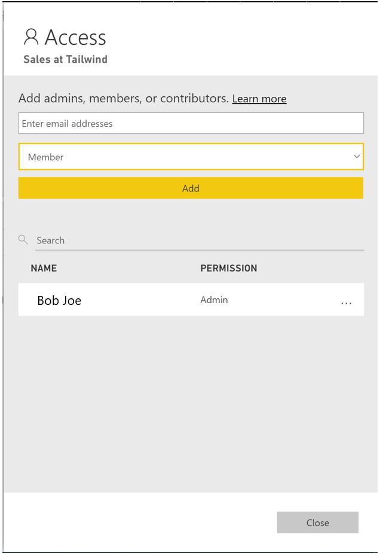
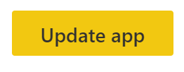

Suppose you have created a few reports for the Sales team at Tailwind Traders. How can you make these reports easily viewable and shareable? By creating a workspace in Power BI Service, you can: house your reports in one location, make them shareable, collaborate with other teams, and easily make updates to reports. Let's see how we can do this.

## Create a workspace 

Navigate to [Power BI Service](https://powerbi.microsoft.com/?azure-portal=true). Select the dropdown on **Workspaces**. On the bottom of the resulting panel, you will see a **Create New Workspace** button.

> [!div class="mx-imgBorder"]
> 

Upon selecting **Create a Workspace,** you are brought to the following window, where you can add in a **Workspace name, Description,** and **Image**.

> [!div class="mx-imgBorder"]
> 

Under **Advanced,** you can create a **Contact list** of users who will receive notifications if there are any issues with the workspace. By default, these are the workspace admins, but you can also add specific users. You can also add this workspace to a specific OneDrive and toggle to choose whether this workspace will be a part of a **dedicated capacity**. Dedicated capacities are a Power BI Premium feature that ensures that your workspaces will have its own computational resources as opposed to sharing resources with other users. Upon filling out the pertinent fields on this window, select **Save** and you've created a workspace! The previous discussion is done using the new workspace experience. As a recommendation, use the modern workspace experience over the classic workspace experience unless the classic workspace is expressly needed.

## Assign workspace roles 

You've successfully created a workspace and now Sales wants to collaborate with other team to build additional dashboards and reports. As the workspace owner, you want to ensure that the appropriate access is given to the members of the Products team since their team includes stakeholders and developers. Workspace roles allow you to designate who can do what within a workspace. The following are some of the abilities of role types in a workspace:

-   Admin:

    -   Add/remove other users

    -   Publish, update, and/or share an app in a workspace

    -   Create, edit, delete, and publish reports and content in a workspace

    -   View and interact with reports and dashboards in a workspace

    -   Configure data refreshes

-   Member:

    -   Can do all tasks associated with admins but **cannot** add or remove users

    -   Cannot delete the workspace

    -   Cannot update the metadata about the workspace

-   Contributor:

    -   Cannot add or remove users

    -   Cannot publish, update, or edit an app in a workspace unless given this ability by admins/members

    -   Can create, update, and publish content and reports within a workspace

    -   Can schedule data refreshes

-   Viewer:

    -   Cannot add or remove users

    -   Can only view a report or dashboard in a workspace

    -   Can read data stored in workspace dataflows

> [!NOTE]
> If the workspace is backed by a Premium capacity, a non-Pro user can view content within the workspace under the viewer role.

To assign these roles to users, navigate to the workspace you've created and, on the top left of the ribbon, select **Access.**

> [!div class="mx-imgBorder"]
> 

In the resulting window, you can add email addresses of individual users, mail-enabled security groups, distribution lists, Microsoft 365 Groups, and regular security groups and assign them their specific roles. You can also change the user's assigned role at the bottom, as well as delete the user from the workspace here by selecting the ellipsis by their name.

> [!div class="mx-imgBorder"]
> 

## Create and configure an App 

Now that you have created an app workspace and assigned your collaborators-specific roles, you want to be able to add content to your app workspace. Content can be in the form of reports, dashboards, datasets, dataflows, etc. An app is a published read-only window into your data for mass distribution and viewing. When you are ready to share apps with your users, you can **publish the app**. This process requires a Power BI Pro license. Consuming and viewing an app requires a pro license or backed premium capacity.

After you have added your content to the App workspace, then you need to create the app. Navigate to your workspace, and on the ribbon, select **+ New** as seen in the following screenshot. Here, you can choose to create a new report, dataset, streaming dataset, or dataflow to name a few. Selecting any one of these options will bring up a window where you can add in the name of the app and select the source of the report (for example, the dataset used to create a report).

> [!div class="mx-imgBorder"]
> 

You can also select the **Get Data** button on the bottom-left of the navigation bar and import already-existing reports from Power BI Desktop and add them to your workspace app.

You can also configure your app and enable whether or not you'd like to include the report or dashboard in the app when you publish, as seen in the following. If you do not want to include this report or dashboard in this app, then you can toggle off this option.

> [!div class="mx-imgBorder"]
> 

When you are ready to publish your app with its collection of reports, dashboards, and datasets, navigate back to the workspace, and select **Create App** in the top-right corner of the ribbon.

> [!div class="mx-imgBorder"]
> 

This retrieves the following window, where you can build your app by naming it, adding a description, and adding an app logo or theme color, if needed.

> [!div class="mx-imgBorder"]
> 

Under the **Navigation** tab, you can change the order in which the content is oriented for the user by creating a custom navigation pane. For instance, you can change the name of the content, change the link, and add it to a specific section on the navigation pane. You can also add content external to Power BI via a link. This can also be included within the content area. For example, a YouTube video, or PowerPoint slide deck has to be an embed URL though, not the raw URL

> [!div class="mx-imgBorder"]
> 

Under the **Permissions** tab, you can grant access either to all the users in your organization or you can choose which users have access. You can also give your users build and share permissions, which mean that they can create and share the content in the app. There are a few options here: with Build permissions, you allow your users to connect to underlying datasets so that they can reuse and build out their own reports using the same dataset. Build permissions are required if your users would like to export the underlying data or to build new content on top of the data. You can also allow your users to only create a copy of the report to view in another workspace, where they can modify and delete visuals as per their needs. You can also give your users Share permissions so that they can share underlying datasets and reports.

> [!div class="mx-imgBorder"]
> 

Upon making edits were necessary, you can select **Publish App** and voila you've published an app! You will get the following screen with a link that you can share with your users:

> [!div class="mx-imgBorder"]
> 

## Update workspaces 

After publishing your app, you realize that you would like to make updates within your workspace. How can you do this?

Navigate back to the workspace, and make any updates required in the reports or dashboards. The workspace acts as a staging area you can make any changes but they will not be added to the app until you select **Update App** in the top-right corner of the ribbon (where previously we had **Publish App**). Dataset and dataflow updates are updated immediately. When you select this, you can make any changes to the **Setup, Navigation,** and **Permissions** tab, and when ready, select the **Update App** button.

> [!div class="mx-imgBorder"]
> 

If you are interested in learning more, please refer to [Publish an App in Power BI](https://docs.microsoft.com/power-bi/collaborate-share/service-create-distribute-apps/?azure-portal=true).

