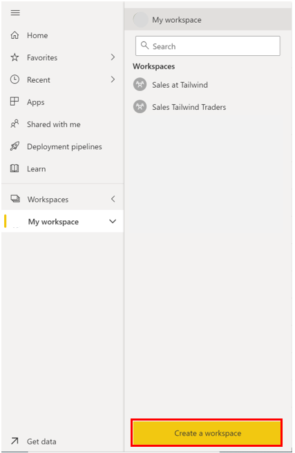
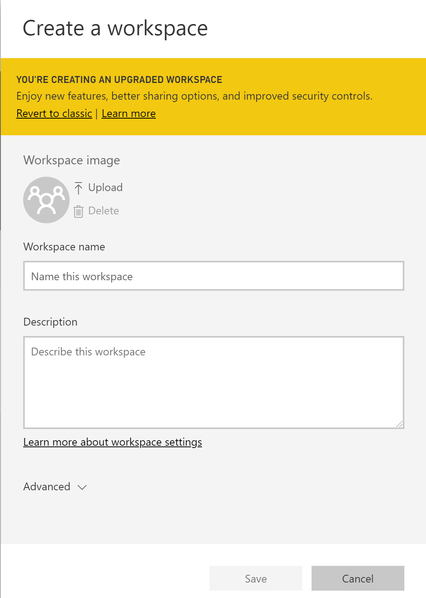
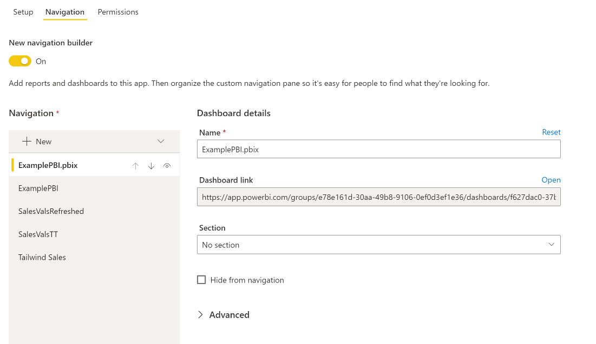
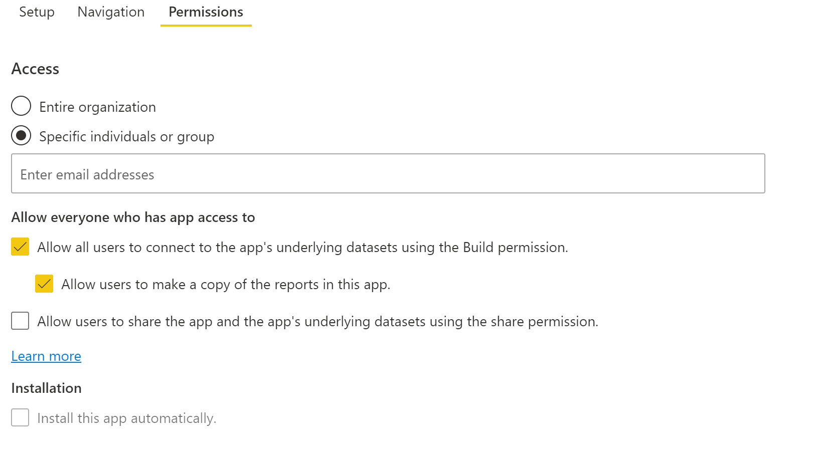

Consider a scenario where you have created a few reports for the Sales team at Tailwind Traders. The issue that you have encountered is determining how to make these reports viewable and shareable. By creating a workspace in Power BI, you can house your reports in one location, make them shareable, collaborate with other teams, and update reports. 

## Create a workspace 

Your first task is to create a workspace by following these steps:

1. Go to [Power BI service](https://powerbi.microsoft.com/?azure-portal=true). 

2. Select the **Workspaces** drop-down menu. 

3. Select the **Create a workspace** button at the bottom of the resulting panel.

> [!div class="mx-imgBorder"]
> 

4. In the **Create a workspace** window, enter information in the **Workspace name** and **Description** fields and then upload a **Workspace image**.

> [!div class="mx-imgBorder"]
> 

5. In the **Advanced** drop-down menu, you can create a **Contact list** of users who will receive notifications if issues with the workspace occur. 

By default, these users are the workspace admins, but you can also add specific users. You can also add this workspace to a specific OneDrive and then choose whether this workspace will be a part of a dedicated capacity or not. Dedicated capacities are Power BI Premium features that ensure that your workspace will have its own computational resources as opposed to sharing resources with other users. 

6. After you have filled out pertinent fields on the **Create a workspace** window, select **Save**. 

You have now created a workspace. 

You can complete the process of creating a workspace by using the new workspace experience. We recommend that you use the modern workspace experience over the classic workspace experience, unless the classic workspace is expressly needed.

## Assign workspace roles 

Now that you've successfully created a workspace, the Sales team wants to collaborate with other teams to build additional dashboards and reports. As the workspace owner, you want to ensure that appropriate access is given to members of the Products team because their team includes stakeholders and developers. Workspace roles allow you to designate who can do what within a workspace. 

The abilities of role types in a workspace include:

-   **Admin**

    -   Add/remove other users

    -   Publish, update, and/or share an app in a workspace

    -   Create, edit, delete, and publish reports and content in a workspace

    -   View and interact with reports and dashboards in a workspace

    -   Configure data refreshes

-   **Member**

    -   Can complete all tasks that are associated with admins but can't add or remove users

    -   Cannot delete the workspace

    -   Cannot update the metadata about the workspace

-   **Contributor**

    -   Cannot add or remove users

    -   Cannot publish, update, or edit an app in a workspace unless given this ability by admins/members

    -   Can create, update, and publish content and reports within a workspace

    -   Can schedule data refreshes

-   **Viewer**

    -   Cannot add or remove users

    -   Can only view a report or dashboard in a workspace

    -   Can read data that is stored in workspace dataflows

> [!NOTE]
> If the workspace is backed by a Premium capacity, a non-Pro user can view content within the workspace under the **Viewer** role.

To assign these roles to users, go to the workspace that you've created and, in the upper-left corner of the ribbon, select **Access**.

> [!div class="mx-imgBorder"]
> 

In the resulting **Access** window, you can add email addresses of individual users, mail-enabled security groups, distribution lists, Microsoft 365 groups, and regular security groups, and then assign them to their specific roles. You can also change the user's assigned role at the bottom of the page and delete the user from the workspace by selecting the ellipsis (**...**) next to their name.

> [!div class="mx-imgBorder"]
> 

## Create and configure an app 

After creating an app workspace and assigning your collaborator-specific roles, you want to add content to your app workspace. Content can be in the form of reports, dashboards, datasets, dataflows, and so on. An app is a published, read-only window into your data for mass distribution and viewing. When ready to share apps with your users, you can publish the app. This process requires a Power BI Pro license. Consuming and viewing an app requires a Pro license or it must be backed by a Premium capacity.

When you have added your content to the app workspace, you can create the app. Go to your workspace, and on the ribbon, select **+ New**, as shown in the following screenshot. In this ribbon, you can choose to create a new report, dataset, streaming dataset, or dataflow, to name a few. Selecting any one of these options will generate a window where you can enter the name of the app and select the source of the report (for example, the dataset that is used to create a report).

> [!div class="mx-imgBorder"]
> 

You can also select the **Get Data** button in the lower-left corner of the navigation bar, and then import already-existing reports from Power BI Desktop and add them to your workspace app.

You can also configure your app and turn on the option to include the report or dashboard in the app when you publish, as shown in the following screenshot. If you do not want to include this report or dashboard in the app, then you can turn off this option.

> [!div class="mx-imgBorder"]
> 

When you are ready to publish your app with its collection of reports, dashboards, and datasets, return to the workspace and select **Create app** in the upper-right corner of the ribbon.

> [!div class="mx-imgBorder"]
> 

This action retrieves the following window, where you can build your app by naming it, adding a description, and adding an app logo or theme color, if necessary.

> [!div class="mx-imgBorder"]
> 

Under the **Navigation** tab, you can change the order in which the content is oriented for the user by creating a custom navigation pane. For instance, you can change the name of the content, change the link, and then add it to a specific section on the navigation pane. You can also add content that is external to Power BI through a link. This external content can also be included within the content area. For example, a YouTube video or PowerPoint slide deck has to be an embed URL, not the raw URL

> [!div class="mx-imgBorder"]
> 

Under the **Permissions** tab, you can grant access to all users in your organization or choose which users have access. You can also give your users build and share permissions, which means that they can create and share the content in the app. The **Permissions** tab provides a few other options. With Build permissions, you can allow your users to connect to underlying datasets so that they can reuse and build their own reports by using the same dataset. Build permissions are required if your users want to export the underlying data or build new content on top of the data. You can also allow your users to only create a copy of the report to view in another workspace, where they can modify and delete visuals according to their needs. You can also give your users Share permissions so that they can share underlying datasets and reports.

> [!div class="mx-imgBorder"]
> 

After making necessary edits, you can select **Publish app**, and your app will be published. Then, you will get the following screen with a link that you can share with your users.

> [!div class="mx-imgBorder"]
> 

## Update workspaces 

After publishing your app, you realize that you want to make updates within your workspace. 

To accomplish this task, return to the workspace, and make the necessary updates in the reports or dashboards. The workspace acts as a staging area where you can make any changes that you want, but they will not be added to the app until you select **Update app** in the upper-right corner of the ribbon (where you previously selected **Publish app**). Dataset and dataflow updates are updated immediately. When you decide to update the app, you can make changes to the **Setup**, **Navigation**, and **Permissions** tabs, and when ready, you can select the **Update app** button.

> [!div class="mx-imgBorder"]
> 

For more information, see [Publish an app in Power BI](https://docs.microsoft.com/power-bi/collaborate-share/service-create-distribute-apps/?azure-portal=true).