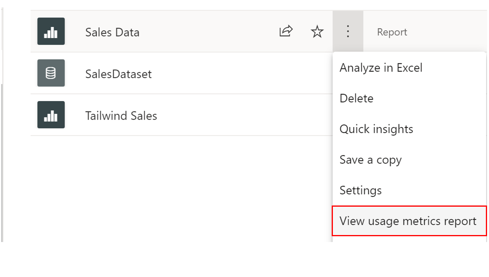

Knowing about the usage and performance of your workspace is crucial because it:

- Focuses your efforts for improvement. If you know the areas that experience the least performance, you can concentrate your efforts for improvement in those areas.

- Quantifies the impact of your reports. Usage metrics help you determine your reports' success.

These performance and usage metrics are available features that you can use in a workspace. With these metrics, you can view who's using your reports, what actions are being done on the reports, and what performance issues exist.

For example, consider the continuing scenario where you work for Tailwind Traders. You've successfully added reports to your workspace, published an app, and begun the process of collaborating with the Products team. Commentary begins to circulate around the company about how useful these workspaces are, resulting in more users being added to the workspace. The Sales team knows that performance might reduce with the increased addition of users. Consequently, the Sales team has asked you to monitor usage and performance of the workspace.

## Configure and view usage metric reports

Usage metric reports are available for Power BI Pro users and can only be accessed by users with the role types of **Admin**, **Member**, or **Contributor**.

To view usage metric reports, go to the pertinent workspace. Find the report or dashboard that you want to see usage metrics for. For example, if you want to see the usage metrics report for **Sales Data**, select the ellipsis (**...**), and then select **View usage metrics report** from the drop-down menu.

> [!div class="mx-imgBorder"]
> 

When the usage metrics report is ready for viewing, you will receive a prompt that will direct you to a dashboard. In the **Report usage** tab, you can view such details as:

-   **Viewers per day**, **Unique viewers per day** (which doesn't include users who returned to the same reports multiple times), and **Shares per day** charts

-   **Total Views**, **Total Viewers**, and **Total Shares** KPI cards

-   **Total views and shares ranking** (compares how your report is doing in comparison to other reports in the app)

-   **Views by Users** (details about each specific user that viewed the dashboard)

You can also filter by the distribution method of the report (for example, through sharing or from the workspace directly) and platform type (for example, mobile or web).

> [!div class="mx-imgBorder"]
> 

You can also view performance metrics on the **Report performance** tab, as shown in the following screenshot.

> [!div class="mx-imgBorder"]
> 

On the **Report performance** tab, you can view metrics such as:

-   **Typical opening time** - How long it takes, at the fiftieth percentile, to open the report.

-   **Opening time trend** - How the typical opening time changes over time. This metric can tell you how the report is performing as the number of users starts to grow.

-   **Daily/7-Day Performance** charts - Highlight the performance for 10, 50, and 90 percent of the open-report actions every day and over a seven-day period.

-   Filters for date, so you can see how the performance changes according to the day.

For more information, see [Monitor Usage Metrics](/power-bi/collaborate-share/service-modern-usage-metrics/?azure-portal=true).