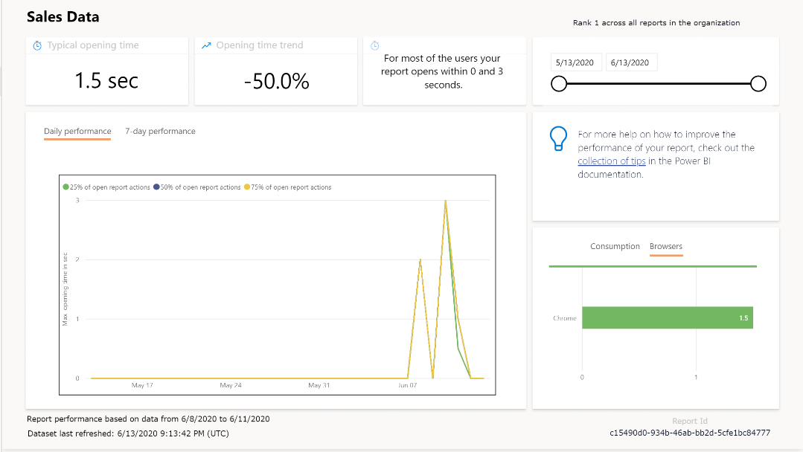

You've successfully added reports to your workspace, published an app, and begun the process of collaborating with the Products team. News of how useful workspaces are begins to spread around Tailwind and more and more users get added to the workspace. The Sales team knows that performance may reduce as more users get added so would like you to monitor usage and performance of the workspace.

Knowing how your workspace is being used and is performing is crucial for several reasons:

-   Focuses your efforts for improvement; if you know where you have the least performance you can concentrate your efforts for improvement in those areas.

-   Quantifies the impact of your reports; by seeing usage metrics you can determine how successful your reports are.

These performance and usage metrics are both a feature available for use in a workspace. You can see who's using your reports, what actions are being done on the reports, and what performance issues exist.

Let's take a closer look!

## Configure and view usage metric reports

Usage metric reports are available for Power BI pro users and can only be accessed by users with role types admin, member, or contributor.

Navigate to the pertinent workspace. Then, find the report or dashboard you would like to see usage metrics for. Let's say we want to see the usage metrics report for **Sales Data.** Under the ellipsis, select **View usage metrics report. **

> [!div class="mx-imgBorder"]
> 

Then you will receive a prompt when the usage metrics report is ready for viewing. When you do, you be brought to a dashboard in which the first tab, **report usage,** you can view such details as:

-   **Viewers per day**, **Unique viewers per day** (which doesn't include users who come back to the same reports multiple times), **Shares per day charts**

-   **Total views**, **Total Viewers**, and **Total Shares** KPI cards

-   **Total views and shares Ranking**: Compares how your report is doing in comparison to other reports in the app

-   **Views by Users**: detail about each specific user that viewed the dashboard.

You can also filter by the distribution method of the report (e.g. through sharing or from the workspace directly) and platform type (e.g. mobile or web).

> [!div class="mx-imgBorder"]
> 

You can also view performance metrics on the next tab, **Report performance,** as seen in the following.

> [!div class="mx-imgBorder"]
> 

Here, you can see metrics such as:

-   **Typical opening time**: how long it takes, at the 50th percentile, to open the report.

-   **Opening time trend**: how the typical opening time changes over time. This can tell you how the report is performing as the number of users starts to grow.

-   **Daily/7-Day Performance** charts: highlights the performance for 10, 50, and 90% of the open-report actions every day and over a seven-day period.

-   Filters for date, so you can see how the performance changes according to the day.

With that, you learned about the basics of monitoring usage and performance. If you would like to know more, please refer to [Monitor Usage Metrics](https://docs.microsoft.com/power-bi/collaborate-share/service-modern-usage-metrics/?azure-portal=true).

