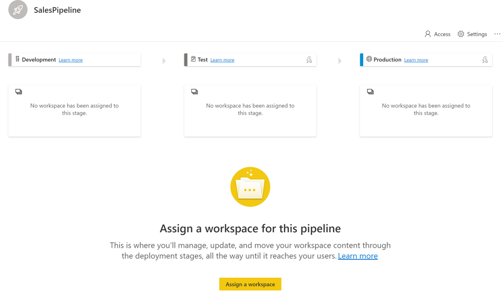
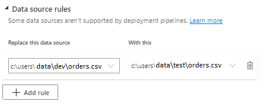
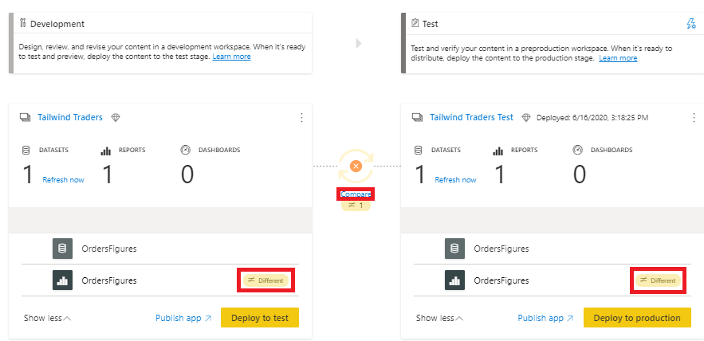
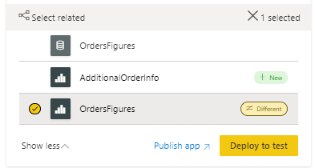

The development process is iterative; it typically requires building an initial solution, testing the solution in a different environment, returning to make necessary revisions, and eventually releasing a final product. This process is known as a development life cycle. This process can take place in several different ways and in different environments.

To continue with the module scenario, the Sales team at Tailwind Traders is impressed with the reports that you have delivered, and as they continue to use the abilities of Power BI, they also want to maintain data and report integrity without slowing development timelines. As a result, they have asked you to create a development pipeline that will be used by all teams to develop reports and dashboards. Power BI provides deployment pipelines that you can use to help accelerate development and minimize errors.

## Deployment pipeline (Premium)

The deployment pipeline feature in Power BI manages content in dashboards, reports, and datasets between different environments in the development life cycle. With this feature, you can develop and test Power BI content in one centralized location and streamline the process before deploying the final content to your users. This Power BI Premium feature requires you to be a Capacity admin. 

The advantages of using the deployment pipeline are:

- **Increased productivity** - Through this feature, you can reuse previous deployment pipelines, ensuring that efforts aren't duplicated.

- **Faster delivery of content** - Report development becomes more streamlined, meaning that it takes less time to get to production.

- **Lower human intervention required** - Having the ability to reuse deployment pipelines means a decreased chance of error associated with moving content from one environment to another.

## Development environments 

Typically, development and collaboration occur in different stages. Reports and dashboards are built in and iterated on a series of controlled stages, or environments, where several tasks occur:

-   **Development** - The location in which dashboard developers or data modelers can build new content with other developers. This stage is first in the deployment pipeline.

-   **Test** - Where a small group of users and user acceptance testers can see and review new reports, provide feedback, and test the reports with larger datasets for bugs and data inconsistencies before it goes into production.

-   **Production** - Where an expansive user audience can use tested reports that are reliable and accurate. This stage is the final one of the deployment pipeline.

You can choose which one of these development environments that you want to include in your deployment pipeline, according to your business needs. For example, you can choose to only include the Test and Production environments, if necessary.

## Configuration of deployment pipelines

In the scenario with Tailwind Traders, you want to create a deployment pipeline. To configure a deployment pipeline, go to Power BI service, and then follow these steps: 

1. On the ribbon on the left side of the page, select **Deployment pipelines**, as shown in the following screenshot.

> [!div class="mx-imgBorder"]
> 

2. On the resulting page, select **Create a pipeline**. 

3. Create a deployment pipeline called **SalesPipeline**. Enter the **Pipeline name** as **SalesPipeline** and enter a description, if necessary. 

4. Select **Create**, which will take you to the following screen.

> [!div class="mx-imgBorder"]
> 

This view shows you the steps of the development life cycle: **Development**, **Test**, and **Production**. 

5. To create your pipeline, assign workspaces to each of these stages to facilitate where your reports and dashboards will be housed during each stage. 

6. Select **Assign a workspace** to begin.

7. You will be directed to the **Assign the workspace to a deployment stage** window, where you can add the **Tailwind Traders** workspace to the **Development** environment.

> [!div class="mx-imgBorder"]
> 

Only workspaces that are assigned to a Premium capacity will appear. Additionally, you can only assign a single workspace to each pipeline. Power BI will auto generate the two other workspaces that are used in the pipeline. 

8. If you already have **Development**, **Test**, and **Production** workspaces, choose one that you want to work with and then select **Assign**. 

If this step is successful, you should see the resulting view.

> [!div class="mx-imgBorder"]
> 

The preceding image shows how many datasets, reports, and dashboards that you have in the current **Development** environment. At every stage, you have the option to publish the associated workspace as an app by selecting **Publish app**. 

9. To view all objects that constitute the workspace, select **Show more**.

## Testing stage

After you have collaborated with the teams and built a testing-ready report, you are ready to proceed to the testing phase. Select **Deploy to test**, which will create a new workspace. This workspace, by default, has the same name as the initial workspace but includes the **\[Test\]** suffix. You can change the name by entering the workspace's settings within the deployment pipeline interface.

Testing should emulate conditions that objects will experience after they've been deployed for users. Therefore, Power BI allows you to change the source of data that is used during testing. To accomplish this task, you will first need to enter the environment's deployment settings by selecting the lightning icon, as shown in the following screenshot.

> [!div class="mx-imgBorder"]
> 

In the resulting **Settings** window, select the correct dataset. In this example, you want the **OrdersFigures** dataset to be used for testing but with a different data source. To accomplish this task, create parameters in Power Query Parameters (which will be discussed in a later module) or add a new rule, which is the process that is used for this example. Under the **Data source rules** drop-down menu, select **+ Add rule**.

> [!div class="mx-imgBorder"]
> 

On the **Data source rules** section, you can change the data source (which was used in development) to a new source, which is used for testing the reports (**orders.csv** in the following example). When you are finished, select **Save** at the bottom of the card.

> [!div class="mx-imgBorder"]
> 

## Production stage

Now, you are close to completing the pipeline, transitioning from development to testing, and finally to production. At this stage, you need to create a data source rule for the **OrdersFigures** dataset in the workspace to ensure that you are using production data. In this instance, you will be changing your source from the test to the production folder version of the orders.csv file, as shown in the following screenshot.

> [!div class="mx-imgBorder"]
> 

After performing a dataset refresh, your production workspace will be ready. You can package the workspace as an app, which is available for users. Currently, your deployment pipeline will appear as shown in the following figure.

> [!div class="mx-imgBorder"]
> 

You have successfully created a deployment pipeline from the development to the testing phase. The following section describes additional operations that you can conduct in the development pipeline.

## Additional operations in the development pipeline

You have created a deployment pipeline and have begun collaborating with other report developers. You receive notification that one of the other developers has modified a report. To see the changes to this report, select the **Compare** button, as shown in the following screenshot.

> [!div class="mx-imgBorder"]
> 

Selecting **Compare** reveals that the **OrdersFigures** report differs between the Development and Test environments.

> [!div class="mx-imgBorder"]
> 

The difference is typically registered as added or removed objects. If you decide that the changes shouldn't be deployed to the next phase, you can choose to ignore the changes. For instance, the other developer has added a report called **AdditionalOrderInfo** in the Development environment, but you don't want to deploy these changes. By selecting a specific report and then selecting **Deploy to test**, you can effectively choose which reports that you want to move from environment to environment, as shown in the following figure.

> [!div class="mx-imgBorder"]
> 

As the following message indicates, only one change will be carried over.

> [!div class="mx-imgBorder"]
> 

Exercise caution with this tool. Reports are dependent on their datasets. If a dataset has changed, but you don't deploy it with an associated report, the report will not behave correctly.

We recommend that you use deployment pipelines in Power BI service. This tool ensures that the development life cycle is streamlined and that you can create one centralized location to collaborate, keep track of, and deploy your reports.

For more information, see [Deployment Pipelines Best Practices](https://docs.microsoft.com/power-bi/create-reports/deployment-pipelines-best-practices/?azure-portal=true).
