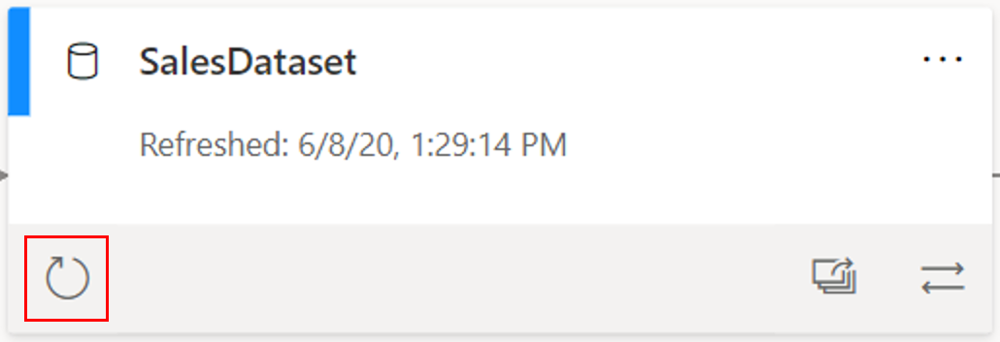
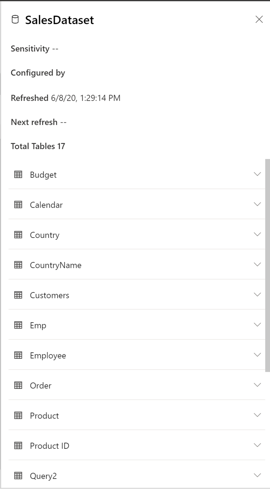
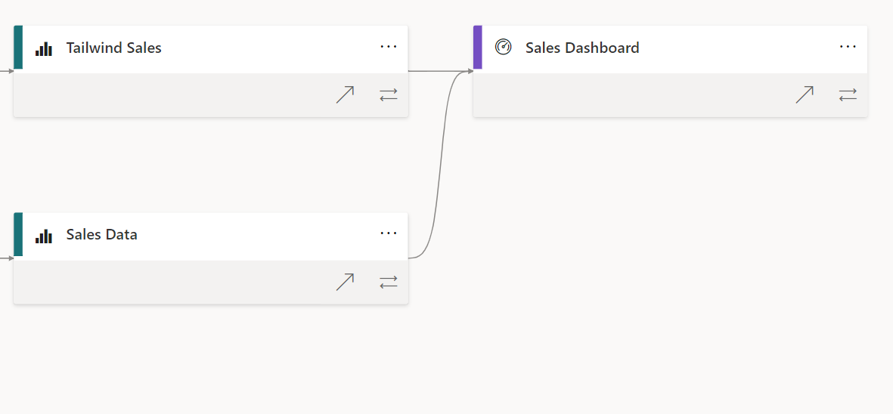
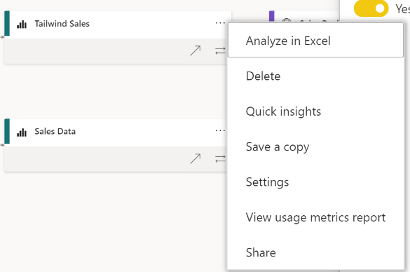

The **Lineage** view feature in Power BI allows you to quickly refresh datasets and see the relationships between the artifacts in a workspace and their external dependencies. 

Consider this module's continuing scenario with Tailwind Traders as an example. Thus far, you've developed several reports and have published them to the Tailwind workspace. However, because you are also collaborating with the Products team, it has become increasingly difficult to track which reports need to be refreshed and which datasets are in which report. Consequently, you want the ability to determine which datasets need to be refreshed because you've been receiving reports of stale data. The path of data from its source to the destination can often be a considerable challenge, more so if you have multiple datasets. 

The **Lineage** view feature can help you accomplish this task efficiently and almost effortlessly.

## Data lineage 

*Data lineage* refers to the path that data takes from the data source to the destination.

The **Lineage** view feature in Power BI is crucial because it:

-   Simplifies the troubleshooting process because you can see the path that the data takes from source to destination and determine pain points and bottlenecks.

-   Allows you to manage your workspaces and observe the impact of a single change in one dataset to reports and dashboards.

-   Saves time by simplifying your task of identifying reports and dashboards that haven't been refreshed.

## Use the Lineage view

The **Lineage** view is only accessible to **Admin**, **Contributor**, and **Member** roles. Additionally, it requires a Power BI Pro license and is only available for app workspaces. To access the **Lineage** view, go to the workspace, and then select **Lineage** from the **View** drop-down menu on the top ribbon.

> [!div class="mx-imgBorder"]
> 

When the view canvas opens, you can begin to explore this view. The following example shown an excerpt of the data lineage for the **Tailwind Sales** workspace.

> [!div class="mx-imgBorder"]
> 

This view shows all the artifacts in your workspace. Artifacts include data sources, datasets and dataflows, reports, and dashboards. Each card represents an artifact, and the arrows in between these cards represent the flow of data or the relationship between different artifacts. By following the arrows from left to right, you can observe the flow of data from the source to the destination, which will often be a dashboard. Typically, the flow would be **data sources > datasets/dataflows > reports > dashboards**. 

## Data sources

Each of the following cards is a data source that is used in your workspace.

> [!div class="mx-imgBorder"]
> 

The card tells you the type of data source (for example, **Text/CSV**) and the **Gateway**, which tells you the source of your data. If you are connected to the data through an on-premises data gateway, this card will tell you more information about the gateway. Additionally, if you double-click the card, you will get more details about the data source, such as the file path and the connection status. 

Selecting the lower-right icon on the card will highlight the path from the data source to the destination, as shown in the following screenshot, which clarifies the exact path that the data takes.

> [!div class="mx-imgBorder"]
> 

Next are the datasets/dataflows, which are marked in blue.

## Datasets/dataflows

Often, datasets and dataflows can connect to external data sources, such as SQL Server, or to external datasets in other workspaces. The following examples show dataset and dataflow cards on the **Lineage** view.

> [!div class="mx-imgBorder"]
> 

The **Lineage** view uses arrows to connect objects, such as datasets, with their data sources. On these cards, you can see when the dataset was last refreshed, and you can refresh the dataset by selecting the arrow icon on the lower-left corner of the card, as shown in the following screenshot.

> [!div class="mx-imgBorder"]
> 

This component is a powerful troubleshooting feature that helps ensure that your dataset refreshes are quick and uncomplicated. 

Returning to the initial quandary with Tailwind Traders, you wanted to determine if the company had stale datasets and then quickly refresh the data. By using the **Lineage** view feature, you can go through the different datasets in one view and then use the **Refresh data** button to refresh datasets that you determine as stale.

Additionally, if a dataset or dataflow belongs to a different workspace (in this case, the **Tailwind** workspace), it will be indicated on the card, as shown in the following screenshot.

> [!div class="mx-imgBorder"]
> 

By double-clicking on any card, you can view the metadata, such as the sensitivity, by whom it was configured, the last refresh date, and the names and count of tables within this dataset, as shown in the following figure.

> [!div class="mx-imgBorder"]
> 

You can also view the impact of this dataset across workspaces. By selecting the overlapping window icon on the lower-right corner of a dataset card, you can determine the impact analysis of the dataset.

> [!div class="mx-imgBorder"]
> 

On the **Impact analysis** window, you can see how many workspaces, reports, and dashboards that this dataset is a part of and how many views that this dataset has gathered, as shown in the following screenshot.

> [!div class="mx-imgBorder"]
> 

The bottom of the **Impact Analysis** window includes more detail about which specific reports and dashboards that this dataset is part of. Additionally, you can select **Notify contacts**, which allows you to notify dataset owners (or any other user) of changes in the dataset. Impact analysis is useful because it allows you to pinpoint datasets that aren't being used or looked at.

## Reports and dashboards 

The reports and dashboards cards have similar functionality as the data source and dataset cards.

> [!div class="mx-imgBorder"]
> 

Selecting a card will bring up a window in which you can view the metadata about the report or dashboard. In this window, you can also go directly to the report or dashboard. You can also enable or disable whether you want to include this report or dashboard within the app.

> [!div class="mx-imgBorder"]
> 

This card also contains useful options under the ellipsis (**...**), as shown in the following figure. From this menu, you can select to analyze the report in Microsoft Excel, delete a report, create Quick Insights, save a copy directly to your local drive, and more.

> [!div class="mx-imgBorder"]
> 

Now that you have had an in-depth look into the **Lineage** view in Power BI, you can commence with cleaning up the Tailwind Traders workspace. For more information, see [Data Lineage](https://docs.microsoft.com/power-bi/collaborate-share/service-data-lineage/?azure-portal=true).