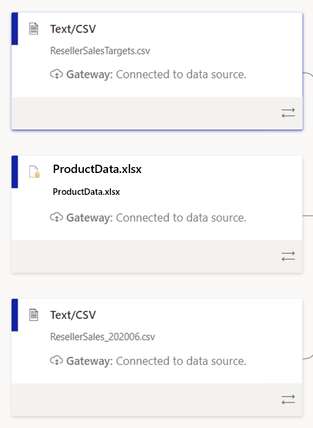
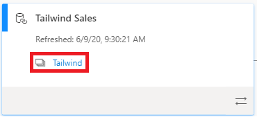
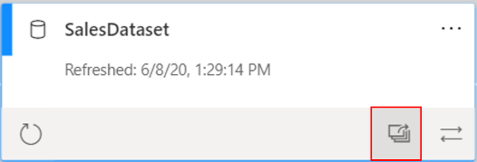
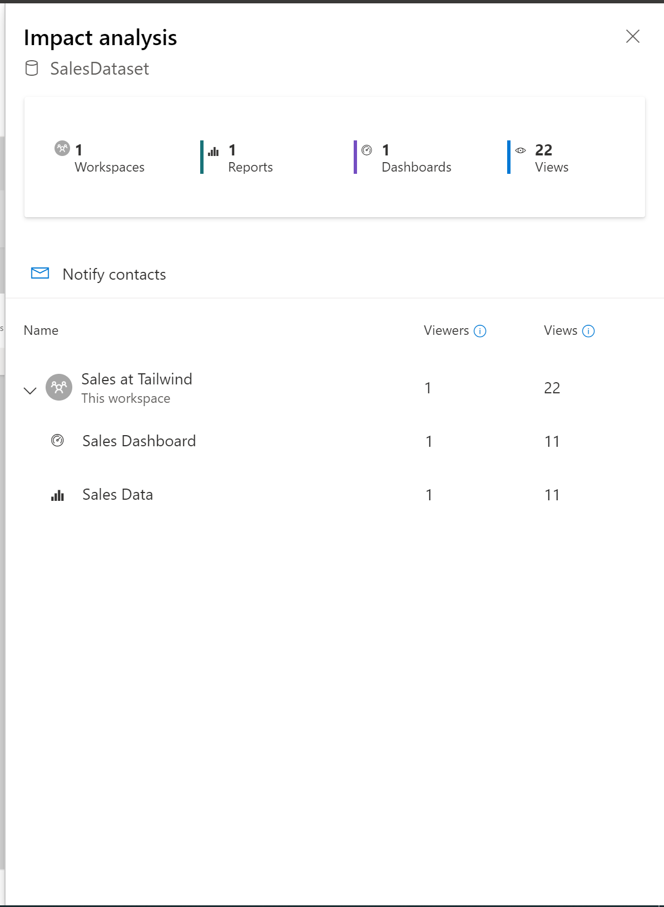
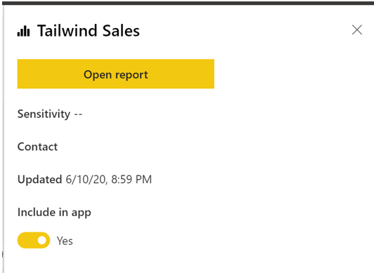

You've had the chance to develop many reports and have published them to the Tailwind workspace. However, because you are also collaborating with the Products team, it has become increasingly difficult to track which reports need to be refreshed and even which datasets are in which report, it is a jumbled mess! You want to be able to determine which datasets need to be refreshed as you've been getting reports of stale data. The path of data from its source to the destination can often be a gargantuan challenge, and more so if you have multiple datasets to add to the mix. How can you make sense of the intricacies of the data paths and troubleshoot unrefreshed data?

Power BI's Lineage View allows you to do just that. In Lineage View, you can quickly refresh datasets and see the relationships between the artifacts in a workspace as well as their external dependencies. With that, let's get started!

## Data lineage 

*Data lineage* refers to the path that data takes from the data source to the destination.

View lineage in Power BI is crucial for several reasons:

-   Simplifies the troubleshooting process, as you can see the path the data takes from source to destination and easily determine pain points and bottlenecks.

-   Allows you to manage your workspaces more easily and clearly see the impact of a single change in one dataset to reports and dashboards.

-   Saves time by making it easy to identify reports and dashboards that haven't been refreshed.

## Using lineage view

Lineage view is only accessible to admin, contributor, and member roles. Additionally, lineage view requires a Power BI Pro license and is only available for App workspaces. First, navigate to the workspace. Select **Lineage** from the **View** dropdown menu on the top ribbon.

> [!div class="mx-imgBorder"]
> 

Once the view canvas opens, we can begin to explore this view. The following is an excerpt of the data lineage for our workspace, **Tailwind Sales**.

> [!div class="mx-imgBorder"]
> 

This view shows us all the artifacts in our workspace. Artifacts include data sources, datasets and dataflows, reports, and dashboards. Each card represents an artifact, and the arrows in between these cards represent the flow of data, or the relationship between different artifacts. By following the arrows from left to right, we can see the flow of data from the source to the destination, which will often be a dashboard. Our flow is typically the following: data sources > datasets/dataflows > reports > dashboards. Let's look at these steps.

## Data sources

> [!div class="mx-imgBorder"]
> 

Each of the above cards is a data source used in our workspace. This card tells you the type of data source (for example, **Text/CSV**) and the gateway. **Gateway** tells us the source of our data. If we are connected to the data via an on-premises data gateway, this will tell you more information about the gateway. Additionally, double-clicking the card itself will tell you more details about the data source, such as the file path and the connection status. Selecting the bottom-right icon on the card will highlight specifically the path from the data source to the destination, as seen in the following, which makes it clearer as to the exact path the data takes.

> [!div class="mx-imgBorder"]
> 

Next, we have datasets/dataflows, marked in blue.

## Datasets/dataflows

Often datasets and dataflows can connect to external data sources, such as SQL Server or to external datasets in other workspaces. The following are examples of dataset and dataflow cards on the lineage view.

> [!div class="mx-imgBorder"]
> 

The lineage view uses arrows to connect objects, such as datasets, with their data sources. On these cards you can see when the dataset was last refreshed, as well refresh the dataset itself by selecting the arrow icon on the bottom left of the card, as seen in the following.

> [!div class="mx-imgBorder"]
> 

This is a powerful troubleshooting feature that makes it a quick and painless task to ensure that all your datasets are refreshed. Going back to our initial quandary, we wanted to easily see if we have any stale datasets and then quickly be able to refresh the data. Using this, you can go through the different datasets in one view and use this button to refresh any datasets that you believe are stale.

Additionally, if a dataset or dataflow belongs to a different workspace (in this case, the **Tailwind** workspace), it will be indicated on the card, as seen in the following.

> [!div class="mx-imgBorder"]
> 

There are a few other features that are important to mention. First, by double-clicking on any card, you can view the metadata. You can see the sensitivity, whom it was configured by, the last refresh date, and the names and count of tables within this dataset, as seen in the following.

> [!div class="mx-imgBorder"]
> 

You can also view the impact of this dataset across workspaces. By selecting the overlapping window icon on the bottom right of a dataset card, as seen in the following, you can determine the impact analysis of the dataset.

> [!div class="mx-imgBorder"]
> 

On the **Impact analysis** window, you can see how many workspaces, reports, and dashboards this dataset is a part of, as well as how many views this dataset has gathered, as seen in the following.

> [!div class="mx-imgBorder"]
> 

At the bottom of this window, you can also see more detail about which specific reports and dashboards this dataset is a part of. Additionally, you can **notify contacts**, which allows you to notify dataset owners (or any other user) of changes in the dataset. Impact analysis is useful for it allows you to pinpoint if you have any datasets that aren't being used or looked at.

## Reports/Dashboards 

The reports and dashboards cards have similar functionality as the data source and dataset cards do.

> [!div class="mx-imgBorder"]
> 

Selecting a card will bring up a window in which you can view the metadata about the report or dashboard; here, you can also go directly to the report or dashboard. You can also enable or disable whether you would like to include this report or dashboard within the app.

> [!div class="mx-imgBorder"]
> 

This card also contains useful options under the ellipsis, as seen in the following. Here, you can analyze the report in Excel, delete a report, create Quick Insights, save a copy directly onto your local drive, and more.

> [!div class="mx-imgBorder"]
> 

With that, you have had a chance to take an in-depth look into the Lineage View in Power BI Service. Knowing this, you can go forth with confidence and tackle cleaning up the Tailwind workspace. If you are interested in learning more, please refer to [Data Lineage](https://docs.microsoft.com/power-bi/collaborate-share/service-data-lineage/?azure-portal=true).
