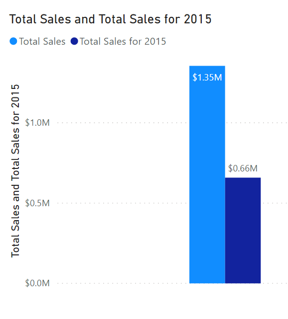
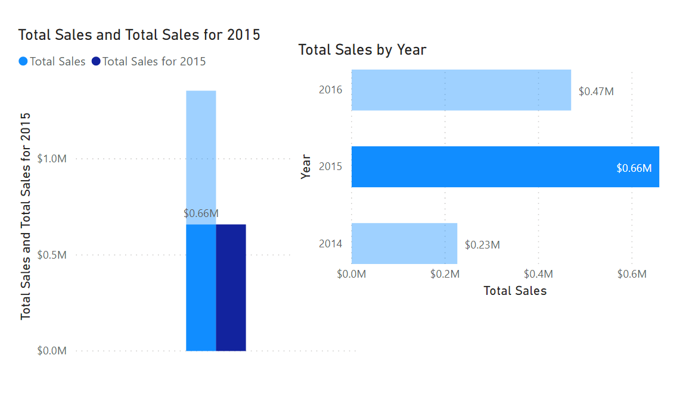

The CALCULATE function in DAX is one of the most important functions that a data analyst can learn. The function name does not adequately describe what it is intended to do.

The CALCULATE function is your method of creating a DAX measure that will override certain portions of the context that are being used to express the correct result.

For instance, if you want to create a measure that always calculates the total sales for 2015, regardless of which year is selected in any other visual in Power BI, you would create a measure that looks like the following sample:

```dax
Total Sales for 2015 = CALCULATE(SUM('Sales OrderDetails'[Total Price]), YEAR('Sales OrderDetails'[orderdate]) = 2015)
```

Notice how the measure is named **Total Sales for 2015**. When you use the CALCULATE function to override the context, it is helpful to name the measure in a way that describes exactly how you are overriding it. In this example, CALCULATE is aggregating the Total Price column, just as you did in the previous measure. However, instead of operating over the entire dataset while using whatever the filter context tells it to do, you are overriding the filter context for the year 2015. No matter what year is selected, you will always get the total for 2015; all other filters still apply. The subsequent example shows this concept in action.

When both measures are added to the previous visual they will resemble the following screenshot.

> [!div class="mx-imgBorder"]
> [](../media/02-two-measures-ss.png#lightbox)

As shown in the preceding screenshot, Total Sales is still USD1.35 million, while the 2015 Total Sales is USD0.66 million.

When you add the other visual onto the report, as you did previously, and then select 2015, the results will look like the following image.

> [!div class="mx-imgBorder"]
> [](../media/02-two-visuals-with-calculate-ss.png#lightbox)

Notice how both measures are now equally the same amount. If you were to filter by any other criteria, including region, employee, or product, the filter context would still be applied to both measures. It's only the year filter that does not apply to that measure.