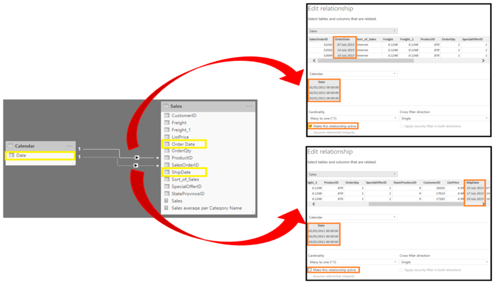
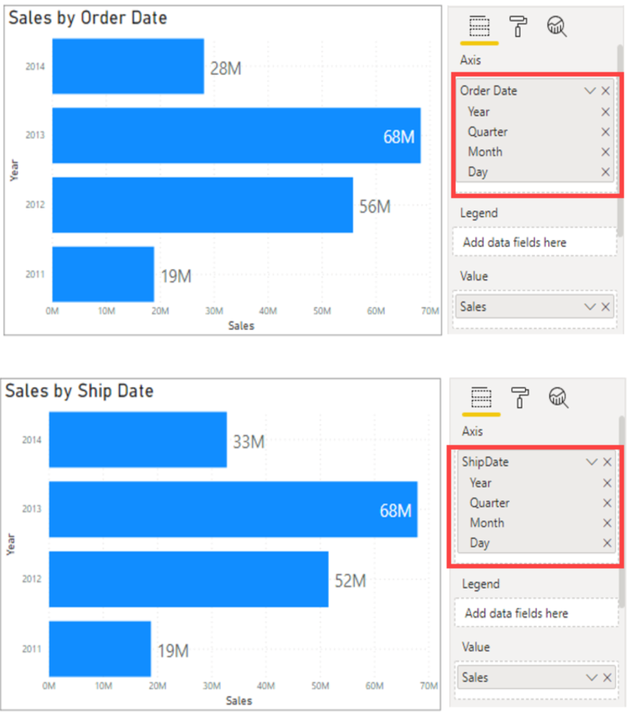

Another DAX function that allows you to override the default behavior is USERELATIONSHIP.

Consider the following data model example.

> [!div class="mx-imgBorder"]
> [](../media/02-manage-relationships-ss.png#lightbox)

The preceding screenshot shows an established relationship between the **Date **and** OrderDate** columns, as shown by the highlighted line connecting the two. The solid line between the two tables indicates that it is the active relationship, meaning that by default, any slicing on the date table where measures in the Sales data are being displayed will be along the **OrderDate** column. A dashed relationship exists between the **Date** and **ShipDate** columns, indicating that it is the inactive relationship. This relationship will never be used unless explicitly declared in a measure.

The goal is to build the following report, where you have two visuals: **Sales by Ship Date** and **Sales by Order Date**.

> [!div class="mx-imgBorder"]
> [](../media/02-two-visuals-with-use-relationship-ssm.png#lightbox)

These visuals show the sales over time, but the first visual is by order date and the second is by ship date so, though they are both dates, a different data point is associated with them to get both sets of data on the same visual.

To create this calculated measure for Sales by Ship Date, you can use the DAX function USERELATIONSHIP(). This function is used to specify a relationship to be used in a specific calculation and is done without overriding any existing relationships. It is a beneficial feature in that it allows developers to make additional calculations on inactive relationships by overriding the default active relationship between two tables in a DAX expression, as shown in the following example:

```Sales by Ship Date = CALCULATE(Sales[TotalPrice], USERELATIONSHIP('Calendar'[Date], Sales[ShipDate]))``` 

Now, you will be able to create the second visual.