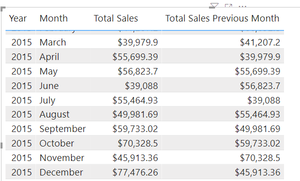

All data analysts will have to deal with time. Dates are important, so we highly recommend that you create or import a dates table. This approach will help make date and time calculations much simpler in DAX.

While some time calculations are simple to do in DAX, others are more difficult. For instance, the following screenshot shows what happens if you want to display a running total.

> [!div class="mx-imgBorder"]
> [](../media/02-running-total-ss.png#lightbox)

Notice that the totals increment for each month but then reset when the year changes. In other programming languages, this result can be fairly complicated, often involving several variables and looping through code. DAX makes this process fairly simple, as shown in the following example:

```dax
YTD Total Sales = TOTALYTD 
( 
    SUM('Sales OrderDetails'[Total Price]) 
    , Dates[Date]
)
```

The **YTD Total Sales** measure uses a built-in DAX function called TOTALYTD. This function takes an argument for the type of calculation. You can use the SUM function to get the Total Price, as you've done throughout this module. The second argument that you want to operate over is the **Dates** field. You can use your Dates table and add this measure to your visual, and you'll get the running total result that you're looking for. You can use all functions with YTD, MTD, and QTD in a similar fashion.

Another example of working with time would be comparing your current sales with the sales of a previous time period. For instance, if you want to see the total sales of the month next to the total sales of the prior month, you would enter the DAX measure definition, as shown in the following example:

```dax
Total Sales Previous Month = CALCULATE
(
    sum('Sales OrderDetails'[Total Price])
    , PREVIOUSMONTH(Dates[Date])
)
```

This measure uses the CALCULATE function, indicating that you're overriding the context to evaluate this expression the way that you want to. You're summing Total Price, as you've been doing throughout this module. For the second argument, you're using PREVIOUSMONTH for the override, which tells Power BI that, no matter what month is the default, the system should override it to be the previous month.

The following screenshot shows the results in a table visual.

> [!div class="mx-imgBorder"]
> [](../media/02-previous-month-ss.png#lightbox)

When you examine the months side-by-side, notice that the total sales for July compare to the total sales for June.