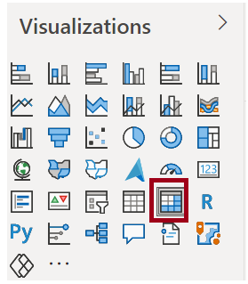
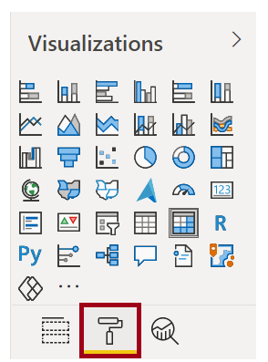
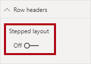
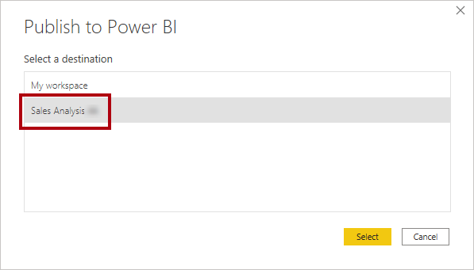
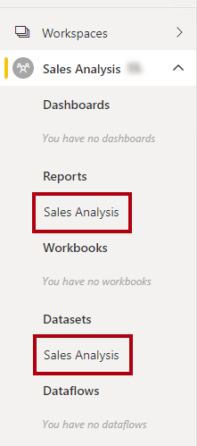
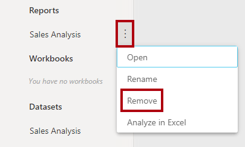

In this lab, you will create measures with DAX expressions involving filter context manipulation.

In this lab, you learn how to:

* Use the CALCULATE() function to manipulate filter context

* Use Time Intelligence functions

## Exercise 1: Work with Filter Context

In this exercise, you will create measures with DAX expressions involving filter context manipulation.

Open the lab’s starter file, which is found in the **D:\DA100\Lab06B\starter** folder.

### Task 1: Create a matrix visual

In this task, you will create a matrix visual to support testing your new measures.

1. In Power BI Desktop, in Report view, create a new report page.

	> [!div class="mx-imgBorder"]
	> [](../media/lab-8-1-ssm.png#lightbox)

1. On **Page 3**, add a matrix visual.

	> [!div class="mx-imgBorder"]
	> [](../media/lab-8-2-ssm.png#lightbox)

1. Resize the matrix visual to fill the entire page.

1. To configure the matrix visual fields, from the **Fields** pane, drag the **Region | Regions** hierarchy, and drop it inside the visual.

1. Add also the **Sales | Sales** field.

1. To expand the entire hierarchy, at the top-right of the matrix visual, click the forked-double arrow icon twice.

	> [!div class="mx-imgBorder"]
	> [](../media/lab-8-3-ssm.png#lightbox)

	Recall that the **Regions** hierarchy has the levels **Group**, **Country**, and **Region**.

1. To format the visual, beneath the **Visualizations** pane, select the **Format** pane.

	> [!div class="mx-imgBorder"]
	> [](../media/lab-8-4-ssm.png#lightbox)

1. In the **Search** box, enter **Stepped**.

1. Set the **Stepped Layout** property to **Off**.

	> [!div class="mx-imgBorder"]
	> [](../media/lab-8-5-ssm.png#lightbox)

1. Verify that the matrix visual has four column headers.

	> [!div class="mx-imgBorder"]
	> [](../media/lab-8-6-ss.png#lightbox)

	At Adventure Works, the sales regions are organized into groups, countries, and regions. All countries—except the United States—have just one region, which is named after the country. As the United States is such a large sales territory, it is divided into five regions.

	You’ll create several measures in this exercise, and then test them by adding them to the matrix visual.

### Task 2: Manipulate filter context

In this task, you will create several measures with DAX expressions that use the CALCULATE() function to manipulate filter context.

1. In Report view, on the **Modeling** ribbon, from inside the **Calculations** group, click **New measure** to add a measure “Sales All Region” to the **Sales** table. 

1.	Use the following expression to create the measure:


	For your convenience, all DAX definitions in this lab can be copied from the **D:\DA100\Lab06B\Assets\Snippets.txt** file.

	```DAX
	Sales All Region =
	CALCULATE(SUM(Sales[Sales]), REMOVEFILTERS(Region))
	```

	The CALCULATE() function is a powerful function used to manipulate the filter context. The first argument takes an expression or a measure (a measure is just a named expression). Subsequent arguments allow modifying the filter context.

	The REMOVEFILTERS() function removes active filters. It can take either no arguments, or a table, a column, or multiple columns as its argument.

	In this formula, the measure evaluates the sum of the **Sales** column in a modified filter context, which removes any filters applied to the **Region** table.

1. In the formula bar copy the expression from Snippets.txt file, and press **Enter**. This create the measure in the **Sales** table. Review the field list in the **Fields** pane under the **Sales** table, and you will see the **Sales All Region** measure.  

1.	Check the **Sales All Region** measure in the **Fields** pane to add the measure to the matrix visual. 


	> [!div class="mx-imgBorder"]
	> [](../media/lab-8-7-ssm.png#lightbox)

1. Notice that the **Sales All Region** measure computes the total of all region sales for each region, country (subtotal) and group (subtotal).

	This measure is yet to deliver a useful result. When the sales for a group, country, or region is divided by this value it produces a useful ratio known as “percent of grand total”.

1. In the **Fields** pane, ensure that the **Sales All Region** measure is selected, and then in the formula bar, replace the measure name and formula with the following formula:

	> [!TIP]
	> To replace the existing formula, first copy the snippet. Then, click inside the formula bar and press **Ctrl+A** to select all text. Then, press **Ctrl+V** to paste the snippet to overwrite the selected text. Then press **Enter**.

	```DAX
	Sales % All Region =
	DIVIDE(
       SUM(Sales[Sales]),
       CALCULATE(
            SUM(Sales[Sales]),
            REMOVEFILTERS(Region)
       )
	)
	```   
	The measure has been renamed to accurately reflect the updated formula. The **DIVIDE()** function divides the **Sales** measure (not modified by filter context) by the **Sales** measure in a modified context which removes any filters applied to the **Region** table.

1. In the matrix visual, notice that the measure has been renamed and that different values now appear for each group, country, and region.

1. Format the **Sales % All Region** measure as a percentage with two decimal places.

	> [!div class="mx-imgBorder"]
	> [](../media/lab-8-7b-ssm.png#lightbox)

1. In the matrix visual, review the **Sales % All Region** measure values.

	> [!div class="mx-imgBorder"]
	> [](../media/lab-8-8-ssm.png#lightbox)

1. Add another measure to the **Sales** table, based on the following expression, and format as a percentage:

	```DAX
	Sales % Country =
	DIVIDE(
       SUM(Sales[Sales]),
       CALCULATE(
           SUM(Sales[Sales]),
           REMOVEFILTERS(Region[Region])
       )
	)
	```

1. Notice that the **Sales % Country** measure formula differs slightly from the **Sales % All Region** measure formula.

	The difference is that the denominator modifies the filter context by removing filters on the **Region** column of the **Region** table, not all columns of the **Region** table. It means that any filters applied to the group or country columns are preserved. It will achieve a result which represents the sales as a percentage of country.

1. Add the **Sales % Country** measure to the matrix visual.

1. Notice that only the United States’ regions produce a value which is not 100%.

	> [!div class="mx-imgBorder"]
	> [](../media/lab-8-9-ssm.png#lightbox)

	Recall that only the United States has multiple regions. All other countries have a single region which explains why they are all 100%.

1. To improve the readability of this measure in visual, overwrite the **Sales % Country** measure with this improved formula.

	```DAX
	Sales % Country =
	IF(
        ISINSCOPE(Region[Region]),
    	DIVIDE(
        	SUM(Sales[Sales]),
        	CALCULATE(
                SUM(Sales[Sales]),
                REMOVEFILTERS(Region[Region]
            )
        ) 
	)
	```

	Embedded within the IF() function, the ISINSCOPE() function is used to test whether the region column is the level in a hierarchy. When true, the DIVIDE() function is evaluated. The absence of a false part means that blank is returned when the region column is not in scope.

1. Notice that the **Sales % Country** measure now only returns a value when a region is in scope.

	> [!div class="mx-imgBorder"]
	> [](../media/lab-8-10-ssm.png#lightbox)

1. Add another measure to the **Sales** table, based on the following expression, and format as a percentage:

	```DAX
	Sales % Group =
	DIVIDE(
        SUM(Sales[Sales]),
        CALCULATE(
             SUM(Sales[Sales]),
             REMOVEFILTERS(
                 Region[Region],
                 Region[Country]
             )
        )
	)
	```

	To achieve sales as a percentage of group, two filters can be applied to effectively remove the filters on two columns.

1. Add the **Sales % Group** measure to the matrix visual.

1. To improve the readability of this measure in visual, overwrite the **Sales % Group** measure with this improved formula.

	```DAX
	Sales % Group =
	IF(
        ISINSCOPE(Region[Region])
             || ISINSCOPE(Region[Country]),
        DIVIDE(
            SUM(Sales[Sales]),
            CALCULATE(
                SUM(Sales[Sales]),
                REMOVEFILTERS(
                     Region[Region],
                     Region[Country]
                )
            )
        )
	)
	```

1. Notice that the **Sales % Group** measure now only returns a value when a region or country is in scope.

1. In Model view, place the three new measures into a display folder named **Ratios**.

	> [!div class="mx-imgBorder"]
	> [](../media/lab-8-11-ss.png#lightbox)

1. Save the Power BI Desktop file.

	The measures added to the **Sales** table have modified filter context to achieve hierarchical navigation. Notice that the pattern to achieve the calculation of a subtotal requires removing some columns from the filter context, and to arrive at a grand total, all columns must be removed.

## Exercise 2: Work with Time Intelligence

In this exercise, you will create a sales year-to-date (YTD) measure and sales year-over-year (YoY) growth measure.

### Task 1: Create a YTD measure

In this task, you will create a sales YTD measure.

1. In Report view, on **Page 2**, notice the matrix visual which displays various measures with years and months grouped on the rows.

1. Add a measure to the **Sales** table, based on the following expression, and formatted to zero decimal places:

	```DAX
	Sales YTD =  
	TOTALYTD(SUM(Sales[Sales]), 'Date'[Date], "6-30")
	```

	The TOTALYTD() function evaluates an expression—in this case the sum of the **Sales** column—over a given date column. The date column must belong to a date table marked as a date table. The function can also take a third optional argument representing the last date of a year. The absence of this date means that December 31 is the last date of the year. For Adventure Works, June in the last month of their year, and so “6-30” is used.

1. Add the **Sales** field and the **Sales YTD** measure to the matrix visual.

1. Notice the accumulation of sales values within the year.

	> [!div class="mx-imgBorder"]
	> [](../media/lab-8-12-ss.png#lightbox)

	The TOTALYTD() function performs filter manipulation, specifically time filter manipulation. For example, to compute YTD sales for September 2017 (the third month of the fiscal year), all filters on the **Date** table are removed and replaced with a new filter of dates commencing at the beginning of the year (July 1, 2017) and extending through to the last date of the in-context date period (September 30, 2017).

    > [!NOTE]
	> Many Time Intelligence functions are available in DAX to support common time filter manipulations.

### Task 2: Create a YoY growth measure

In this task, you will create a sales YoY growth measure.

1. Add an additional measure to the **Sales** table, based on the following expression:

	```DAX
	Sales YoY Growth =
	VAR SalesPriorYear =
    	CALCULATE(
        	SUM(Sales[Sales]),
        	PARALLELPERIOD(
            	'Date'[Date],
            	-12,
           	 MONTH
       	    )
        )
	RETURN
        SalesPriorYear
	```
	The **Sales YoY Growth** measure formula declares a variable. Variables can be useful for simplifying the formula logic, and more efficient when an expression needs to be evaluated multiple times within the formula (which will be the case for the YoY growth logic). Variables are declared by a unique name, and the measure expression must then be output after the **RETURN** keyword.

	The **SalesPriorYear** variable is assigned an expression which calculates the sum of the **Sales** column in a modified context that uses the PARALLELPERIOD() function to shift 12 months back from each date in filter context.

1. Add the **Sales YoY Growth** measure to the matrix visual.

1. Notice that the new measure returns blank for the first 12 months (there were no sales recorded before fiscal year 2017).

1. Notice that the **Sales YoY Growth** measure value for **2017 Jul** is the **Sales** value for **2018 Jul**.

	> [!div class="mx-imgBorder"]
	> [](../media/lab-8-13-ssm.png#lightbox)

	Now that the “difficult part” of the formula has been tested, you can overwrite the measure with the final formula which computes the growth result.

1. To complete the measure, overwrite the **Sales YoY Growth** measure with this formula, formatting it as a percentage with two decimal places:

	```DAX
	Sales YoY Growth =
	VAR SalesPriorYear =
    	CALCULATE(
        	  SUM(Sales[Sales]),
        	  PARALLELPERIOD(
              'Date'[Date],
              -12,
              MONTH
            )
	)
	RETURN
       DIVIDE(
           (SUM(Sales[Sales]) - SalesPriorYear),
           SalesPriorYear
       )
	```

1. In the formula, in the **RETURN** clause, notice that the variable is referenced twice.

1. Verify that the YoY growth for **2018 Jul** is **392.83%**.

	> [!div class="mx-imgBorder"]
	> [](../media/lab-8-14-ssm.png#lightbox)

	This means that July 2018 sales (`$`2,411,559) represents a nearly 400% (almost 4x) improvement over the sales achieved for the prior year (`$`489,328).

1. In Model view, place the two new measures into a display folder named **Time Intelligence**. 

	> [!div class="mx-imgBorder"]
	> [](../media/lab-8-15-ss.png#lightbox)

1. Save the Power BI Desktop file.

	DAX includes many Time Intelligence functions to make it easy to implement time filter manipulations for common business scenarios. This exercise completes the data model development.

## Exercise 3: Publish the Power BI Desktop File

In this exercise, you will publish the Power BI Desktop file to Power BI.

> [!NOTE]
> The following exercise will require you to login to Power BI service, you can use your existing account or create a trial account before starting this part of the lab.

### Task 1: Publish the file

In this task, you will publish the Power BI Desktop file to Power BI.

1. Save the Power BI Desktop file.

1. To publish the file, on the **Home** ribbon tab, from inside the **Share** group, click **Publish**.

1. In the **Publish to Power BI** window, select your **Sales Analysis** workspace.

	> [!div class="mx-imgBorder"]
	> [](../media/lab-8-17-ssm.png#lightbox)

1. Click **Select**.

1. When the file has been successfully published, click **Got It**.

1. Close Power BI Desktop.

1. In Edge, in the Power BI service, in the **Navigation** pane (located at the left), review the contents of your **Sales Analysis** workspace.

	> [!div class="mx-imgBorder"]
	> [](../media/lab-8-20-ssm.png#lightbox)

	The publication has added a report and a dataset. If you don’t see them, press **F5** to reload the browser, and then expand the workspace again.

	The data model has been published to become a dataset. The report—used to test your model calculations—has been added as a report. This report is not required, so you will now delete it.

1. Hover the cursor over the **Sales Analysis** report, click the vertical ellipsis (…), and then select **Remove**.

	> [!div class="mx-imgBorder"]
	> [](../media/lab-8-21-ssm.png#lightbox)

1. When prompted to confirm the deletion, click **Delete**.
