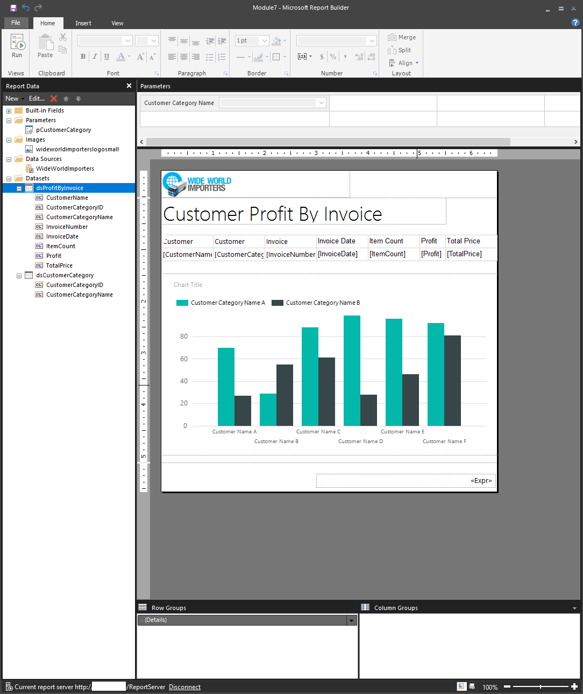

Paginated reports allow report developers to create Power BI artifacts that have tightly controlled rendering requirements. Paginated reports are ideal for creating sales invoices, receipts, purchase orders, and tabular data. This module will teach you how to create reports, add parameters, and work with tables and charts in paginated reports.

### Paginated reports defined

Paginated reports give a pixel-perfect view of the data. Pixel perfect means that you have total control of how the report renders. If you want a footer on every sales receipt that you create, a paginated report is the appropriate solution. If you want a certain customer's name to always appear in green font on a report, you can do that in a paginated report.

Power BI paginated reports are descendants of SQL Server Reporting Services (SSRS), which was first introduced in 2004. Power BI paginated reports and SSRS have a lot in common. If you're are looking for information on paginated reports and can't find it, searching the internet and Microsoft documentation on SSRS is an excellent idea because you'll find numerous blog posts, videos, and documentation available to you.

> [!div class="mx-imgBorder"]
> 

### When paginated reports are the right fit

You can use paginated reports for operational reports with tables of details and optional headers and footers.

Additionally, you can use paginated reports when you expect to print the report on paper or when you want an e-receipt, a purchase order, or an invoice. Paginated reports also render tabular data exceedingly well. You can have customized sort orders, clickable-headers, and URLs in results, which allows for simple integration with custom applications.

Power BI paginated reports can also display all of your data in a single report element, such as a table. If you have 25,000 records, and you want the reports to print over 100 pages, you can do that. If you want every third record to be printed with a light pink background, you can do that as well.

Power BI paginated reports are not created in Power BI Desktop; they are built by using Power BI Report Builder. Power BI paginated reports are a feature of Power BI Premium.

> [!div class="mx-imgBorder"]
> 

In this module, you will:

-   Get data.

-   Create a paginated report. 

-   Work with charts and tables on the report. 

-   Publish the report. 
