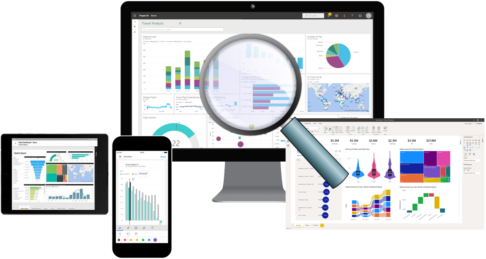

Before data can be used to tell a story, it must first be run through a process that makes it usable in the story. Thus, data analysis is the process of identifying, cleaning, transforming, and modeling data to discover meaningful and useful information. The data is then crafted into a story via reports for analysis to support the critical decision-making process.

> [!div class="mx-imgBorder"]
> 

As the world becomes more data-driven, storytelling through data analysis is becoming a more vital component and aspect of businesses large and small and is the reason organizations continue to hire data analysts.

Data-driven businesses make decisions based on the story their data tells, and in today's data-driven world, data is not being used to its full potential, a challenge that most business face today. Data analysis is and should be a critical aspect of all organizations to determine the impact to their business, including customer sentiment, market and product research, identify trends, or any other data insights.

While the process of data analysis focuses on the tasks of cleaning, modeling, and visualizing data, the concept of data analysis and how it is important to business should not be understated. To analyze data, core components of analytics are divided in the following categories:

## Descriptive analytics

Descriptive analytics helps answer questions about what has happened, based on historical data. Descriptive analytics techniques summarize large datasets to describe outcomes to stakeholders.

By developing KPIs (Key Performance Indicators), these strategies can help track the success or failure of key objectives. Metrics such as return on investment (ROI) are used in many industries. Specialized metrics are developed to track performance in specific industries.

Examples of descriptive analytics include generating reports to provide a view of an organization's sales and financial data.

## Diagnostic analytics

Diagnostic analytics helps answer questions about why things happened. Diagnostic analytics techniques supplement more basic descriptive analytics. They take the findings from descriptive analytics and dig deeper to find the cause. The performance indicators are further investigated to discover why they got better or worse. This generally occurs in three steps:

1.  Identify anomalies in the data. These may be unexpected changes in a metric or a particular market.

1.  Collect data that's related to these anomalies.

1.  Use statistical techniques to discover relationships and trends that explain these anomalies.

## Predictive analytics

Predictive analytics helps answer questions about what will happen in the future. Predictive analytics techniques use historical data to identify trends and determine if they're likely to recur. Predictive analytical tools provide valuable insight into what may happen in the future. Techniques include a variety of statistical and machine learning techniques such as neural networks, decision trees, and regression.

## Prescriptive analytics

Prescriptive analytics helps answer questions about what actions should be taken to achieve a goal or target. By using insights from predictive analytics, data-driven decisions can be made. This technique allows businesses to make informed decisions in the face of uncertainty. Prescriptive analytics techniques rely on machine learning strategies to find patterns in large datasets. By analyzing past decisions and events, the likelihood of different outcomes can be estimated.

## Cognitive analytics

Cognitive analytics attempts to draw inferences from existing data and patterns, derive conclusions based on existing knowledge bases, and then add these findings back into the knowledge base for future inferences, a self-learning feedback loop. Cognitive analytics helps you to learn what might happen if circumstances change, and how you might handle these situations.

Inferences aren't structured queries based on a rules database, rather they're unstructured hypotheses gathered from several sources and expressed with varying degrees of confidence. Effective cognitive analytics depends on machine learning algorithms. It uses several NLP (Natural Language Processing) concepts to make sense of previously untapped data sources, such as call center conversation logs and product reviews.

### Example

By enabling reporting and data visualizations, a retail business uses descriptive analytics to look at patterns of purchases from previous years to determine what products might be popular next year. They might also look at supporting data to understand why a particular product was popular and if that trend is continuing, determine whether they need to continue to stock that product.

A business might determine that a certain product was popular over a certain timeframe and use analysis to determine whether any marketing efforts or online social activities contributed to the sales increase.

An underlying facet of data analysis is that businesses need to be able to trust its data, and as a practice, the data analysis process take data from trusted sources and shapes it into something that is consumable, meaningful and easily understood from which business decisions can be made. Data analysis enables businesses to fully understand their data through data-driven processes and decisions, allowing businesses to be confident in their decisions.

As the amount of data grows, so does the need for data analysts. A data analyst knows how to organize information and distill it into something meaningful and understandable. A data analyst knows how to gather the right data and what to do with it, i.e., the mission of making sense of the data in your data swamp.
