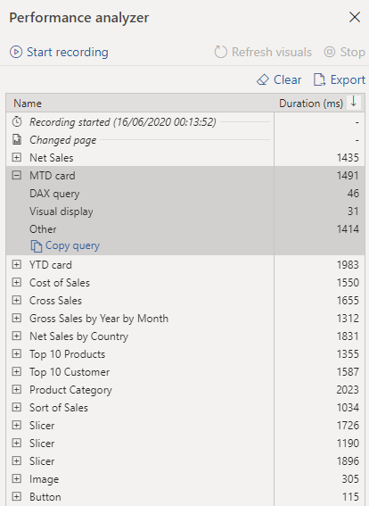
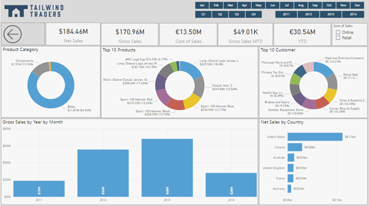

When you have finished creating your report, the performance of that report depends on how quickly data can load onto the report page. You should test your report in the Power BI service to see how it works from a user's perspective. If you experience issues, or if the report users have reported issues, you need to investigate the cause of those issues and take measures to tune the report for more optimized performance.

## Analyze performance

To investigate the cause of issues, your first step is to use the **Performance analyzer** tool within Power BI Desktop. **Performance analyzer** allows you to discover how each of your report elements, such as visuals and DAX formulas, are performing. **Performance analyzer** provides you with logs that measure (in time duration) how each of your report elements performs when users interact with them. By examining the durations in the logs, you can identify which elements of the report are the most (or least) resource intensive. You can find where bottlenecks exist, which is a good starting point for making changes.

Before you run **Performance analyzer**, ensure that you clear the visual cache and data engine cache; otherwise, the results will not be accurate. Also, you should set up the report so that it opens on a blank page.

When you have cleared the caches and opened the report on the blank page, to run the **Performance analyzer**, go to the **View** tab, select **Performance analyzer**, and then select **Start recording**.

> [!div class="mx-imgBorder"]
> 

Interact with your report as you would expect a user to, and then stop the recording. The results of your interactions will display in the **Performance analyzer** pane as you work. When you are finished, select the **Stop** button. Then, you can analyze the results in the **Performance analyzer** pane. Performance results of each item in the report will display, in milliseconds, under the **Duration** column. The following image shows that all items on the report take less than two seconds to load, which is acceptable. You can expand an item in the list to view more detailed information and identify the exact cause of the issue, such as the DAX query, the visual display, or something else (other).

> [!div class="mx-imgBorder"]
> 

If you want to examine the DAX query, select **Copy query** and then paste it into DAX Studio for further analysis. DAX Studio is a free, open-source tool that is provided by another source that you can download and install on your computer.

## Tune performance

The results of your analysis will identify areas for improvement and highlight items that you need to optimize.

A common reason for poor performance is too many visuals on the same page. The following image shows an example of a busy page that contains several visuals.

> [!div class="mx-imgBorder"]
> 

If you identify visuals as the bottleneck that has caused poor performance, take the following measures to tune the report:

- Reduce the number of visuals on the report page because fewer visuals means better performance. If a visual is not necessary and doesn't add value to the user, you should remove it. Rather than using multiple visuals on the page, consider other ways to provide additional details, such as drillthrough pages and report page tooltips.

- Reduce the number of fields in each visual. The upper limit for visuals is 100 fields, so a visual with more than 100 fields will be slow to load (and will look cluttered and confusing). Identify fields that are not valuable to the visual and then remove them.

If you find that visuals are not causing the performance issues, you should assess the DAX query results that are displayed in the **Performance analyzer** pane and investigate those results further. For example, you might need to look elsewhere in your data model, such as the relationships and columns.

In circumstances where you have made necessary changes to tune report performance and have established that the report is performing well, but some users are still experiencing poor performance, other factors might be affecting performance. These factors include the bandwidth, server, firewall, and other external, uncontrollable factors. You might need to speak to the IT team in your organization to see if they can explain why users are experiencing poor performance when using your reports.
