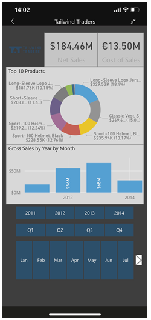
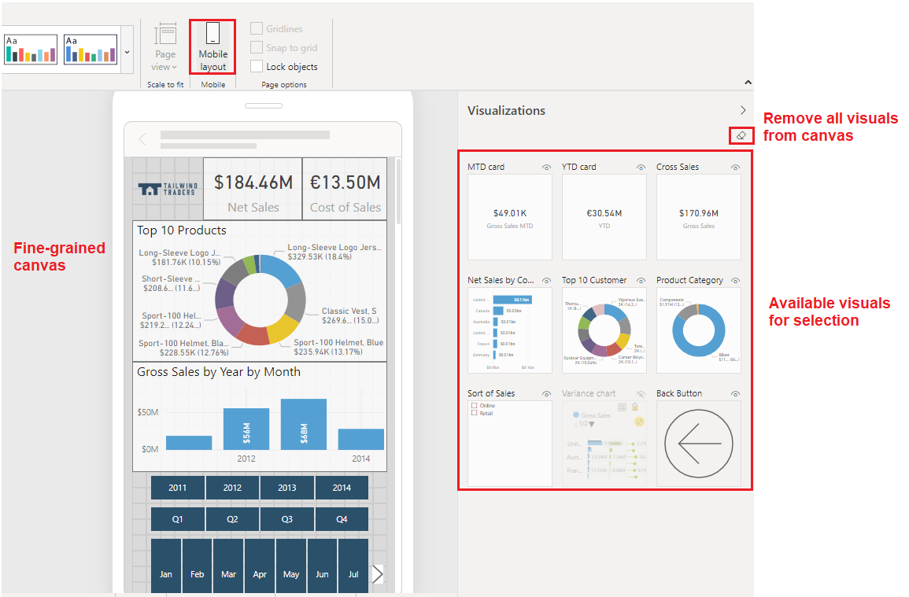
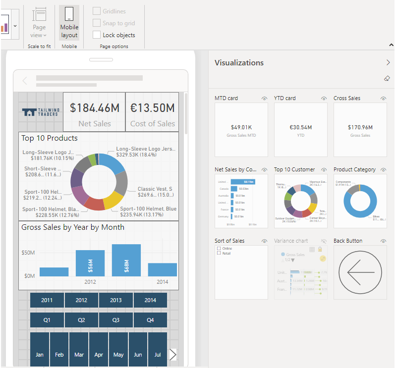

Some of your report users will want to view your report on their mobile phone or tablet. While they can view any Power BI report page in landscape orientation, you might want to create an additional view that is optimized for mobile devices and displays in portrait orientation. Power BI gives you the power to use visuals that make sense for mobile users and rearrange those visuals in the most effective way.

> [!div class="mx-imgBorder"]
> 

When you have finished creating your report for the regular web view, you can then change the report so that it's optimized for use on phones and tablets.

To create a mobile-optimized version of your report, you can:

-   Design a mobile layout view, where you can drag and drop certain visuals onto a phone emulator canvas.

-   Use visuals and slicers that are suitable for use on small, mobile screens.

To publish a mobile-optimized version of your report, you can publish the main report as you did previously. The web and mobile versions are published at the same time.

## Design a mobile report layout

To design the mobile-optimized view of a report page, start by opening the mobile layout view for that page. In Power BI Desktop, open the specific report page, select the **View** tab, and then select **Mobile layout**.

This selection will result in showing a scrollable canvas that is shaped like a phone and a **Visualizations** pane that lists all visuals on the original report page. Each visual appears with its name, for easy identification, and a visibility indicator that is useful when you are working with bookmarks. The visibility indicator of a visual will change depending on the visibility status of the visual in the current state of the web report view.

> [!div class="mx-imgBorder"]
> 

To add a visual to the mobile layout canvas, drag the visual from the **Visualizations** pane to the phone canvas, or double-click the visual in the **Visualization** pane. You can then resize and reposition the visual in the same way that you would a report page. Repeat these steps to add other visuals to the mobile layout canvas.

> [!div class="mx-imgBorder"]
> 

## Configure visuals and slicers for use in mobile reports

By default, many visuals in Power BI are responsive, which means that they change dynamically to display the maximum amount of data and insight, regardless of the screen size. As a visual changes size, Power BI gives priority to the data and makes small changes, such as removing padding or repositioning the legend, so that the data remains visible. When it comes to configuring visuals for mobile reports, Power BI does all the hard work for you. However, if you want to turn off this default responsiveness, you can do so in the **General** section of the visual's format settings.

Regarding slicers, which offer on-canvas filtering of report data, you might want to modify some settings to optimize them for mobile use. Return to the regular report authoring mode to edit the slicer settings, and then consider the following points:

-   Determine whether you want to allow report readers to select only one item or multiple items.

-   Decide on the orientation of the slicer, whether it should be vertical, horizontal, or responsive (responsive slicers must be horizontal). If you make the slicer responsive, as you change its size and shape, it shows more or fewer options. If you make the slicer small enough, it becomes a filter icon on the report page.

> [!div class="mx-imgBorder"]
> 
