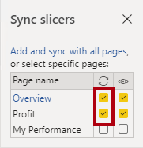
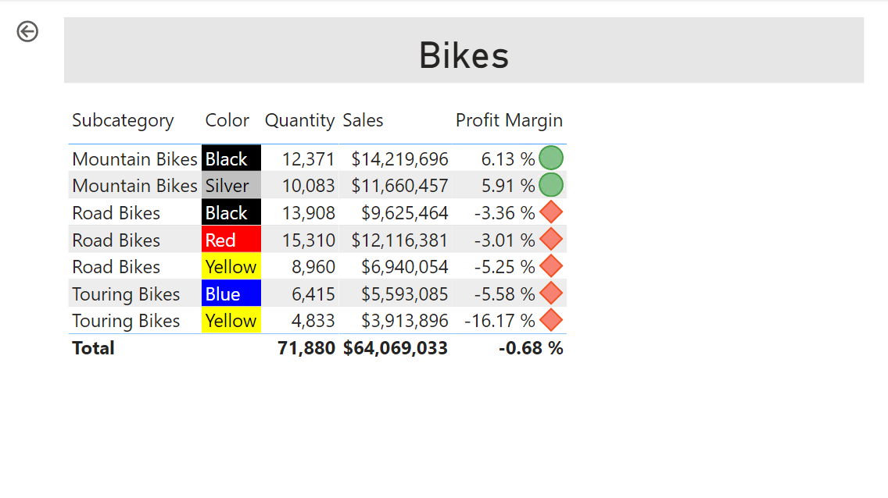
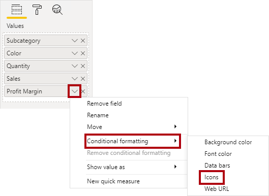
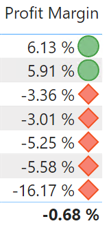
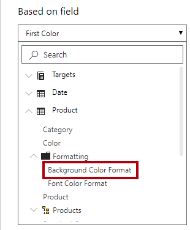
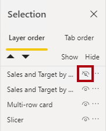
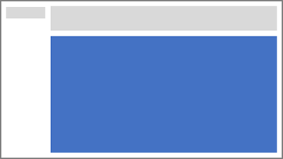
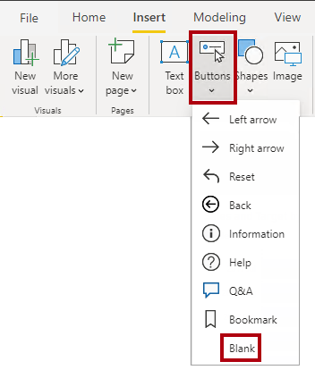
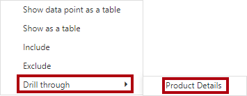
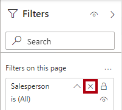

**The estimated time to complete the lab is 45 minutes**

In this lab, you will enhance the **Sales Analysis** with advanced design features.

In this lab, you will learn how to:

- Sync slicers

- Create a drillthrough page

- Apply conditional formatting

- Create and use bookmarks

### Lab story

This lab is one of many in a series of labs that was designed as a complete story from data preparation to publication as reports and dashboards. You can complete the labs in any order. However, if you intend to work through multiple labs, for the first 10 labs, we suggest you do them in the following order:

1. [Prepare data in Power BI Desktop](https://docs.microsoft.com/learn/modules/get-data/lab-prepare/?azure-portal=true)

1. [Load data in Power BI Desktop](https://docs.microsoft.com/learn/modules/clean-data-power-bi/8-lab/?azure-portal=true)

1. [Model data in Power BI Desktop, part 1](https://docs.microsoft.com/learn/modules/design-model-power-bi/8-lab/?azure-portal=true)

1. [Model data in Power BI Desktop, part 2](https://docs.microsoft.com/learn/modules/design-model-power-bi/9-lab/?azure-portal=true)

1. [Create DAX calculations in Power BI Desktop, part 1](https://docs.microsoft.com/learn/modules/create-measures-dax-power-bi/6-lab/?azure-portal=true)

1. [Create DAX calculations in Power BI Desktop, part 2](https://docs.microsoft.com/learn/modules/create-measures-dax-power-bi/8-lab/?azure-portal=true)

1. [Design a report in Power BI Desktop, part 1](https://docs.microsoft.com/learn/modules/visuals-power-bi/8-lab/?azure-portal=true)

1. **Design a report in Power BI Desktop, part 2** << You are here. This is the lab for the current module.

1. [Create a Power BI dashboard](https://docs.microsoft.com/learn/modules/create-dashboards-power-bi/9-lab/?azure-portal=true)

1. [Perform data analysis in Power BI Desktop](https://docs.microsoft.com/learn/modules/ai-visuals-power-bi/5-lab/?azure-portal=true)

1. [Create a Power BI paginated report](https://docs.microsoft.com/learn/modules/create-paginated-reports-power-bi/6-lab/?azure-portal=true)

> [!NOTE]
> Each lab starts with a PBIX file that has all of the previous lab work completed. If you should lose your work for any reason, you can open the PBIX file that includes the progress up to that point from the folder indicated at the beginning of the next lab.

## Exercise 1: Configure sync slicers

In this exercise, you will sync the report page slicers.

### Task 1: Get started - Sign in

In this task you'll set up the environment for the lab by signing in to Power BI.

> [!Important]
> If you have already signed into Power BI, continue from the next task.

1. To open Microsoft Edge, on the taskbar, select the Microsoft Edge program shortcut.

1. In the Microsoft Edge browser window, navigate to [https://powerbi.com](https://powerbi.com).

    > [!Tip]
    > You can also use the Power BI Service favorite on the Microsoft Edge favorites bar.

1. Select **Sign In** (located at the top-right corner).

1. Enter the account details provided to you.

1. If prompted to update the password, reenter the provided password, and then enter and confirm a new password.

    > [!Important]
    > Be sure to record your new password.

1. Complete the sign in process.

1. If prompted by Microsoft Edge to stay signed in, select **Yes**.

1. In the Microsoft Edge browser window, in the Power BI service, in the **Navigation** pane, expand **My Workspace**.

    > [!div class="mx-imgBorder"]
    > 

1. Leave the Microsoft Edge browser window open.

### Task 2: Get started – Open report

In this task you'll set up the environment for the lab by opening the starter report.

> [!Important]
> If you're continuing on from the previous lab (and you completed that lab successfully), do not complete this task. Instead, continue from the next task.

1. To open the Power BI Desktop, on the taskbar, select the Microsoft Power BI Desktop shortcut.

1. To close the getting started window, at the top-left of the window, select **X**.

1. To sign in to the Power BI service, at the top-right, select **Sign In**.

1. Complete the sign in process using the same account used to sign in to the Power BI service.

1. To open the starter Power BI Desktop file, select the **File** ribbon tab to open the backstage view.

1. Select **Open Report**.

    > [!div class="mx-imgBorder"]
    > 

1. Select **Browse Reports**.

1. In the Open window, navigate to the **D:\DA100\Labs\design-report-in-power-bi-desktop-enhanced\Starter** folder.

1. Select the **Sales Analysis** file.

1. Select **Open**.

1. Close any informational windows that may open.

1. To create a copy of the file, select the **File** ribbon tab to open the backstage view.

1. Select **Save As**.

    > [!div class="mx-imgBorder"]
    > 

1. If prompted to apply changes, select **Apply**.

1. In the **Save As** window, navigate to the **D:\DA100\MySolution** folder.

1. Select **Save**.

### Task 3: Sync slicers

In this task, you will sync the **Year** and **Region** slicers.

You will continue the development of the report created in the **Design a report in Power BI Desktop, Part 1** lab.

1. In Power BI Desktop, on the **Overview** page, set the **Year** slicer to **FY2018**.

1. Go to the **My Performance** page, and then notice that the **Year** slicer is a different value.

    When slicers aren't synced, it can contribute to misrepresentation of data and frustration for report users. You'll now sync the report slicers.

1. Return to the **Overview** page, and then select the **Year** slicer.

1. On the **View** ribbon tab, from inside the **Show Panes** group, select **Sync Slicers**.

    > [!div class="mx-imgBorder"]
    > 

1. In the **Sync Slicers** pane (at the left of the **Visualizations** pane), in the second column (which represents syncing),  select the  checkboxes for the **Overview** and **My Performance** pages.

    > [!div class="mx-imgBorder"]
    > 

1. On the **Overview** page, select the **Region** slicer.

1. Sync the slicer with the **Overview** and **Profit** pages.

    > [!div class="mx-imgBorder"]
    > 

1. Test the sync slicers by selecting different filter options, and then verifying that the synced slicers filter by the same selection.

1. To close the **Sync Slicer** page, select the **X** located at the top-right of the pane.

## Exercise 2: Configure drill through

In this exercise, you will create a new page and configure it as a drill through page. When you've completed the design, the page will look like the following:

> [!div class="mx-imgBorder"]
> 

### Task 1: Create a drill through page

In this task, you will create a new page and configure it as a drill through page.

1. Add a new report page named **Product Details**.

    > [!div class="mx-imgBorder"]
    > 

1. Right-click the **Product Details** page tab, and then select **Hide Page**.

    Report users won't be able to go to the drill through page directly. They'll need to access it from visuals on other pages. You'll learn how to drill through to the page in the final exercise of this lab.

1. Beneath the **Visualizations** pane, in the **Drill Through** section, add the **Product | Category** field to the **Add Drill-Through Fields Here** box.

    The labs use a shorthand notation to reference a field. It looks like this: **Product | Category**. In this example, **Product** is the table name and **Category** is the field name.

    > [!div class="mx-imgBorder"]
    > 

1. To test the drill through page, in the drill through filter card, select **Bikes**.

    > [!div class="mx-imgBorder"]
    > 

1. At the top-left of the report page, notice the arrow button.

    > [!div class="mx-imgBorder"]
    > 

    A button is added automatically when a field is added to the drill through well. It allows report users to navigate back to the page from which they drilled through.

1. Add a **Card** visual to the page, and then resize and reposition it so it sits to the right of the button and fills the remaining width of the page.

    > [!div class="mx-imgBorder"]
    > 

    > [!div class="mx-imgBorder"]

    > 

1. Drag the **Product | Category** field into the card visual.

1. Configure the format options for the visual, and then turn the **Category Label** property to **Off**.

    > [!div class="mx-imgBorder"]
    > 

1. Set the **Background Color** property to a light shade of gray.

1. Add a **Table** visual to the page, and then resize and reposition it so it sits beneath the card visual and fills the remaining space on the page.

    > [!div class="mx-imgBorder"]
    > 

    > [!div class="mx-imgBorder"]
    > 

1. Add the following fields to the visual:

    - Product | Subcategory

    - Product | Color

    - Sales | Quantity

    - Sales | Sales

    - Sales | Profit Margin

1. Configure the format options for the visual, and in the **Grid** section, set the **Text Size** property to **20pt**.

    The design of the drill through page is almost complete. In the next exercise, you'll enhance the page with conditional formatting.

## Exercise 3: Add conditional formatting

In this exercise, you will enhance the drill through page with conditional formatting. When you've completed the design, the page will look like the following:

> [!div class="mx-imgBorder"]
> 

### Task 1: Add conditional formatting

In this task, you will enhance the drill through page with conditional formatting.

1. Select the table visual.

1. In the visual fields pane, for the **Profit Margin** field, select the down-arrow, and then select **Conditional Formatting | Icons**.

    > [!div class="mx-imgBorder"]
    > 

1. In the **Icons - Profit Margin** window, in the **Icon Layout** dropdown list, select **Right of Data**.

    > [!div class="mx-imgBorder"]
    > 

1. To delete the middle rule, at the left of the yellow triangle, select **X**.

    > [!div class="mx-imgBorder"]
    > 

1. Configure the first rule (red diamond) as follows:

    - In the second control, remove the value

    - In the third control, select **Number**

    - In the fifth control, enter **0**

    - In the sixth control, select **Number**

1. Configure the second rule (green circle) as follows:

    - In the second control, enter **0**

    - In the third control, select **Number**

    - In the fifth control, remove the value

    - In the sixth control, select **Number**

    > [!div class="mx-imgBorder"]
    > 

    The rules are as follows:

    - Display a red diamond if the profit margin value is less than 0.
    - Otherwise if the value is greater than or equal to zero, display the green circle.

1. Select **OK**.

1. In the table visual, verify that the that the correct icons are displayed.

    > [!div class="mx-imgBorder"]
    > 

1. Configure background color conditional formatting for the **Color** field.

1. In the **Background color - Color** window, in the **Format By** dropdown list, select **Field Value**.

    > [!div class="mx-imgBorder"]
    > 

1. In the **Based on field** dropdown list, select **Product | Formatting | Background Color Format**.

    > [!div class="mx-imgBorder"]
    > 

1. Select **OK**.

1. Repeat the previous steps to configure font color conditional formatting for the **Color** field, using the **Product | Formatting | Font Color Format** field.

You may recall that the background and font colors were sourced from the **ColorFormats.csv** file in the **Prepare data in Power BI Desktop** lab, and then integrated with the **Product** query in the **Load data in Power BI Desktop** lab.

## Exercise 4: Add bookmarks and buttons

In this exercise, you will enhance the **My Performance** page with buttons, allowing the report user to select the visual type to display. When you've completed the design, the page will look like the following:

> [!div class="mx-imgBorder"]
> 

### Task 1: Add bookmarks

In this task, you will add two bookmarks, one to display each of the monthly sales/targets visuals.

1. Go to the **My Performance** page.

1. On the **View** ribbon tab, from inside the **Show Panes** group, select **Bookmarks**.

    > [!div class="mx-imgBorder"]
    > 

1. On the **View** ribbon tab, from inside the **Show Panes** group, select **Selection**.

    > [!div class="mx-imgBorder"]
    > 

1. In the **Selection** pane, beside one of the **Sales and Target by Month** items, to hide the visual, select the eye icon.

    > [!div class="mx-imgBorder"]
    > 

1. In the **Bookmarks** pane, select **Add**.

    > [!div class="mx-imgBorder"]
    > 

1. To rename the bookmark, double-click the bookmark.

1. If the visible chart is the bar chart, rename the bookmark as **Bar Chart ON**, otherwise rename the bookmark as **Column Chart ON**.

1. To edit the bookmark, in the **Bookmarks** pane, hover the cursor over the bookmark, click the ellipsis, and then select **Data**.

    > [!div class="mx-imgBorder"]
    > 

    Disabling the **Data** option means the bookmark won’t use the current filter state. That’s important because otherwise the bookmark would permanently lock in the filter currently applied by the Year slicer.

1. To update the bookmark, click the ellipsis again, and then select Update.

   In the following steps, you’ll create and configure a second bookmark to show the second visual.

1. In the **Selection** pane, toggle the visibility of the two **Sales and Target by Month** items.

    In other words, make the visible visual hidden, and make the hidden visual visible.

    > [!div class="mx-imgBorder"]
    > 

1. Create a second bookmark, and name it appropriately (either **Column Chart ON** or **Bar Chart ON).**

    > [!div class="mx-imgBorder"]
    > 

1. Configure the second bookmark to ignore filters (**Data** option off), and update the bookmark.

1. In the **Selection** pane, to make both visuals visible, show the hidden visual.

1. Resize and reposition both visuals so they fill the page beneath the multi-card visual, and completely overlap one another.

    > [!TIP]
    > To select the visual that is covered up, select it in the **Selection** pane.

    > [!div class="mx-imgBorder"]
    > 

1. In the **Bookmarks** pane, select each of the bookmarks, and notice that only one of the visuals is visible.

The next stage of design is to add two buttons to the page, which will allow the report user to select the bookmarks.

### Task 2: Add buttons

In this task, you will add two buttons, and assign bookmark actions to each.

1. On the **Insert** ribbon, from inside the **Elements** group, select **Button**, and then select **Blank**.

    > [!div class="mx-imgBorder"]
    > 

1. Reposition the button directly beneath the **Year** slicer.

1. Select the button, and the in the **Visualizations** pane, turn the **Button Text** property to **On**.

    > [!div class="mx-imgBorder"]
    > 

1. Expand the **Button Text** section, and then in the **Button Text** box, enter **Bar Chart**.

1. Expand the **Background** section, and then set a background color using a complementary color.

1. Turn the **Action** property to **On** (located near the bottom of the list).

1. Expand the **Action** section, and then set the **Type** dropdown list to **Bookmark**.

1. In the **Bookmark** dropdown list, select **Bar Chart ON**.

    > [!div class="mx-imgBorder"]
    > 

1. Create a copy of the button by using copy and paste, and then configure the new button as follows:

    > [!tip]
    > The shortcut commands for copy and paste are **Ctrl+C** followed by **Ctrl+V.**

    - Set the **Button Text** property to **Column Chart**

    - In the **Action** section, set the **Bookmark** dropdown list to **Column Chart ON**

The design of the Sales Analysis report is now complete.

### Task 3: Publish the report

In this task, you will publish the report.

1. Select the **Overview** page.

1. In the **Year** slicer, select **FY2020**.

1. In the **Region** slicer, choose **Select All**.

1. Save the Power BI Desktop file.

    The file must always be saved prior to publishing to the Power BI service.

1. On the Home ribbon tab, from inside the **Share** group, click **Publish**.

    In the **Publish to Power BI** window, notice that **My Workspace** is selected.

1. To publish the report, choose **Select**.

1. If prompted to replace the report, select **Replace**.

1. When the publication has succeeded, click **Got It**.

1. Leave Power BI Desktop open.

In the next exercise, you will explore the report in the Power BI service.

## Exercise 5: Explore the report

In this exercise, you will explore the report in the Power BI service.

### Task 1: Explore the report

In this task, you will explore the report in the Power BI service.

1. In the Microsoft Edge browser window, in the Power BI service, in the **Navigation** pane, select the **Sales Analysis** report.

1. To test the drill through report,  in the **Overview** page, in the **Quantity by Category** visual, right-click the **Clothing** bar, and then select **Drill Through | Product Details**.

    > [!div class="mx-imgBorder"]
    > 

1. Notice that the **Product Details** page is for **Clothing**.

1. To return to the source page, at the top-left corner, select the arrow button.

1. Select the **My Performance** page.

1. Select each of the buttons, and then notice that a different visual is displayed.

### Task 2: Finish up

In this task, you will complete the lab.

1. To return to the workspace, in the breadcrumb trail, select your workspace name.

1. Leave the Microsoft Edge browser window open.

1. In Power BI Desktop, go to the **My Performance** page, and in the **Filters** pane, remove the **Salesperson** filter card.

    > [!div class="mx-imgBorder"]
    > 

1. Select the **Overview** page.

1. Save the Power BI Desktop file, and then republish the report to Power BI.

1. If you intend to start the next lab, you can opt to leave Power BI Desktop open.

    > [!WARNING]
    > If you leave the lab open, it will time out after one to four hours. Your work in the *current* module's lab will be lost, but each lab after the first one includes a PBIX file with the work from all previous labs completed so that you don't need to start over.

When you share the report in the **Publish and share Power BI content** lab, the report will enforce row-level security.

[!INCLUDE ]
