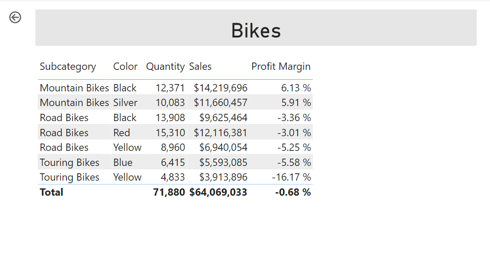
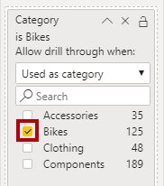
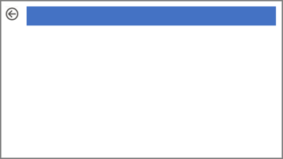
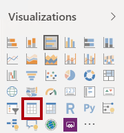
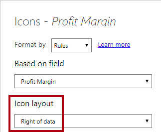
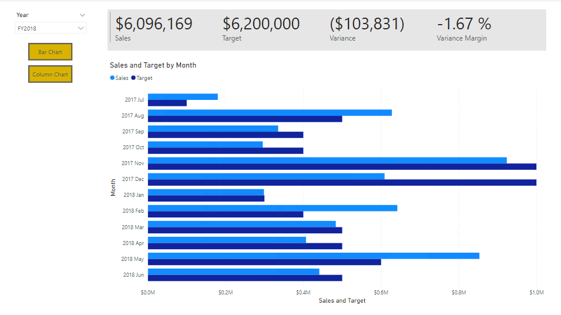
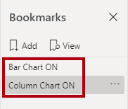

In this lab, you will enhance the **Sales Report** with advanced design features. You will:

-   Sync slicers

-   Create a drillthrough page

-   Apply conditional formatting

-   Create and use bookmarks

## Configure sync slicers

In this exercise, you will sync the report page slicers.

> [!IMPORTANT]
> This exercise will require you to login to Power BI,  you will use your existing account you created before starting this lab.

### Sync slicers

In this task, you will sync the **Year** and **Region** slicers.

1.  In Power BI Desktop, navigate to **D:\DA100\L08-design-report-in-power-bi-desktop-enhanced\Starter** folder, and open **Sales Report.pbix** file.

1. You will be prompted to login to Power BI, login using Power BI account credentials.

1.	You may get an error “Unable to connect,” the account is utilized by many learners. Click on **Edit** and select the Sales Analysis report you created in an earlier lab.    

1. On the **Sales Report** file, on the **Overview** page, set the **Year** slicer to **FY2018**.

1.  Go to the **My Performance** page, and then notice that the **Year** slicer is a different value.

	When slicers aren't synced, it can contribute to misrepresentation of data and frustration for report users. You'll now sync the report slicers.

1.  Go to the **Overview** page, and then select the **Year** slicer.

1.  On the **View** ribbon tab, from inside the **Show Panes** group, click **Sync Slicers**.

	> [!div class="mx-imgBorder"]
	> 

1.  In the **Sync Slicers** pane (at the left of the **Visualizations** pane), in the second column (which represents syncing), check the checkboxes for the **Overview** and **My Performance** pages.

	> [!div class="mx-imgBorder"]
	> 

1.  On the **Overview** page, select the **Region** slicer.

1.  Sync the slicer with the **Overview** and **Profit** pages.

	> [!div class="mx-imgBorder"]
	> 

1.  Test the sync slicers by selecting different filter options, and then verifying that the synced slicers filter by the same options.

1.  To close the **Sync Slicer** page, click the **X** located at the top-right of the pane.

## Configure drill through

In this exercise, you will create a new page and configure it as a drill through page. When you've completed the design, the page will look like the following:

> [!div class="mx-imgBorder"]
> 

### Create a drill through page

In this task, you will create a new page and configure it as a drill through page.

1. Add a new report page named **Product Details**.

	> [!div class="mx-imgBorder"]
	> 

1. Right-click the **Product Details** page tab, and then select **Hide Page**.

	Report users won't be able to go to the drill through page directly. They'll need to access it from visuals on other pages. You'll learn how to drill through to the page in the final exercise of this lab.

1. Beneath the **Visualizations** pane, in the **Drill Through** section, add the **Product | Category** field to the **Add Drill-Through Fields Here** box.

	> [!div class="mx-imgBorder"]
	> 

1. To test the drill through page, in the drill through filter card, select **Bikes**.

	> [!div class="mx-imgBorder"]
	> 

1. At the top-left of the report page, notice the arrow button.

	> [!div class="mx-imgBorder"]
	> 

	The button was added automatically. It allows report users to navigate back to the page from which they drilled through.

1. Add a **Card** visual to the page, and then resize and reposition it so it sits to the right of the button and fills the remaining width of the page.

	> [!div class="mx-imgBorder"]
	>  

	> [!div class="mx-imgBorder"]

	> 

1. Drag the **Product | Category** field into the card visual.

1. Configure the format options for the visual, and then turn the **Category Label** property to **Off**.

	> [!div class="mx-imgBorder"]
	> 

1. Set the **Background Color** property to a light shade of gray.

1. Add a **Table** visual to the page, and then resize and reposition it so it sits beneath the card visual and fills the remaining space on the page.

	> [!div class="mx-imgBorder"]
	> 

	> [!div class="mx-imgBorder"]
	>  

1. Add the following fields to the visual:

	-   Product | Subcategory
	
	-   Product | Color
	
	-   Sales | Quantity
	
	-   Sales | Sales
	
	-   Sales | Profit Margin

1. Configure the format options for the visual, and in the **Grid** section, set the **Text Size** property to **20pt**.

	The design of the drill through page is almost complete. In the next exercise, you'll define conditional formatting.

## Add conditional formatting

In this exercise, you will enhance the drill through page with conditional formatting. When you've completed the design, the page will look like the following:

> [!div class="mx-imgBorder"]
> 

### Add conditional formatting

In this task, you will enhance the drill through page with conditional formatting.

1. Select the table visual.

1. In the visual fields pane, for the **Profit Margin** field, click the down-arrow, and then select **Conditional Formatting | Icons**.

	> [!div class="mx-imgBorder"]
	> 

1. In the **Icons -- Profit Margin** window, in the **Icon Layout** dropdown list, select **Right of Data**.

	> [!div class="mx-imgBorder"]
	> 

1. To delete the middle rule, at the left of the yellow triangle, click **X**.

	> [!div class="mx-imgBorder"]
	> 

1. Configure the first rule (red diamond) as follows:

	-   In the second control, remove the value
	
	-   In the third control, select **Number**
	
	-   In the fifth control, enter **0**
	
	-   In the sixth control, select **Number**

1. Configure the second rule (green circle) as follows:

	-   In the second control, enter **0**
	
	-   In the third control, select **Number**
	
	-   In the fifth control, remove the value
	
	-   In the sixth control, select **Number**

	> [!div class="mx-imgBorder"]
	> 

	The rules are as follows: display a red diamond if the profit margin value is less than 0; otherwise if the value is great or equal to zero, display the green circle.

1. Click **OK**.

1. In the table visual, verify that the that the correct icons are displayed.

	> [!div class="mx-imgBorder"]
	> 

1. Configure background color conditional formatting for the **Color** field.

1. In the **Background Color -- Color** window, in the **Format By** dropdown list, select **Field Value**.

	> [!div class="mx-imgBorder"]
	> 

1. In the **Based on Field** dropdown list, select **Product | Formatting | Background Color Format**.

	> [!div class="mx-imgBorder"]
	> 

1. Click **OK**.

1. Repeat the previous steps to configure font color conditional formatting for the **Color** field, using the **Product | Formatting | Font Color Format** field.

The background and font colors are sourced from the **ColorFormats.csv** file in Data folder.

## Add bookmarks and buttons

In this exercise, you will enhance the **My Performance** page with buttons, allowing the report user to select the visual type to display. When you've completed the design, the page will look like the following:

> [!div class="mx-imgBorder"]
> 

### Add bookmarks

In this task, you will add two bookmarks, one to display each of the monthly sales/targets visuals.

1. Go to the **My Performance** page.

1. On the **View** ribbon tab, from inside the **Show Panes** group, click **Bookmarks**.

1. On the **View** ribbon tab, from inside the **Show Panes** group, click **Selection**.

1. In the **Selection** pane, beside one of the **Sales and Target by Month** items, to hide the visual, click the eye icon.

	> [!div class="mx-imgBorder"]
	> 

1. In the **Bookmarks** pane, click **Add**.

	> [!div class="mx-imgBorder"]
	> 

1. To rename the bookmark, double-click the bookmark.

1. If the visible chart is the bar chart, rename the bookmark as **Bar Chart ON**, otherwise rename the bookmark as **Column Chart ON**.

1. In the **Selection** pane, toggle the visibility of the two **Sales and Target by Month** items.

	In other words, make the visible visual hidden, and make the hidden visual visible.

1. Create a second bookmark, and name it appropriately (either **Column Chart ON** or **Bar Chart ON).**

	> [!div class="mx-imgBorder"]
	> 

1. In the **Selection** pane, to make both visuals visible, simple show the hidden visual.

1. Resize and reposition both visuals so they fill the page beneath the multi-card visual, and completely overlap one another.

	> [!TIP]
	> To select the visual that is covered up, select it in the **Selection** pane.

	> [!div class="mx-imgBorder"]
	> 

1. In the **Bookmarks** pane, select each of the bookmarks, and notice that only one of the visuals is visible.

The next stage of design is to add two buttons to the page, which will allow the report user to select the bookmarks.

### Add buttons

In this task, you will add two buttons, and assign bookmark actions to each.

1. On the **Insert** ribbon, from inside the **Elements** group, click **Button**, and then select **Blank**.

	> [!div class="mx-imgBorder"]
	> 

1. Reposition the button directly beneath the **Year** slicer.

1. Select the button, and the in the **Visualizations** pane, turn the **Button Text** property to **On**.

1. Expand the **Button Text** section, and then in the **Button Text** box, enter **Bar Chart**.

1. Format the background color, using a suitable color.

1. Turn the **Action** property to **On** (located near the bottom of the list).

1. Expand the **Action** section, and then set the **Type** dropdown list to **Bookmark**.

1. In the **Bookmark** dropdown list, select **Bar Chart ON**.

1. Create a copy of the button by using copy and paste, and then configure the new button as follows:

	-   Set the **Button Text** property to **Column Chart**
	
	-   In the **Action** section, set the **Bookmark** dropdown list to **Column Chart ON**

### Publish the report

In this task, you will publish the report.

1. Select the **Overview** page.

1. In the **Year** slicer, select **FY2020**.

1. In the **Region** slicer, select **Select All**.

1. Save the Power BI Desktop file.

1. Publish the report to your **Sales Analysis** workspace.

1. When prompted to replace the report, click **Replace**.

1. Leave Power BI Desktop open.

In the next exercise, you will explore the report in Power BI service.

## Explore the report

In this exercise, you will explore the **Sales Report** in Power BI service.

> [!NOTE]
> The exercise will require you to login to Power BI, you will use your existing account to login before starting the lab.

### Explore the report

In this task, you will explore the **Sales Report** in Power BI service.

1. In the Edge, in the Power BI service, open the **Sales Report** report.

1. To test the drill through report, in the **Quantity by Category** visual, right-click the **Clothing** bar, and then select **Drill Through | Product Details**.

	> [!div class="mx-imgBorder"]
	> 

1. Notice that the **Product Details** page is for **Clothing**.

1. To return to the source page, at the top-left corner, click the arrow button.

1. Select the **My Performance** page.

1. Click each of the buttons, and then notice that a different visual is displayed.

### Finish up

In this task, you will complete the lab.

1. To return to the workspace, in the breadcrumb trail, click your workspace name.

1. Leave the Edge browser window open.

1. In Power BI Desktop, go to the **My Performance** page, and in the **Filters** pane, remove the **Salesperson** filter card.

	> [!div class="mx-imgBorder"]
	> 

1. Select the **Overview** page.

1. Save the Power BI Desktop file, and then republish to the workspace.

1. Close Power BI Desktop.

