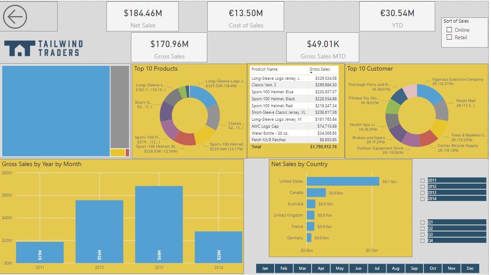
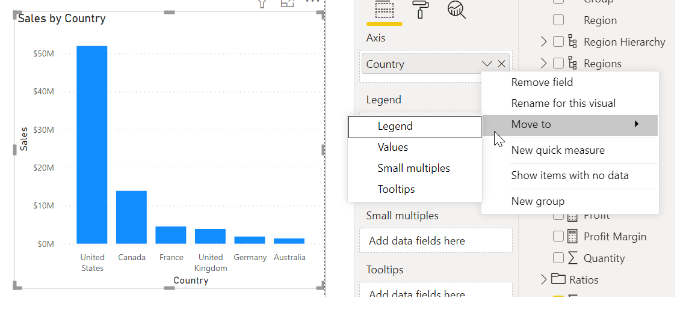
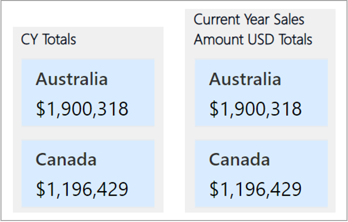
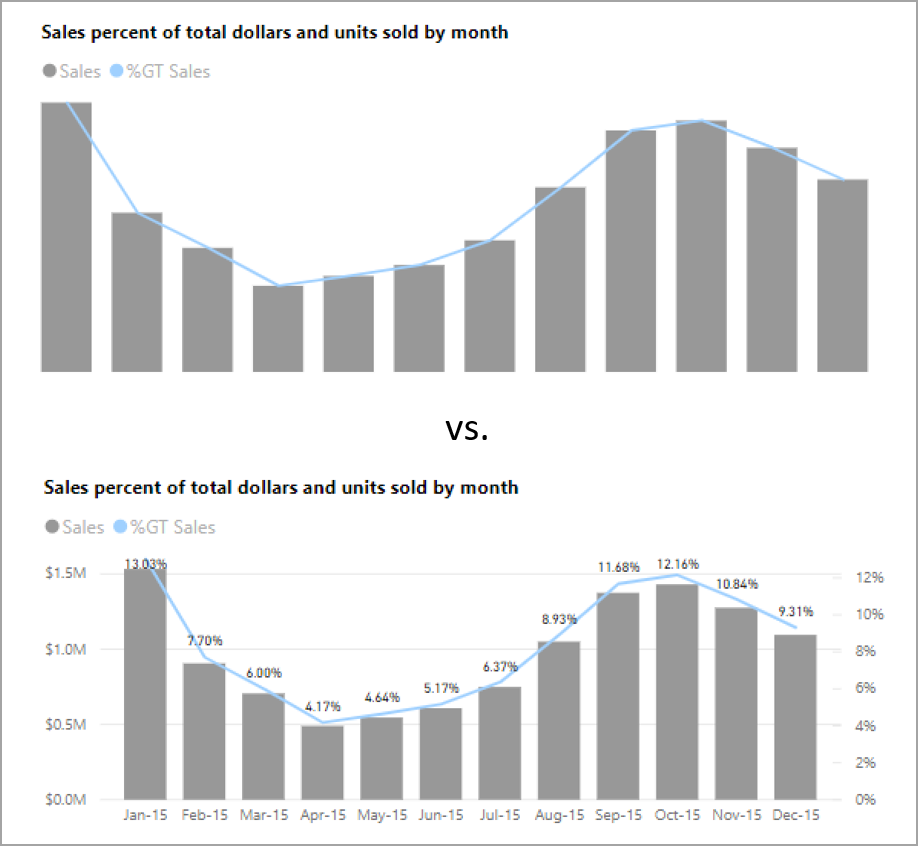

The page layout of the reports you create in Power BI Desktop will likely depend on the business requirements, the context of the underlying data, and the output requirements. For example, if you are designing a dashboard, you'll need to present high-level information on a single page. If you are designing a report, it is a multi-perspective view into your dataset, with visuals that represent different findings and insights from that dataset.

## Report design best practice

The first step in designing a great report layout is choosing the correct format to use. It's likely that your manager, or whomever requested the report, will give you some requirements in terms of the format. If not, you'll need to imagine the audience and take a best guess at what kind of format they'll want.

For example, if your report users have a technical background and are looking for the nitty-gritty, you can use multiple, complex visuals that offer the most detail, along with interactive slicers. Conversely, if your users are just looking for quick data insights at a high level, you could use a small range of basic visuals.

Even if you have been given some layout requirements, you still need to carefully consider the audience of your report. Your goal is to provide the audience with the information they need, in the most optimal way. While you may have strong feelings towards what to data to display and how to display it, ultimately the report is not for you, it is for a dedicated audience that needs to make business decisions based on your report.

It is also important to consider the different needs that the end users within that audience may have. End users of your report might have hearing, motor, cognitive, or visual impairment. To cater for those needs, you'll have to create a report that offers an accessible experience, which means it is easy to navigate and understand by keyboard or screen reader users. You'll learn more about design and configuring your report for accessibility that later in this unit.

You also need to carefully consider each visual and element that you plan on using in the report. Everything should have a purpose, and you should consider how each element will look to your report users. While you might want to use lots of different types visuals for the sake of variety or to show off your skillset, sometimes a simple visual is all that you need. It's likely that your organization will have style guidelines for reports, in which case you'll have to adhere to particular color scheme and font. Do keep in mind also that the more visuals you use in your report, the more they impact on the performance of your report. You'll take a close look at visuals later in this unit.

Here are some other key guidelines for creating a well-designed report layout:

-   Draw a sketch of your report layout, so you can get a quick picture of what will look like, before you spend lots of time physically designing it. You could even draw multiple sketches where you try out different ideas, then discuss these ideas with your team to help you choose the best layout design.

-   Focus on the most important information. Highlight key parts of your report with a bright color or summary icon, so that it stands out, and users drawn to the most critical metrics.

-   Select the right background for the context of your report. It is said that a white background makes your report look clean and business-like, a black background draws the eye to colorful highlights on the report, and an image used as a background adds numerous feeling.

The following image depicts an example of a badly designed layout; something you should avoid. At the end of this unit, you will see the same report but with an improved design.

> [!div class="mx-imgBorder"]
> 

The following sections provide more detailed guidance for setting up the report page and using visuals.

### Report page

It is important to consider that you and the report users might view the reports on screens with different aspect ratios and sizes.

The default display view is **Fit to page**, which means that the contents are scaled to best fit the page. If you need to change this view, go to the **View** tab, select **Page view**, and then select your preferred page view option, as illustrated in the following screenshot.

> [!div class="mx-imgBorder"]
> 

To access the page settings, select the white space on your report canvas to open the **Format** pane. You can then configure the following settings to suit your needs: **Page information**, **Page alignment**, **Page size**, **Wallpaper**, **Page background**, and **Filter pane**.

> [!div class="mx-imgBorder"]
> 

### Visuals 

You might want to use a combination of visuals in your report, such as cards, charts, tables, slicers, and so on. It is important to use the right number of visuals on a page, and then size and position those visuals in the best way.

#### Number of visuals

Consider the number of visuals (including slicers) that you want to use on each report page. More visuals might have the opposite effect to what you are trying to achieve, your report might look too busy, and users might feel overwhelmed and not know where to look. Also, visuals are a key factor in the performance of your report, they contribute to performance issues. The fewer visuals you use, the better performance you'll get.

It's best to limit the number of visuals you use on a page. Examine each visual and ask yourself if it is necessary. If a visual does not add any value to the end user, you should not use it in your report.

Rather than using multiple visuals, you can provide information in other ways, such as drill through pages and report page tooltips. You'll learn more about these in subsequent units in this module.

#### Position of visuals

When you add visualizations to a report, you can move those visuals to specific locations on the page, and make them bigger or smaller for a more effective display.

It is best practice to place the most important visual in the top-left corner of your report, as your report users will most likely from read left to right, and top to bottom. You might also want to place your organization's logo in or near this area. You can then arrange the other visuals accordingly.

To move a visualization, select any area of the visualization and then drag it to the new location.

To evenly distribute distance between visuals located on the canvas, you can also use the **Align** function. Use **CTRL**+click to select all of the visuals that you want to align, then select the **Format** tab and select **Distribute horizontally**.

> [!div class="mx-imgBorder"]
> 

The visuals will be evenly distributed against each other.

> [!div class="mx-imgBorder"]
> 

#### Size of visuals

When you add a visual to a report, Power BI determines the size of that visual by default. You can resize that visual to present the information it displays in the most optimal way. For example, if it is a small car visual, you might want to make it even smaller. Similarly, if it is a scatter chart visual with much data, you might want to make that visual a larger size, so users can see the data more clearly.

To resize a visual, select the visual to display its border, then and click and drag the dark frame handles to the size you want it to be.

#### Interaction of visuals

The visuals that you add to your report will interact with each other. For example, when you select an element in one visual, such as a product category, the other visuals will update in relation to that element, they might highlight or filter the specific data they display. Therefore, when you are designing the report, it is important to understand these interactions and consider how they might affect the overall user experience of the report. You have control over how interactions flow between the visuals, you might want to change a filter action to a highlight, and vice versa, or even prevent an interaction from happening. You'll learn how to do this later in this module.

#### Hierarchies in visuals

It is likely that you'll have a number of hierarchies in your data, so you should consider how these hierarchies will affect how the data displays in the visuals, and the navigation experience of your report users. You can set how hierarchies are presented in the visuals. You can also determine the hierarchical path of visuals, so you have full control over what level of detail can be accessed. You'll learn more about hierarchies later in this module.

## Report accessibility

As mentioned in the introduction of this unit, it is important to consider that your end-users may have hearing, motor, cognitive, or visual impairments. You must design a report that adheres to accessibility standards and makes use of accessibility features that are available within Power BI Desktop.

Designing a report that offers an accessible experience will benefit all report users, as it ensures your report has an effective design, and uses consistent formatting and a color scheme or theme.

In general, when using Power BI with a screen reader, it is recommended that you turn scan mode or browse mode off.

To improve the process of creating reports with screen readers, a context menu is available. The menu allows moving fields in the well up or down in the **Fields** list. The menu also allows moving the field to other wells, such as **Legend** or **Value** or others.

> [!div class="mx-imgBorder"]
> 

### Accessibility standards

Power BI is committed to accessibility standards under the Web Content Accessibility Guidelines. (WCAG) The standards help ensure that your Power BI experiences are accessible to as many people as possible. When you build accessible reports or dashboards, that content is accessible for anyone who views them using Power BI Mobile.

Web Content Accessibility Guidelines (WCAG) help make web content accessible to people with disabilities. The following are key principles of the guidelines:

-   Perceivable - Information and user interface components must be presentable to users in ways they can perceive.

-   Operable - User interface components and navigation must be operable.

-   Understandable - Information and the operation of user interface must be understandable.

### Accessibility features

The following accessibility features are built-in to Power BI Desktop, so you don't need to do any configuration in this regard:

-   Keyboard navigation

-   Screen-reader compatibility

-   High contrast colors view

-   Focus mode

-   Show data table

Accessibility features that you do need to configure include the following:

#### Alt text

To cater for report users that user screen readers, you can use alternative (Alt) text to describe the appearance and function of objects (such as a visual, shape, and so on) on the report page. Using alt text ensures that users understand what you are trying to communicate with those objects, even if they cannot see them.

To add alt text to an object, select that object and in the **Visualizations** pane, open the **Format** pane. Expand the **General** section, scroll to the bottom of the options, then type a description into the **Alt Text** box. Repeat this step for every object that conveys meaningful information on a report.

If you do not want to use static text, you can use DAX measures and conditional formatting to create dynamic alt text. Screen readers will then call out values specific to the data that a report user is viewing.

To apply conditional formatting, right-click the **Alt Text** box, select **Conditional Formatting**, then configure the settings as required.

> [!div class="mx-imgBorder"]
> 

#### Tab order

To help keyboard users to navigate your report in an order that matches the way visual users would, you can set the tab order.

To set the tab order, select the **View** tab in the ribbon, then select **Selection Pane**. On the **Selection** pane that displays, use the up and down arrow buttons to move the objects to the correct order, or select an object with your mouse and drag it into the position you want it in the list.

To hide an object from the tab order, select the number next to that object. For example, it's best to hide any decorative shapes and images that you have in your report.

> [!div class="mx-imgBorder"]
> 

#### Titles and labels

To help all users, you should add use clear, concise, descriptive titles for your visuals and report pages. Avoid using acronyms or jargon that new users or users who are external to your organization will not understand.

Compare the following images, where the image on the left shows a visual with an acronym in the title, and the image on the left shows a visual with a clearer title.

> [!div class="mx-imgBorder"]
> 

You should also make sure that all labels within a visual are easy to read and understand. You can turn on or off the labels for each series in your visual or position them above or below a series to make them clearer. Don't turn labels on for every visual, as it might have the opposite effect by distracting users and making your report less accessible.

Compare the following images, where the first image has few numbers or descriptions of the data, and the second has many. 

> [!div class="mx-imgBorder"]
> 

#### Markers

It's best practice to avoid using color (including features conditional formatting) as the only way of conveying information. Instead, you can use markers to convey different series. For Line, Area, and Combo visuals, as well as Scatter and Bubble visuals, you can turn Markers on, and use a different shape for each line.

Keep in mind that if you turn markers on for every visual, it might be distracting and make your report less accessible for users.

To turn Markers on, in the **Format** pane, expand the **Shapes** section, then scroll down and move the **Show Markers** slider to the **On** position.

> [!div class="mx-imgBorder"]
> 

> [!div class="mx-imgBorder"]
> 

#### Themes

To make your reports even more accessible, you should ensure that there is enough contrast between the text and any background colors; the contrast ratio should be at least 4.5:1. There are several tools that you can use to check your report colors, such as Color Contrast Analyzer, WebAIM, and Accessible Colors.

You should also consider that some report viewers might have color vision deficiencies. Using fewer colors or a monochrome palette in your report can help mitigate creating reports that are inaccessible. The following color combinations are difficult for users with color vision deficiencies to distinguish, so you should avoid using them together in a chart, or on the same report page.

-   green and red

-   green and brown

-   blue and purple

-   green and blue

-   light green and yellow

-   blue and grey

-   green and grey

-   green and black

Power BI Desktop has built-in themes you can use to make your report more accessible and generally look better. You can access these themes from the **View** tab. Select the **Expand** button to view all available themes and related options. Select any theme and it automatically apply across whole report - all visuals will use the colors and formatting from your selected theme as their defaults.

> [!div class="mx-imgBorder"]
> 

You can also import or create your custom themes by expanding the **Themes** options:

> [!div class="mx-imgBorder"]
> 

The following image depicts the same report that was shown at the beginning of this unit, however, in this image the report has a better design - it has a planned layout, consistent color scheme and formatting.

> [!div class="mx-imgBorder"]
> 