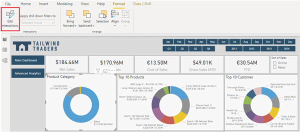
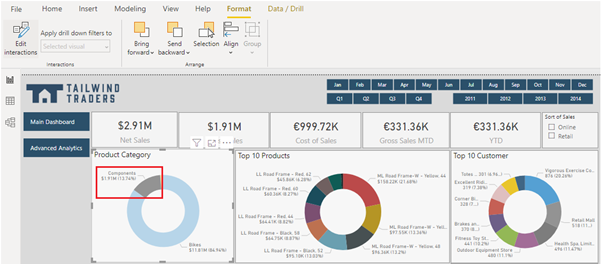
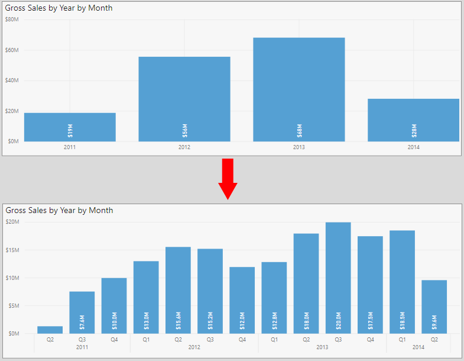
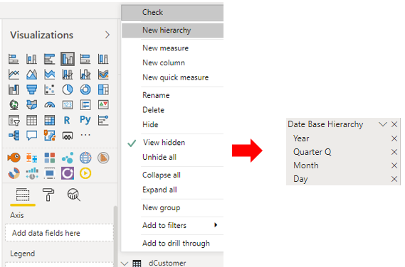

In Power BI Desktop, your report is dynamic. When you make a selection on one visual in the report, other visuals might change to reflect that selection. Similarly, if hierarchies are in your data, you can move up and down the hierarchy to see the data at different levels.

The following sections explain how the basic interactions work and how you can use hierarchies in your visuals. 

## View interactions

When multiple visuals exist on the same report page, they all interact with each other. For that reason, you should become familiar with these interactions to see how your report changes.

Compare the following two images. In the first image, the data displays at a high level. 

> [!div class="mx-imgBorder"]
> 

When you select an element in a visual, such as **Components** in the **Product Category** visual, the other visuals update to reflect your selection, as illustrated in the second image.

> [!div class="mx-imgBorder"]
> 

When you have become familiar with the interactions, you might want to make changes to control how those interactions flow between the visuals. This process is further explained later in this module.

## Use hierarchies

A hierarchy is a structure in which groups are ranked one above the other according to a specific status. Think of your own organizational hierarchy, where the CEO is at the top level, then managers in the middle level, and employees at the lower level. Similarly, you'll likely have hierarchies for your data in Power BI. For example, you could have a time hierarchy with levels such as year, quarter, month, and day, or a product hierarchy with levels such as category, subcategory, and product.

Regarding dates, Power BI creates hierarchies for you automatically. When you select the hierarchy in the **Fields** pane, the date hierarchy is added to the **Axis** field on the **Visualizations** pane and a blank visual is created for you, which is ready for additional fields. The hierarchy icons are located above the visual, as illustrated in the following image.

> [!div class="mx-imgBorder"]
> 

When you add another field to the visual, the visual becomes useful, and you can then use the hierarchy icons to navigate through the hierarchy. Power BI creates a predefined drill path for the data. In the following image, the **Gross Sales** field was added to the visual and you can see the data at the highest level (year). Then, when the **Expand all down one level in the hierarchy** button was selected, the hierarchy was expanded down by one level (quarter). If you were to select the button again, the visual would update to display the next lower level in the hierarchy (month), and so on.

> [!div class="mx-imgBorder"]
> 

Another navigation option is the **Go to the next level in the hierarchy** button. When you select either hierarchy option, select the **Drill up** button to move back up the hierarchy.

The default date hierarchy feature in Power BI is quick and simple to use. However, if you have your own date table, you can use it to create the hierarchy instead. In the following image, the **Year**, **Month**, **Quarter**, and **Day** fields were added to the **Axis** field well on the **Visualizations** pane. The data result is the same as  the default hierarchy, so you can navigate through the hierarchy in the same way.

> [!div class="mx-imgBorder"]
> 

You can also predefine the hierarchy path for your report users to remove any guesswork. For example, you might want to prevent users from viewing a particular hierarchy level. To do so, remove all fields from the **Axis** well and then, in the **Fields** pane, right-click the field that you want to set as the top level of the hierarchy and select **New hierarchy**. The new hierarchy displays in the list in the **Fields** pane. You can now drag and drop other fields into the new hierarchy or right-click each field and select **Add to hierarchy**.

> [!div class="mx-imgBorder"]
> 

Ensure that your visual is selected, and then select the **New hierarchy** field in the **Fields** pane to apply it to the visual.

> [!div class="mx-imgBorder"]
> 

You can use the hierarchy buttons above the visual to expand the hierarchy and drill back up again.
