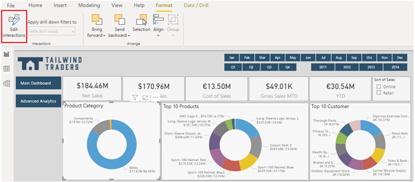
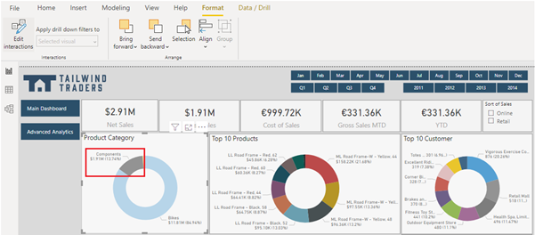
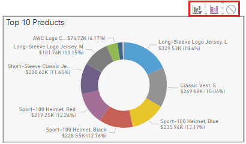
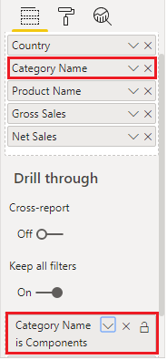
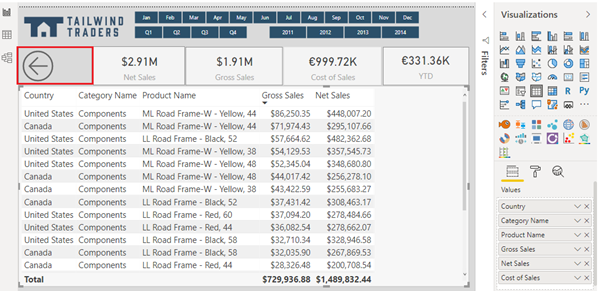
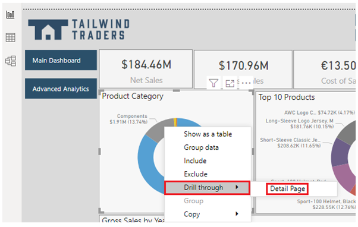
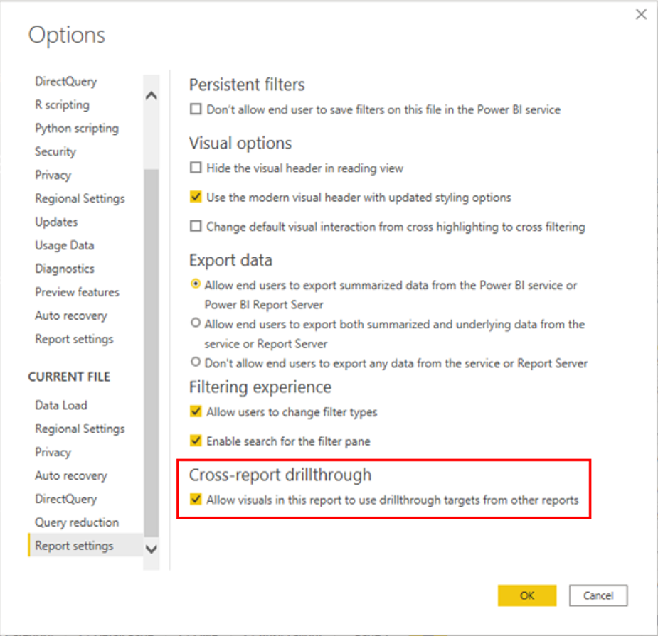

To ensure that you have full control over the behavior of your report and can determine the expected user experience, you can edit the default interactions and use the drillthrough features.

## Edit interactions

You can use visual interaction controls to customize how the visualizations on your report page impact each other, in other words, filter and highlight each other.

For example, when you select an item in a visual, the other visuals update to display data for that item; they might be highlighting or filtering the selected data. You can stop this occurrence from happening, or change a highlight action to a filter action and vice versa. Therefore, you have the power to determine what data is displayed for a specific selection that you've made.

To enable the visual interaction controls, select a visualization, go to the **Format** tab in the ribbon, and then select **Edit interactions**.

> [!div class="mx-imgBorder"]
> 

The **Edit interactions** button turns grey to show that it's enabled, and **Filter**, **Highlight**, and/or **None** icons are added to the other visualizations on the report page. When you hover over an icon, a grey box displays over the related visual. The icon in bold is the one that is being applied. In the following image, notice that the tree map is cross-filtering the card visuals and cross-highlighting the column chart. You can now change how the selected visualization interacts with the other visualizations on the report page.

> [!div class="mx-imgBorder"]
> 

You can now select each visualization on your report page, one at a time, to see how it interacts with the other visualizations. If you don't like the behavior that you see, you can change the interactions. These changes are saved with the report, so your report users will have the same visual interaction experience as you do.

The following example shows how all elements are updated after the Components category has been selected. You can compare this image to the first image in this unit, when no category was selected.

> [!div class="mx-imgBorder"]
> 

To change an interaction of a selected visual, select the required interaction icon. Remember, the applied interaction is displayed in bold. The following image shows that:

-   The selected interaction is cross-highlighted because the **Highlight** icon is displayed in bold.

-   You can change the interaction to cross-filter by selecting the **Filter** icon.

-   You can remove the interaction altogether by selecting the **None** icon.

> [!div class="mx-imgBorder"]
> 

Keep in mind that the number of interactions between your visuals will impact the performance of your report. To optimize the performance of your report, consider the query reduction options that are available within Power BI Desktop. You have the option to send fewer queries (which will reduce query chattiness) by disabling cross-highlighting/filtering by default. You can also disable certain interactions that would result in a poor experience, if the resulting queries take a long time to run.

You can access the query reduction settings by selecting **File > Options and settings > **Options**, then scrolling down and selecting the **Query reduction** option.

> [!div class="mx-imgBorder"]
> 

## Drill through

You can use the **Drill through** feature to create a page in your report that focuses on a specific entity, such as a product, category, or region. You can then access this page when you drill through from the related visuals that are on other pages in your report. The information that displays on the drillthrough page will be specific to the item that you select on the visual, as illustrated in the following image.

> [!div class="mx-imgBorder"]
> 

In this example, you will create a drillthrough for the product category entity. You can start by creating a page in your report and rename it to **Details Page**. On that page, you will add a visual for the entity that you want to provide the drillthrough for (a table that displays data for the **Category**, **SubCategory**, **Country**, **Gross Sales**, and **Net Sales** fields).

> [!div class="mx-imgBorder"]
> 

Then, from the **Values** section of the **Visualizations** pane, drag the field (**Category Name**) for which you want to enable drillthrough in the **Drill through** filters well.

> [!div class="mx-imgBorder"]
> 

Ensure that the **Keep all filters** option is set to **ON**, so when you drill through from a visual, the same filters will be applied on the **Details** page.

Power BI Desktop automatically creates a **Back** button visual on the page for you. This button is for navigation purposes, so your report users can return to the report page from which they came. You can reposition and resize this button on the report page or replace it with your own type of button.

> [!div class="mx-imgBorder"]
> 

To use drillthrough, right-click a data point on a visual in another report page, select **Drill through**, and then select the focused page (**Details page**) to get details that are filtered to that context.

> [!div class="mx-imgBorder"]
> 

## Cross-report drillthrough

The **Cross-report drillthrough** feature allows you to contextually jump from one report to another report in the same Power BI service workspace or app. This feature allows you to connect two or more reports that have related content. You can also pass filter context along with that cross-report connection.

For example, you can select a data point on a visual in one report, then drill through to related, detailed information that is in another report.

> [!div class="mx-imgBorder"]
> 

To enable **Cross-report drillthrough**, you first need to validate the data models for the source and target reports. Though the schemas in each report don't have to be the same, both data models must contain the fields that you want to pass. Also, the names of those fields, and the names of the tables that they belong to, must be identical. The strings must match and are case-sensitive. If they are not identical, you must update the field name or table name in the underlying model.

When you have validated your data models, you need to enable the **Cross-report drillthrough** feature in Power BI Desktop. Go to **File > Options and settings > Options**, then scroll down the **Current File** settings and select **Report settings**. In the **Cross-report drillthrough** section, select the check box for **Allow visuals in this report to use drillthrough targets from other reports** and then select **OK**.

> [!div class="mx-imgBorder"]
> 

> [!NOTE]
> The **Cross-report drillthrough** feature can also be enabled/disabled in the **Report settings** in Power BI service.

Next, you will set up a target page for the cross-report drillthrough in the same way that you would set up a page for a drillthrough within a report in the previous section. The other visuals will target that page for drillthrough.

When you have set up the target page, go to the **Drillthrough** section of the **Visualizations** pane and set the **Cross-report** option to the **On** position. Then, drag the fields that you want to use as drillthrough targets into the **Drill through** filters well. For each field, select whether you want to allow drillthrough when the field is used as a category or when it's summarized like a measure.

> [!div class="mx-imgBorder"]
> 

Select whether you want the **Keep all filters** option **On** or **Off** for the visual. If you don't want to pass filters that are applied to the source visual to your target visual, select **Off**.

Similar to when you create a drillthrough for a single report, Power BI Desktop automatically adds a **Back** button to the target drillthrough page. However, in this case, you should delete the **Back** button because it only works for navigation within a report.

When you save and publish your changes, you can use the **Cross-report drillthrough** feature. Select the source report in the Power BI service, and then select a visual that uses the **Drill through** field in the way that you specified when you set up the target page. Right-click a data point on the visual, select **Drill through**, and then select the drillthrough target. Notice that the **Cross-report drillthrough** targets are formatted as Page name [Report name].
