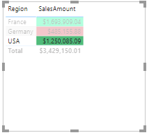

Conditional formatting in Power BI Desktop allows you to specify customized cell colors, including color gradients, that are based on field values. Additionally, you can use conditional formatting to represent cell values with data bars, KPI icons, or active web links.

You might want to use conditional formatting to highlight or differentiate the data that is displayed in your visual. This approach will help you and other users see key data insights easily.

For example, you could set up conditional formatting for your sales figures. If the sales amount falls below zero, you could display this value in red, a color that is associated with danger, so that users will see it clearly and know that they need to take immediate action. Conversely, you could set a value for your sales target, displaying amounts over that target amount in a green color to signify that the target is met and all is going well.

The following example shows conditional formatting being used in two visuals, **Table** and **Matrix**, where it is possible to set different conditions on a column. You can apply conditional formatting to any text or data field, but the formatting needs to be based on a field that has numeric, color name or hex code, or web URL values.

In this example, you will select the table visualization and then, in the **Format** pane, expand the **Conditional formatting** section. Turn on the **Background color** option, and then select the **Advanced controls** option. In the window that displays, set a condition to change background color to red for cells that have low values and  green for cells with high values.

> [!div class="mx-imgBorder"]
> 

The Power BI conditional formatting function will automatically detect the highest and the lowest number in each column and will apply background coloring according to the values. 

> [!div class="mx-imgBorder"]
> 

If you want to remove the conditional formatting that you set, select the **Values** tab on the **Visualizations** pane and right-click the value (field) that you set the formatting for. Select **Remove conditional formatting** and then select the type of formatting that you want to remove, for example **All** or **Background color**.

> [!div class="mx-imgBorder"]
> 

