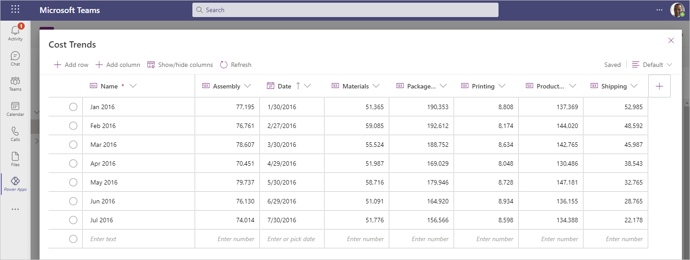

Data empowers employees to make better decisions, accelerate business transformation, and grow the organization. Providing business intelligence reports and dashboards offers users a way to visualize, interact, and share insights with others. Power BI and Dataverse for Teams embeds powerful self-service reports and dashboards. That way, users can access your organizations' data and insights without having to leave Microsoft Teams.

The learning objectives for this module are:

- Import a Dataverse dataset into Power BI.

- Create a new Power BI report based on the data set.

- Edit the report.

- Share the report with others.

> [!Note]
> You must have the appropriate Power BI license to build and share Power BI reports. For more information about Power BI licenses, please see the Summary unit links at the end of this module.

## Dataverse for Teams sample data

For this module, we need a table in Dataverse for Teams. You can use thie [Cost trends](https://github.com/MicrosoftDocs/mslearn-developer-tools-power-platform/blob/master/power-apps/dataverse-power-bi/CostTrends.zip) spreadsheet to upload data.  Select **Download** and then extract the spreadsheet to your local computer. Select a Microsoft Team and create a new table named "Cost Trends" with the following fields and data types:

| Column Name | Data Type |
|-------------|-----------|
| Title | String |
| Date | Date |
| Materials | Number |
| Printing | Number |
| Assembly | Number |
| Production Total | Number |
| Shipping | Number |
|   Package Total | Number |

Enter the following sample data into the table, then save the table.

> [!div class="mx-imgBorder"]
> 
