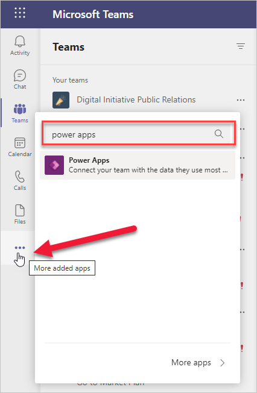
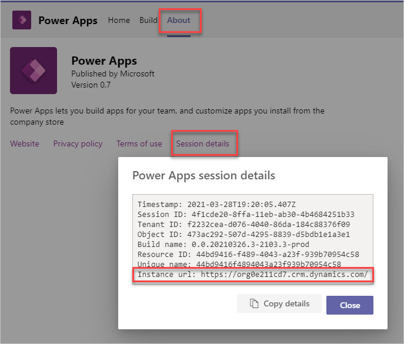
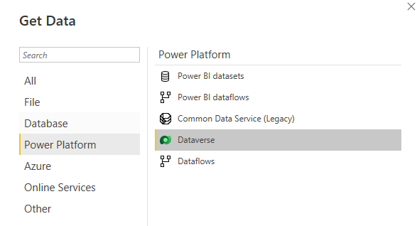
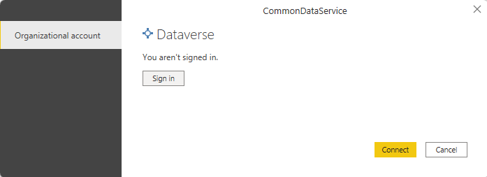
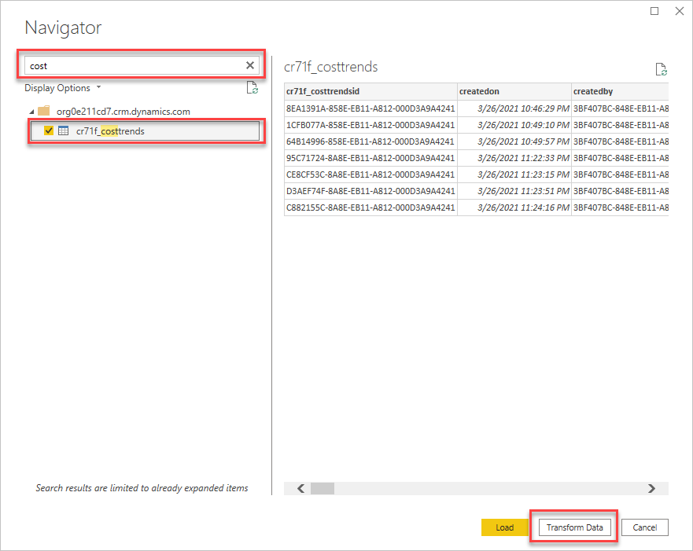
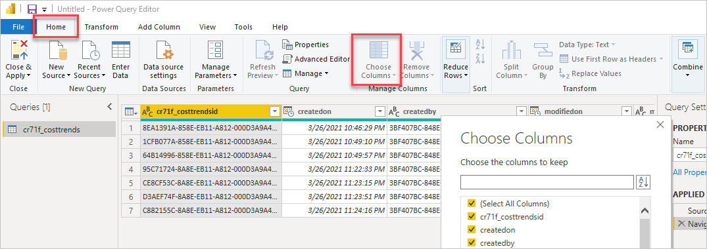
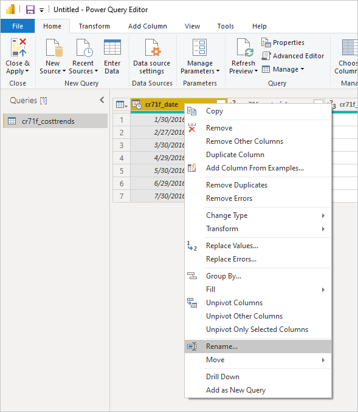
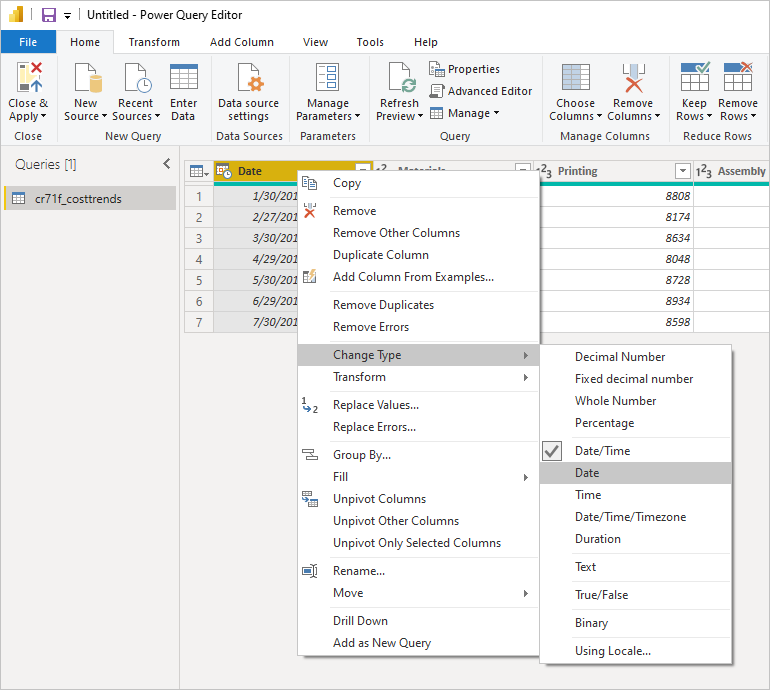
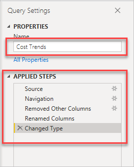

To connect to Dataverse for Teams data, you need to install Microsoft Power BI Desktop and then get the environment URL.

## Install Power BI Desktop

Power BI Desktop is a free application that allows you to connect, transform, and visualize your data. It can connect to many data sources, including Microsoft SQL, Excel, Microsoft Lists, and Dataverse for Teams tables. Then, Power BI Desktop will transform and clean the data to create interactive reports.

Two ways to install Power BI Desktop are:

- **Windows 10** - Use the [Microsoft Store](https://www.microsoft.com/store/productId/9NTXR16HNW1T/?azure-portal=true). Software updates will automatically install each month.

- **Windows 8 and 10** - Download the installer from [https://powerbi.microsoft.com/desktop](https://powerbi.microsoft.com/desktop/?azure-portal=true). Each month, you'll be prompted to install the latest updates to the application.

## Get the environment URL for the Dataverse for Teams table

The environment URL for the Dataverse for Teams table is required when you are connecting with Power BI Desktop. To find the environment URL, follow these steps:

1. Launch Teams or use your browser to open [https://teams.microsoft.com](https://teams.microsoft.com/?azure-portal=true).

1. Select the **More added apps** ellipsis then type in **power apps** in the search bar.

1. Select **Power Apps** from the search results. If you don't already have it installed click, on **More apps >** and install it from the Teams app store.

    > [!div class="mx-imgBorder"]
    >     

1. Select the **Build** tab.

1. Select the team that contains the Dataverse for Teams table.

    > [!div class="mx-imgBorder"]
    > 

1. Select the **About** tab and then select **Session details**. Copy the **Instance url** into notepad for later reference. The **Instance url** is the environment URL to connect Power BI Desktop to the Dataverse for Teams table.

    > [!div class="mx-imgBorder"]
    > 

## Connect to Dataverse for Teams table data

To connect to Dataverse for Teams table data, follow these steps:

1. Launch Power BI Desktop.

1. From the **Home** ribbon, select **Get Data**.

1. Select **Microsoft Power Platform** then **Dataverse**. Select **Connect** to continue.

    > [!div class="mx-imgBorder"]
    > 

1. Enter the environment URL for the Dataverse for Teams table that you copied previously. Remove the **https://** protocol and the trailing slash (**/**) from the URL. Set **Data Connectivity mode** to **Import** and then select **OK**.

    > [!div class="mx-imgBorder"]
    > 

1. Select **Sign in** and then use your credentials when prompted. After you've successfully signed in, select **Connect**.

1. In the **Navigator** screen, enter the name of the table to locate it. Select the table by selecting the check box next to the name. For this example, select the Cost Trends table that you created previously.

    > [!div class="mx-imgBorder"]
    > 

1. Select **Transform Data** to open the table in Power Query Editor.

    Power Query Editor allows you to clean the data and helps make it easier for you to create charts, graphs, and other visualizations. The following steps use Power Query Editor to transform the data.

## Transform the data

Transforming data is the process of changing data to make it easier to work with. For example, you might want to bring in only a select few columns, change data types, or filter the data before creating Power BI reports. Dataverse for Teams tables have system columns that are used by Dataverse for Teams. You don't necessarily need these system columns when you are creating Power BI visualizations.

For the Cost Trends table data, you need to remove unnecessary columns, rename columns, and verify that the correct data types are used:

1. To reduce the number of columns in the Power Query Editor **Home** ribbon, select **Choose Columns**.

    > [!div class="mx-imgBorder"]
    > 

1. Select only the following columns. The prefix is different in your environment.

    - cr71f_date
    - cr71f_materials
    - cr71f_printing
    - cr71f_assembly
    - cr71f_productiontotal
    - cr71f_shipping
    - cr71f_packagetotal

    Select **OK** to continue.

1. Rename columns by right-clicking the column name and selecting **Rename**.

    > [!div class="mx-imgBorder"]
    > 

    Rename the columns as follows:

    - Date
    - Materials
    - Printing
    - Assembly
    - Total Production Cost
    - Shipping
    - Total Cost

1. Verify that the data type is correct for each column by looking at the icon next to the column names. For example, the Date column uses the **Date/Time** data type, so 12:00:00 AM is added to each entry. Right-click the column name and select **Change Type > Date** so that only the date appears.

    > [!div class="mx-imgBorder"]
    > 

   Common data types and their icons are shown in the following table.

    | Icon | Data type |
    |------|-----------|
    |  | Date/Time |
    |  | Date |
    |  | Whole number |
    |  | Percentage |
    |  | String |

1. In the **Query Settings** tab, rename the table by selecting **Name** and entering **Cost Trends**. All transformation actions are listed under **Applied Steps**. You can undo a step by deleting it from the list.

    > [!div class="mx-imgBorder"]
    > 

1. Select **Close & Apply** from the **Home** ribbon to load the data with the transformations into Power BI Desktop.

For more information about Power Query Editor, see the Summary section at the end of the module.
