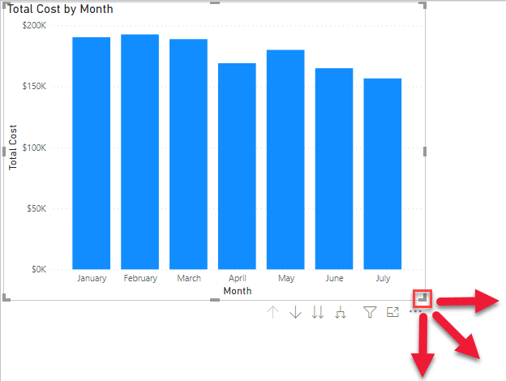
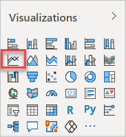
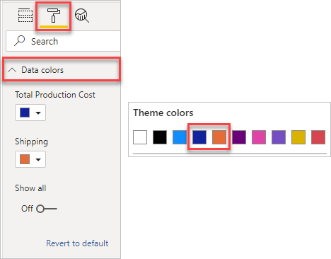

Previously, we connected to our Dataverse for Teams table data and then transformed it. We can build a report with interactive visualizations using the Power BI **Report** view. The report view consists of:

- The **Report** canvas where visualizations are created and arranged (1 in the image).

- The **Filters** pane allows you to filter and only work with subsets of data (2 in the image).

- The **Visualizations** pane where you can select and edit the visualizations (3 in the image).

- The **Fields** pane where you choose the data to include in the visualizations or include as a filter (4 in the image).

- The **Pages** tab where you can create more report canvases (5 in the image).

    > [!div class="mx-imgBorder"]
    > 

The basic steps to add visualizations to the report are:

1. Select a visualization from the **Visualizations** pane.

1. Select and drag the required fields from the **Fields** pane into the Visualizations pane or Filters pane.

1. Move and resize the visualization in the **Report** canvas.

1. Make more edits to the visualization in the visualization pane.

## Add a stacked column chart

1. Select the **Stacked Column Chart** from the **Visualizations** pane.

    > [!div class="mx-imgBorder"]
    > 

1. Select and drag from the Fields pane:

    - **Date** field to **Axis**
    - **Total Cost** field to **Values**

    > [!div class="mx-imgBorder"]
    > 

1. Notice that the chart is showing the data by years. You can drill in to see the data by quarter and month by selecting the **Go to next level of the hierarchy** icon underneath the chart. In the next step, we edit the chart to show the data by month.

    > [!div class="mx-imgBorder"]
    > 

1. With the chart selected in the report canvas, remove the **Year** and **Quarter** under **Axis** so the graph shows the data by month.

    > [!div class="mx-imgBorder"]
    > 

1. Resize the chart in the **Report** canvas by selecting and dragging the indicated border controls. Have the chart fill up the upper left portion of the canvas.

    > [!div class="mx-imgBorder"]
    > 

## Add a line chart

1. Select the **Line Chart** icon in the **Visualizations** pane.

    > [!div class="mx-imgBorder"]
    > 

    > [!NOTE]
    > If you already have a visualization selected in the report canvas, then selecting another visualization will replace it. Make sure not to have a visualization selected by selecting a blank area of the report canvas before creating a new one.

1. Select and drag from the Fields pane:

    For **Axis**
    - Date (remove Year and Quarter)

    > [!div class="mx-imgBorder"]
    > 

    For **Values**
    - Materials
    - Printing
    - Assembly
    - Shipping

    > [!div class="mx-imgBorder"]
    > 

1. Select and drag to resize the line chart to cover the bottom half of the Report canvas.

    > [!div class="mx-imgBorder"]
    > 

1. Change the data colors by going to the Visualizations pane, selecting the Format tab, and then expanding **Data colors**. Use the pull-down next to each one and select the following theme colors.

    - **Materials** - Theme color 4
    - **Printing** - Theme color 5
    - **Assembly** - Theme color 6
    - **Shipping** - Theme color 3

    > [!div class="mx-imgBorder"]
    > 

## Add a stacked area chart

1. Select the **Stacked Area Chart** icon in the **Visualizations** pane.

    > [!div class="mx-imgBorder"]
    > 

1. Select and drag from the **Fields** pane to the **Values** area.

    For **Axis**:
    - Date (Remove Year and Quarter)

    > [!div class="mx-imgBorder"]
    > 

    For **Values:**
    - Total Production Cost
    - Shipping

    > [!div class="mx-imgBorder"]
    > 

1. Change the colors of the are chart to make it consistent with the rest of the report. In the Visualizations pane, select the **Format** tab, then expand **Data colors**. Use the pull-down next to each one and select the following theme colors.

    - **Total Production Cost** - Theme color 2
    - **Shipping** - Theme color 3

    > [!div class="mx-imgBorder"]
    > 

1. Select and resize the chart in the report canvas to use up the existing space.

    > [!div class="mx-imgBorder"]
    > 

## Change data to use currency format

Notice the report shows data in the legends and pop-outs as simple numbers without any formatting. It would be more useful to have the data appear as currency.

> [!div class="mx-imgBorder"]
> 

To change to currency format:

1. Under the **Fields** pane, select the **Assembly** field.

1. In the **Column tools** ribbon, select the **Currency** format icon.

    > [!div class="mx-imgBorder"]
    > 

1. Repeat these steps for **Materials**, **Printing**, **Shipping**, **Total Cost**, and **Total Production Cost**.

Once completed, our data shows up as currency.

> [!div class="mx-imgBorder"]
> 

## Save the report

Save the report by selecting **File** > **Save as** in the menu. Type in **Contoso Cost Trends** as a name and then select **Save.** Power BI Desktop uses a **pbix** file extension for its save files.

The final report should look similar to this.

> [!div class="mx-imgBorder"]
> 
