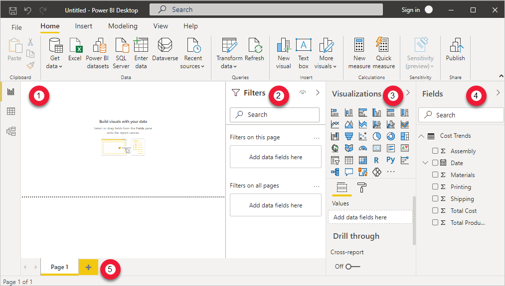
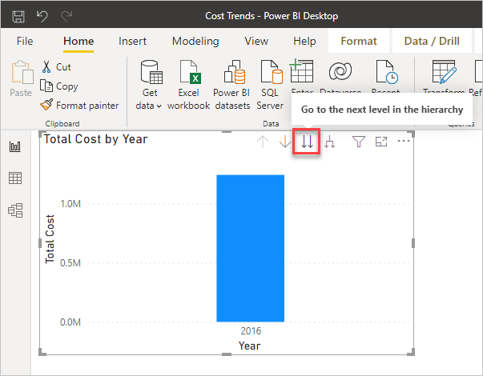
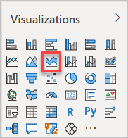
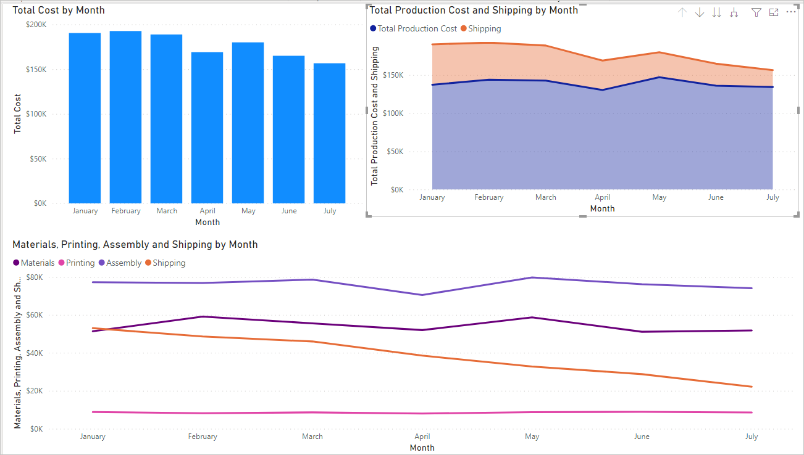
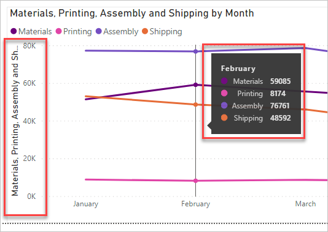
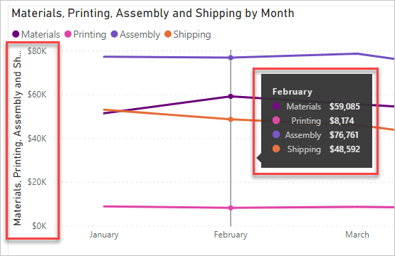
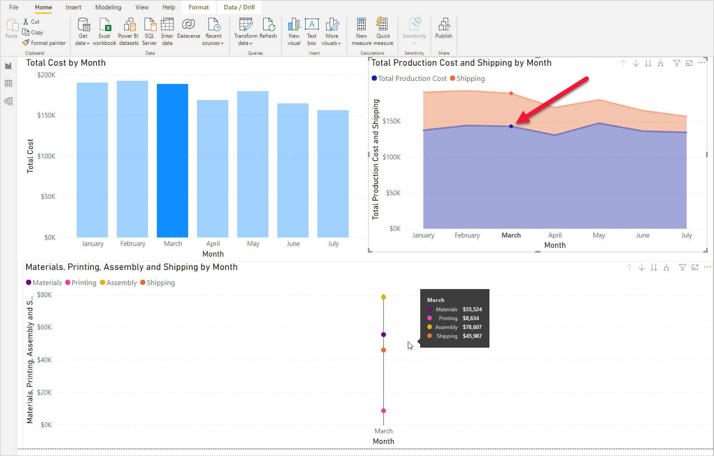
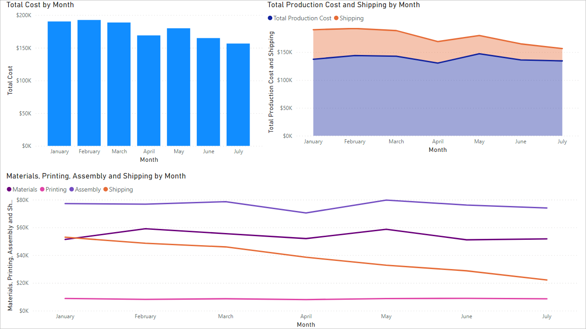

Previously, you connected to your Dataverse for Teams table data and then transformed it. Now, you can build a report with interactive visualizations by using the **Report** view in Power BI, which consists of the following areas:

- **Report canvas** - Where visualizations are created and arranged (number **1** in the image).

- **Filters pane** - This allows you to filter and only work with subsets of data (number **2** in the image).

- **Visualizations pane** - Where you can select and edit the visualizations (number **3** in the image).

- **Fields pane** - Where you can choose the data to include in the visualizations or include it as a filter (number **4** in the image).

- **Pages tab** - Where you can create more report canvases (number **5** in the image).

    > [!div class="mx-imgBorder"]
    > 

The basic steps to add visualizations to the report are:

1. Select a visualization from the **Visualizations** pane.

1. Select and drag the required fields from the **Fields** pane into the **Visualizations** pane or **Filters** pane.

1. Move and resize the visualization in the report canvas.

1. Make more edits to the visualization in the **Visualizations** pane.

## Add a stacked column chart

To add a stacked column chart, follow these steps:

1. Select the **Stacked Column Chart** icon from the **Visualizations** pane.

    > [!div class="mx-imgBorder"]
    > 

1. Select and drag the following elements from the **Fields** pane:

    - **Date** field to **Axis**
    - **Total Cost** field to **Values**

    > [!div class="mx-imgBorder"]
    > 

1. Notice that the chart is showing the data by years. You can drill in to see the data by quarter and month by selecting the **Go to the next level in the hierarchy** icon. In the next step, you will edit the chart to show the data by month.

    > [!div class="mx-imgBorder"]
    > 

1. With the chart selected in the report canvas, remove **Year** and **Quarter** under **Axis** so that the graph shows the data by month.

    > [!div class="mx-imgBorder"]
    > 

1. Resize the chart in the report canvas by selecting and dragging the indicated border controls. Have the chart fill up the upper-left portion of the canvas.

    > [!div class="mx-imgBorder"]
    > 

## Add a line chart

To add a line chart, follow these steps:

1. Select the **Line Chart** icon in the **Visualizations** pane.

    > [!div class="mx-imgBorder"]
    > 

    > [!NOTE]
    > If you already have a visualization selected in the report canvas, then selecting another visualization will replace it. Make sure that you don't have a visualization selected by selecting a blank area of the report canvas before you create a new one.

1. Select and drag the following entities from the **Fields** pane.

    For **Axis**:
    - Date (remove Year and Quarter)

    > [!div class="mx-imgBorder"]
    > 

    For **Values**:
    - Materials
    - Printing
    - Assembly
    - Shipping

    > [!div class="mx-imgBorder"]
    > 

1. Select and drag to resize the line chart to cover the lower half of the report canvas.

    > [!div class="mx-imgBorder"]
    > 

1. Change the data colors by going to the **Visualizations** pane, selecting the **Format** tab, and then expanding **Data colors**. Use the drop-down list next to each color and select the following theme colors:

    - **Materials** - Theme color 4
    - **Printing** - Theme color 5
    - **Assembly** - Theme color 6
    - **Shipping** - Theme color 3

    > [!div class="mx-imgBorder"]
    > 

## Add a stacked area chart

To add a stacked area chart, follow these steps:

1. Select the **Stacked Area Chart** icon in the **Visualizations** pane.

    > [!div class="mx-imgBorder"]
    > 

1. Select and drag the following entities from the **Fields** pane to the **Values** area.

    For **Axis**:
    - Date (Remove Year and Quarter)

    > [!div class="mx-imgBorder"]
    > 

    For **Values**:
    - Total Production Cost
    - Shipping

    > [!div class="mx-imgBorder"]
    > 

1. Change the colors of the area chart to make it consistent with the rest of the report. In the **Visualizations** pane, select the **Format** tab and then expand **Data colors**. Use the drop-down list next to each color and select the following theme colors:

    - **Total Production Cost** - Theme color 2
    - **Shipping** - Theme color 3

    > [!div class="mx-imgBorder"]
    > 

1. If the new chart has automatically set the Y axis to zoom in on the shipping data, in the **Format** tab expand the **Y Axis** section and type in **0** for the start. The graph now shows both the Total Production Cost and the Shipping information.

    > [!div class="mx-imgBorder"]
    > 

1. Select and resize the chart in the report canvas to occupy the existing space.

    > [!div class="mx-imgBorder"]
    > 

## Change data to use currency format

Notice that the report shows data in the legends and pop-out windows as simple numbers without formatting. It would be more useful to have the data appear as currency.

> [!div class="mx-imgBorder"]
> 

To change to currency format, follow these steps:

1. Under the **Fields** pane, select the **Assembly** field.

1. In the **Column tools** ribbon, select the **Currency** format icon.

    > [!div class="mx-imgBorder"]
    > 

1. Repeat these steps for **Materials**, **Printing**, **Shipping**, **Total Cost**, and **Total Production Cost**.

After you have completed these steps, your data will appear as currency.

> [!div class="mx-imgBorder"]
> 

## Explore the report

Power BI links your charts to be interactive when selecting a visual in one chart; the other charts will automatically adjust. For example, if you click on the data point for March under **Total Production Cost and Shipping by Month**, the other two charts will adjust to show data for that month. **Total Cost by Month** will highlight the data for March while the **Materials, Printing, Assembly, and Shipping by Month** line graph shows just the data point for March. Click on the same data point to revet all the charts back to normal.

> [!div class="mx-imgBorder"]
> 

Experiment by selecting other visuals in the other charts. As you add additional tables into your reports, you will create more complex reports that automatically interact to help you and your users explore the data. For more information on Power BI visual interactions and how to configure them, please see the links that are provided in the Summary section at the end of the module.

## Save the report

Save the report by selecting **File > Save as** in the menu. Enter **Contoso Cost Trends** as a name and then select **Save**. Power BI Desktop uses a **pbix** file extension for its saved files.

The final report should look similar to the following image.

> [!div class="mx-imgBorder"]
> 
