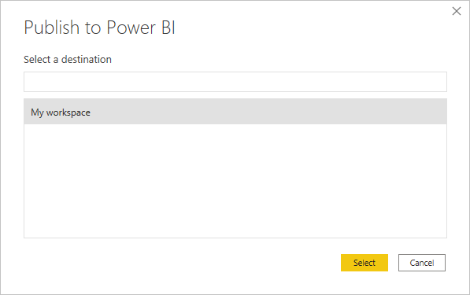
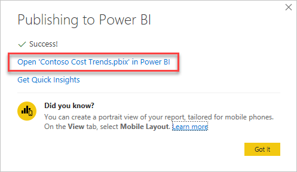

For users to access the report in Teams, the report and dataset need to be **Published** to a workspace. A Power BI **workspace** is an area to store reports, workbooks, datasets, and dashboards in the Power BI service. Every Power BI user has a **My workspace** that only they have access to. From **My workspace,** users can share out reports and dashboards. Members of workspaces created in Power BI have access to any reports published to them. For more information about Power BI workspaces, see the links in the Summary unit at the end of the module.

1. Open the report in Power BI Desktop.

1. From the Power BI Report View, select **Publish** from the **Home** ribbon.

1. If you haven't signed into Power BI Desktop yet, you're prompted for credentials.

1. After successfully logging in, select a Power BI **workspace** to publish the report.

    > [!div class="mx-imgBorder"]
    > 

1. A pop-up appears with the status of publishing the report to the Power BI service. Once completed, select **Open 'Contoso Cost Trends.pbix' in Power BI**.

    > [!div class="mx-imgBorder"]
    > 

1. The default web browser connects to the Power BI web site with the published report.

    > [!div class="mx-imgBorder"]
    > 
