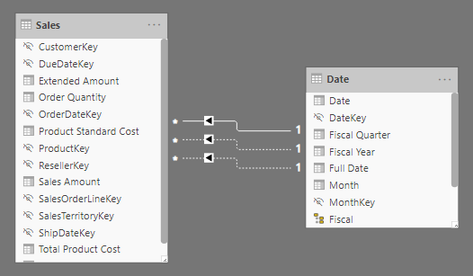
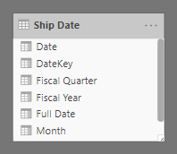

You can write a Data Analysis Expressions (DAX) formula to add a *calculated table* to your model. The formula can duplicate or transform existing model data to produce a new table.

> [!NOTE]
> A calculated table can't connect to external data; you must use Power Query to accomplish that task.

A calculated table formula must return a table object. The simplest formula can duplicate an existing model table.

Calculated tables have a cost: They increase the model storage size and they can prolong the data refresh time. The reason is because calculated tables recalculate when they have formula dependencies to refreshed tables.

## Duplicate a table

The following section describes a common design challenge that can be solved by creating a calculated table. First, you should download and open the [**Adventure Works DW 2020 M03.pbix**](https://github.com/MicrosoftDocs/mslearn-dax-power-bi/raw/main/activities/Adventure%20Works%20DW%202020%20M03.pbix) file and then switch to the model diagram.

In the model diagram, notice that the Sales table has three relationships to the Date table.

> [!div class="mx-imgBorder"]
> [](../media/dax-sales-date-relationships-ss.png#lightbox)

The model diagram shows three relationships because the Sales table stores sales data by order date, ship date, and due date. If you examine the **OrderDateKey**, **ShipDateKey**, and **DueDateKey** columns, notice that one relationship is represented by a solid line, which is the *active relationship*. The other relationships, which are represented by dashed lines, are *inactive relationships*.

> [!NOTE]
> Only one active relationship can exist between any two model tables.

In the diagram, hover the cursor over the active relationship to highlight the related columns, which is how you would interact with the model diagram to learn about related columns. In this case, the active relationship filters the **OrderDateKey** column in the Sales table. Thus, filters that are applied to the Date table will propagate to the Sales table to filter by order date; they'll never filter by ship date or due date.

The next step is to delete the two inactive relationships between the Date table and the Sales table. To delete a relationship, right-click it and then select **Delete** in the context menu. Make sure that you delete both inactive relationships.

Next, add a new table to allow report users to filter sales by ship date. Switch to report view and then, on the **Modeling** ribbon tab, from inside the **Calculations** group, select **New table**.

> [!div class="mx-imgBorder"]
> [](../media/dax-modeling-ribbon-new-table-ssm.png#lightbox)

In the formula box (located beneath the ribbon), enter the following calculated table definition and then press **Enter**.

```dax
Ship Date = 'Date'
```

The calculated table definition duplicates the Date table data to produce a new table named **Ship Date**. The Ship Date table has exactly the same columns and rows as the Date table. When the Date table data refreshes, the Ship Date table recalculates, so they'll always be in sync.

Switch to the model diagram, and then notice the addition of the Ship Date table.

> [!div class="mx-imgBorder"]
> [](../media/dax-ship-data-table-ss.png#lightbox)

Next, create a relationship between the **DateKey** column in the Ship Date table and the **ShipDateKey** column in the Sales table. You can create the relationship by dragging the **DateKey** column in the Ship Date table onto the **ShipDateKey** column in the Sales table.

A calculated table only duplicates data; it doesn't duplicate any model configurations like column visibility or hierarchies. You'll need to configure them for the new table, if required.

> [!TIP]
> It's possible to rename columns of a calculated table. In this example, it's a good idea to rename columns so that they better describe their purpose. For example, the **Fiscal Year** column in the Ship Date table can be renamed as **Ship Fiscal Year**. Accordingly, when fields from the Ship Date table are used in visuals, their names are automatically included in captions like the visual title or axis labels.

To complete the design of the Ship Date table, you can:

-   Rename the following columns:

    -   **Date** as **Ship Date**

    -   **Fiscal Year** as **Ship Fiscal Year**

    -   **Fiscal Quarter** as **Ship Fiscal Quarter**

    -   **Month** as **Ship Month**

    -   **Full Date** as **Ship Full Date**

-   Sort the **Ship Full Date** column by the **Ship Date** column.

-   Sort the **Ship Month** column by the **MonthKey** column.

-   Hide the **MonthKey** column.

-   Create a hierarchy named **Fiscal** with the following levels:

    -   Ship Fiscal Year

    -   Ship Fiscal Quarter

    -   Ship Month

    -   Ship Full Date

-   Mark the Ship Date table as a date table by using the **Ship Date** column.

Calculated tables are useful to work in scenarios when multiple relationships between two tables exist, as previously described. They can also be used to add a date table to your model. Date tables are required to apply special time filters known as *time-intelligence*.

## Create a date table

In the next example, a second calculated table will be created, this time by using the [CALENDARAUTO](https://docs.microsoft.com/dax/calendarauto-function-dax/?azure-portal=true) DAX function.

Create the Due Date calculated table by using the following definition.

```dax
Due Date = CALENDARAUTO(6)
```

The CALENDARAUTO function takes a single optional argument, which is the last month number of the year, and returns a single-column table. If you don't pass in a month number, it's assumed to be 12 (for December). For example, at Adventure Works, their financial year ends on June 30 of each year, so the value 6 (for June) is passed in.

The function scans all date and date/time columns in your model to determine the earliest and latest stored date values. It then produces a complete set of dates that span all dates in your model, ensuring that full years of dates are loaded. For example, if the earliest date that is stored in your model is October 15, 2017, then the first date that is returned by the CALENDARAUTO function would be July 1, 2017. If the latest date that is stored in the model is June 15, 2020, then the last date that is returned by the CALENDARAUTO function would be June 30, 2020.

Effectively, the CALENDARAUTO function guarantees that the following requirements to *mark a date table* are met:

-   The table must include a column of data type Date.

-   The column must contain complete years.

-   The column must not have missing dates.

> [!TIP]
> You can also create a date table by using the [CALENDAR](https://docs.microsoft.com/dax/calendar-function-dax/?azure-portal=true) DAX function and passing in two date values, which represent the date range. The function generates one row for each date within the range. You can pass in static date values or pass in expressions that retrieve the earliest/latest dates from specific columns in your model.

Next, switch to data view, and then in the **Fields** pane, select the Due Date table. Now, review the column of dates. You might want to order them to see the earliest date in the first row by selecting the arrow inside the **Date** column header and then sorting in ascending order.

> [!NOTE]
> Ordering or filtering columns doesn't change how the values are stored. These functions help you explore and understand the data.

> [!div class="mx-imgBorder"]
> [](../media/dax-due-date-table-data-view-1-ss.png#lightbox)

Now that the **Date** column is selected, review the message in the status bar (located in the lower-left corner). It describes how many rows that the table stores and how many distinct values are found in the selected column.

> [!div class="mx-imgBorder"]
> [](../media/dax-due-date-table-data-view-status-ss.png#lightbox)

When the table rows and distinct values are the same, it means that the column contains unique values. That factor is important for two reasons: It satisfies the requirements to mark a date table, and it allows this column to be used in a model relationship as the one-side.

The Due Date calculated table will recalculate each time a table that contains a date column refreshes. In other words, when a row is loaded into the Sales table with an order date of July 1, 2020, the Due Date table will automatically extend to include dates through to the end of the next year: June 30, 2021.

The Due Date table requires additional columns to support the known filtering and grouping requirements, specifically by year, quarter, and month. 
