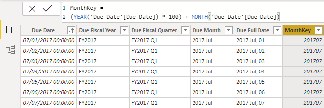

You can write a DAX formula to add a **calculated column** to any table in your model. A calculated column formula must return a scalar or single value.

It's important to understand that calculated columns in Import models have a cost: They increase the model storage size. And, they can prolong the data refresh time. It's because calculated columns recalculate when they have formula dependencies to refreshed tables.

In data view, in the **Fields** pane, ensure that the **Due Date** table is selected. Before we create a calculated column, let's first rename the **Date** column as **Due Date**.

Let's now add a calculated column to the **Due Date** table. To create a calculated column, in the **Table Tools** contextual ribbon, from inside the **Calculations** group, click **New Column**.

> [!div class="mx-imgBorder"]
> [](../media/dax-due-date-table-tools-contextual-ribbon-ssm.png#lightbox)

In the formula box, enter the following calculated column definition, and then press **Enter**.

```dax
Due Fiscal Year =
"FY"
	& YEAR('Due Date'[Due Date])
		+ IF(
			MONTH('Due Date'[Due Date]) <= 6,
			1
		)
```

The calculated column definition adds the **Due Fiscal Year** column to the **Due Date** table. The following steps describe how Power BI evaluates the calculated column formula:

1.  The addition operator (+) is evaluated before the text concatenation operator (&).

1.  The [YEAR](https://docs.microsoft.com/dax/year-function-dax/?azure-portal=true) DAX function returns the whole number value of the due date year.

1.  The [IF](https://docs.microsoft.com/dax/if-function-dax/?azure-portal=true) DAX function returns the value one when the due date month number is 1-6 (June to December), otherwise it returns BLANK. (It's because the Adventure Works financial year is July-June the first six months of the calendar year use the next calendar year as their financial year.)

1.  The year value is added to value returned by the IF function. It's the value one or BLANK. If it's BLANK, it's implicitly converted to 0 to allow the addition to produce the fiscal year value.

1.  The literal text value "FY" concatenated with the fiscal year value, which is implicitly converted to text.

Add a second calculated column, using the following definition:

```dax
Due Fiscal Quarter =
'Due Date'[Due Fiscal Year] & " Q"
	& IF(
		MONTH('Due Date'[Due Date]) <= 3,
		3,
		IF(
			MONTH('Due Date'[Due Date]) <= 6,
			4,
			IF(
				MONTH('Due Date'[Due Date]) <= 9,
				1,
				2
			)
		)
	)
```

The calculated column definition adds the **Due Fiscal Quarter** column to the **Due Date** table. The IF function returns the quarter number (Quarter 1 is July-September), and the result is concatenated to the **Due Fiscal Year** column value and the literal text " Q".

Add a third calculated column, using the following definition:

```dax
Due Month =
FORMAT('Due Date'[Due Date], "yyyy mmm")
```

The calculated column definition adds the **Due Month** column to the **Due Date** table. The [FORMAT](https://docs.microsoft.com/dax/format-function-dax/?azure-portal=true) DAX function converts the **Due Date** column value to text using a format string. In this case, the format string produces a label describing the year and abbreviated month name.

**Note:** There are many user-defined date/time formats. For more information ,see [Custom date and time formats for the FORMAT function](https://docs.microsoft.com/dax/custom-date-and-time-formats-for-the-format-function/?azure-portal=true).

Add a fourth calculated column, using the following definition:

```dax
Due Full Date =
FORMAT('Due Date'[Due Date], "yyyy mmm, dd")
```

Lastly, add a fifth calculated column, using the following definition:

```dax
MonthKey =
(YEAR('Due Date'[Due Date]) * 100) + MONTH('Due Date'[Due Date])
```

The **MonthKey** calculated column multiplies the due date year by the value 100, and then adds the month number of the due date. It produces a numeric value that can be used to sort the **Due Month** text values in chronological order.

Verify that the **Due Date** table has six columns. The first column was added when the calculated table was created, and the other five columns were added as calculated columns.

> [!div class="mx-imgBorder"]
> [](../media/dax-due-date-table-data-view-2-ss.png#lightbox)

To complete the design of the **Due Date** table, you can:

-   Sort the **Due Full Date** column by the **Due Date** column.

-   Sort the **Due Month** column by the **MonthKey** column.

-   Hide the **MonthKey** column.

-   Create a hierarchy named **Fiscal** with the following levels:

    -   Due Fiscal Year

    -   Due Fiscal Quarter

    -   Due Month

    -   Due Full Date

-   Mark the **Due Date** table as a date table, using the **Due Date** column.
