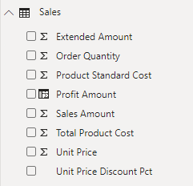
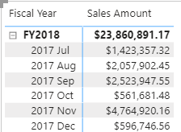
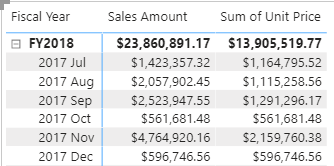

*Implicit* and *explicit* are two types of measures. Implicit measures are automatic behaviors that allow visuals to summarize model column data. Explicit measures, also known simply as *measures*, are calculations that you can add to your model. The following sections focus on how you can use implicit measures.

In the **Fields** pane, a column that's shown with the sigma symbol (∑) indicates two facts:

-   It's a numeric column.

-   It will summarize column values when it is used in a visual (when added to a field well that supports summarization).

In the following image, notice that the Sales table includes only fields that can be summarized, including the **Profit Amount** calculated column.

> [!div class="mx-imgBorder"]
> 

As a data modeler, you can control if and how the column summarizes by setting the **Summarization** property to **Don't summarize** or to a specific aggregation function. When you set the **Summarization** property to **Don't summarize**, the sigma symbol will no longer show next to the column in the **Fields** pane.

To observe how report authors can use implicit measures, you can first download and open the [**Adventure Works DW 2020 M04.pbix**](https://github.com/MicrosoftDocs/mslearn-dax-power-bi/raw/main/activities/Adventure%20Works%20DW%202020%20M04.pbix) file.

In the report, from the Sales table, add the **Sales Amount** field to the matrix visual that groups fiscal year and month on its rows.

> [!div class="mx-imgBorder"]
> 

To determine how the column is summarized, in the visual fields pane, for the **Sales Amount** field, select the arrow and then review the context menu options.

> [!div class="mx-imgBorder"]
> 

Notice that the **Sum** aggregation function has a check mark next to it. This check mark indicates that the column is summarized by *summing* column values together. It's also possible to change the aggregation function by selecting any of the other options like average, minimum, and so on.

Next, add the **Unit Price** field to the matrix visual.

> [!div class="mx-imgBorder"]
> 

The default summarization is now set to **Average** (the modeler knows that it's inappropriate to sum unit price values together because they're rates, which are non-additive).

> [!div class="mx-imgBorder"]
> 

Implicit measures allow the report author to start with a default summarization technique and lets them modify it to suit their visual requirements.

Numeric columns support the greatest range of aggregation functions:

-   Sum

-   Average

-   Minimum

-   Maximum

-   Count (Distinct)

-   Count

-   Standard deviation

-   Variance

-   Median

## Summarize non-numeric columns

Non-numeric columns can be summarized. However, the sigma symbol does not show next to non-numeric columns in the **Fields** pane because they don't summarize by default.

Text columns allow the following aggregations:

-   First (alphabetically)

-   Last (alphabetically)

-   Count (Distinct)

-   Count

Date columns allow the following aggregations:

-   Earliest

-   Latest

-   Count (Distinct)

-   Count

Boolean columns allow the following aggregations:

-   Count (Distinct)

-   Count

## Benefits of implicit measures

Several benefits are associated with implicit measures. Implicit measures are simple concepts to learn and use, and they provide flexibility in the way that report authors visualize model data. Additionally, they mean less work for you as a data modeler because you don't have to create explicit calculations.

## Limitations of implicit measures

Implicit measures do have limitations. Despite setting an appropriate summarization method, report authors could choose to aggregate a column in unsuitable ways. For example, in the matrix visual, you could modify the aggregate function of **Unit Price** to **Sum**.

> [!div class="mx-imgBorder"]
> 

The report visual obeys your configuration, but it has now produced a **Sum of Unit Price** column, which contains misleading data.

The most significant limitation of implicit measures is that they only work for simple scenarios, meaning that they can only summarize column values that use a specific aggregation function. Therefore, in situations when you need to calculate the ratio of each month's sales amount over the yearly sales amount, you'll need to produce an explicit measure by writing a Data Analysis Expressions (DAX) formula to achieve that more sophisticated requirement.

Implicit measures don't work when the model is queried by using Multidimensional Expressions (MDX). This language expects explicit measures and can't summarize column data. It's used when a Power BI dataset is queried by using [Analyze in Excel](https://docs.microsoft.com/power-bi/collaborate-share/service-analyze-in-excel/?azure-portal=true) or when a [Power BI paginated report](https://docs.microsoft.com/power-bi/paginated-reports/paginated-reports-report-builder-power-bi/?azure-portal=true) uses a query that is generated by a graphical query designer.