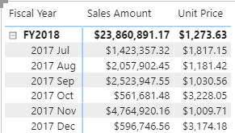

There are two types of measures: *implicit* and *explicit*. Implicit measures are an automatic behavior, allowing visuals to summarize model column data. Explicit measures also just known as *measures* are calculations you can add to your model. Let's first learn how you can use implicit measures.

In the **Fields** pane, a column that's adorned with the sigma symbol (∑) informs you of two facts:

-   It's a numeric column.

-   It will summarize column values when used in a visual (when added to a field well that supports summarization).

In the following image, notice that the **Sales** table comprises only fields that are summarizable. Even the calculated column named **Profit Amount** is summarizable.

> [!div class="mx-imgBorder"]
> 

As a data modeler, you can control if and how the column summarizes: You do that by setting the **Summarization** property to **Don't summarize**, or to a specific aggregation function. When you set it to **Don't summarize**, the sigma symbol no longer adorns the column in the **Fields** pane.

Let's see how report authors can use implicit measures. First, download and open the **Adventure Works DW 2020 M04.pbix** file.

Now, in the report, from the **Sales** table, add the **Sales Amount** field to the matrix visual that groups fiscal year and month on its rows.

> [!div class="mx-imgBorder"]
> 

To determine how the column is summarized, in the visual fields pane, for the **Sales Amount** field, click the down arrow, and then review the context menu options.

> [!div class="mx-imgBorder"]
> 

Notice that the **Sum** aggregation function is checked. It informs your that the column is summarized by *summing* column values together. Notice also that it's possible to change the aggregation function by selecting any of the others like average, minimum, etc.

Now, add the **Unit Price** field to the matrix visual.

> [!div class="mx-imgBorder"]
> 

Then, discover that it's default summarization is set to **Average** (the modeler knows that it's inappropriate to sum unit price values together because they're rates, which are non-additive).

> [!div class="mx-imgBorder"]
> 

So, implicit measures allow the report author to start with a default summarization technique, and lets them modify it to suit their visual requirements.

Numeric columns support the greatest range of aggregation functions. They include:

-   Sum

-   Average

-   Minimum

-   Maximum

-   Count (Distinct)

-   Count

-   Standard deviation

-   Variance

-   Median

## Summarize non-numeric columns

Non-numeric columns can be summarized, too. However, you won't ever see the sigma symbol adorning such columns in the **Fields** pane. It's because they don't summarize by default.

Text columns allow the following aggregations:

-   First (alphabetically)

-   Last (alphabetically)

-   Count (Distinct)

-   Count

Date columns allow the following aggregations:

-   Earliest

-   Latest

-   Count (Distinct)

-   Count

Boolean columns allow the following aggregations:

-   Count (Distinct)

-   Count

## Benefits of implicit measures

There are several benefits associated with implicit measures. They're a simple concept to understand and use. And, they provide flexibility in the way report authors can visualize model data. Lastly, they mean less work for you as a data modeler, because you don't have to create explicit calculations.

## Limitations of implicit measures

However, implicit measures have limitations. Despite setting an appropriate summarization method, report authors could choose to aggregate a column in unsuitable ways. Let's see how: In the matrix visual, modify the aggregate function of the **Unit Price** to **Sum**.

> [!div class="mx-imgBorder"]
> 

The report visual obeys your configuration, but now produces a **Sum of Unit Price** column, which contains misleading data.

Perhaps the biggest limitation of implicit measures is that they only work for simple scenarios. It means they can only summarize column values using a specific aggregation function. What happens, then, when you need to calculate the ratio of each month's sales amount over the yearly sales amount? You'll need to produce an explicit measure by writing a DAX formula to achieve that more sophisticated requirement.

Lastly, implicit measures don't work when the model is queried by using Multidimensional Expressions (MDX). This language expects explicit measures and can't summarize column data. It's used when a Power BI dataset is queried using [Analyze in Excel](https://docs.microsoft.com/power-bi/collaborate-share/service-analyze-in-excel/?azure-portal=true), or when a [Power BI paginated report](https://docs.microsoft.com/power-bi/paginated-reports/paginated-reports-report-builder-power-bi/?azure-portal=true) uses a query generated by a graphical query designer.
