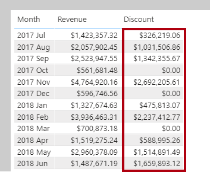
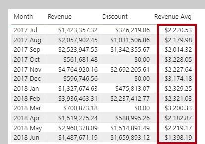
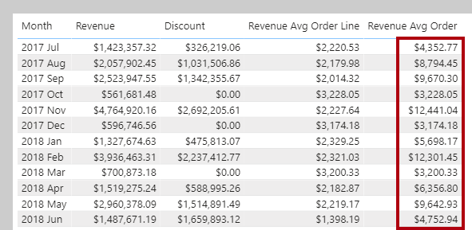

Each single-column summarization function has its equivalent iterator function. We'll now consider two aggregation scenarios when iterator functions are useful: complex summarization and higher grain summarization.

## Complex summarization

Let's now create our first measure that uses an iterator function. First, download and open the [**Adventure Works DW 2020 M05.pbix**](https://github.com/MicrosoftDocs/mslearn-dax-power-bi/raw/main/activities/Adventure%20Works%20DW%202020%20M05.pbix) file. Go ahead and add the following measure definition:

```dax
Revenue =
SUMX(
	Sales,
	Sales[Order Quantity] * Sales[Unit Price] * (1 - Sales[Unit Price Discount Pct])
)
```

Format the **Revenue** measure as currency with two decimal places, and then add it to the table visual found on **Page 1** of the report.

> [!div class="mx-imgBorder"]
> [](../media/dax-table-month-revenue-1-ss.png#lightbox)

Using an iterator function, the **Revenue** measure formula aggregates more than the values of just a single column. For each row, it uses the row context values of three columns to produce the revenue amount.

Let's now add another measure:

```dax
Discount =
SUMX(
	Sales,
	Sales[Order Quantity]
	* (
		RELATED('Product'[List Price]) - Sales[Unit Price]
	)
)
```

Format the **Discount** measure as currency with two decimal places, and then add it to the table visual.

> [!div class="mx-imgBorder"]
> [](../media/dax-table-month-revenue-2-ssm.png#lightbox)

Notice that the formula uses the RELATED function. Remember, row context does not extend beyond the table. If your formula needs to reference columns in other tables, and there are model relationships between the tables, use the RELATED function for the one-side, or the RELATEDTABLE function for the many-side.

## Higher grain summarization

Let's now consider a requirement to report on average revenue. Add the following measure:

```dax
Revenue Avg =
AVERAGEX(
	Sales,
	Sales[Order Quantity] * Sales[Unit Price] * (1 - Sales[Unit Price Discount Pct])
)
```

Format the **Revenue Avg** measure as currency with two decimal places, and then add it to the table visual.

> [!div class="mx-imgBorder"]
> [](../media/dax-table-month-revenue-3-ssm.png#lightbox)

Consider that *average* means the sum of values divided by the count of values. But that raises an interesting question: What does the count of values represent? In this case, the count of values is the number expressions that didn't evaluate to BLANK. And, because the iterator function enumerates rows of the **Sales** table, we can describe that average means *revenue per row*. Taking this logic one step further, because each row in the **Sales** table records a sales order line, it can be more precisely described as *revenue per order line*.

So, let's now rename the **Revenue Avg** measure as **Revenue Avg Order Line**. This way, it's clear to report users what's used as the average base.

Let's now use an iterator function to create a new measure that raises the granularity to the sales order level. (A sales order comprises one or more order lines). Add the following measure:

```dax
Revenue Avg Order =
AVERAGEX(
	VALUES('Sales Order'[Sales Order]),
	[Revenue]
)
```

Format the **Revenue Avg Order** measure as currency with two decimal places, and then add it to the table visual.

> [!div class="mx-imgBorder"]
> [](../media/dax-table-month-revenue-4-ssm.png#lightbox)

As expected, the average revenue for an order is always higher than the average revenue for a single order line.

Notice that the formula uses the [VALUES](https://docs.microsoft.com/dax/values-function-dax/?azure-portal=true) DAX function. This function lets your formulas determine what values are in filter context. In this case, this AVERAGEX function iterates over each sales order *in filter context*. In other words, it iterates over each sales order for the month. Filter context and the VALUES function are introduced in the filter context module.

