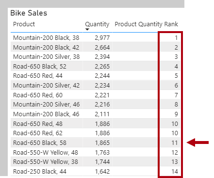

The [RANKX](https://docs.microsoft.com/dax/rankx-function-dax/?azure-portal=true) DAX function is a special iterator function you can use to calculate ranks. Its syntax is as follows:

```dax
RANKX(<table>, <expression>[, <value>[, <order>[, <ties>]]])
```

Similar to all iterator functions, you must pass in a table and an expression. Optionally, you can pass in a rank value to find the order direction or to help you determine how to handle ranks when values are tied.

### Order direction

Order direction is either ascending or descending. When ranking something favorable, like revenue values, you're likely to use descending order so that the highest revenue will be ranked first. When ranking something unfavorable, like customer complaints, you might use ascending order so that the lowest number of complaints will be ranked first. When you don't pass in an order argument, the function will use **descending** order.

### Handle ties

You can handle ties by skipping rank values or using dense ranking, which uses the next rank value after a tie. When you don't pass in a ties argument, the function will use **skipped**. You'll have an opportunity to work with an example of each tie argument in subsequent sections.

### Create ranking measures

Add the following measure:

```dax
Product Quantity Rank =
RANKX(
	ALL('Product'[Product]),
	[Quantity]
)
```

Add the **Product Quantity Rank** measure to the table visual that is found on **Page 2** of the report. The table visual groups bike products and displays quantity, which orders products by descending quantity.

The RANKX function iterates over a table that is returned by the [ALL](https://docs.microsoft.com/dax/all-function-dax/?azure-portal=true) DAX function. The ALL function is used to return all rows in a model table or values in one or more columns, and it *ignores all filters*. Therefore, in this case, it returns a table that consists of all **Product** column values in the Product table. The RANKX function must use the ALL function because the table visual will group by product (which is a filter on the Product table).

In the table visual, notice that two products tie for tenth place and that the next product's rank is 12. This visual is an example of using the **Skipped** ties argument.

> [!div class="mx-imgBorder"]
> [](../media/dax-table-bike-product-quanity-rank-skipped-ssm.png#lightbox)

Your next task is to enter the following logic to modify the **Product Quantity Rank** measure definition to use dense ranking:

```dax
Product Quantity Rank =
RANKX(
	ALL('Product'[Product]),
	[Quantity],
	,
	,
	DENSE
)
```

In the table visual, notice that a skipped ranking no longer exists. After the two products that tie for tenth place, the next ranking is 11.

> [!div class="mx-imgBorder"]
> [](../media/dax-table-bike-product-quantity-rank-dense-ssm.png#lightbox)

Notice that the table visual total for the **Product Quantity Rank** is one (1). The reason is because the total for all products is ranked.

> [!div class="mx-imgBorder"]
> [](../media/dax-table-bike-product-quantity-rank-dense-total-ssm.png#lightbox)

It's not appropriate to rank total products, so you will now use the following logic to modify the measure definition to return BLANK, unless a single product is filtered:

```dax
Product Quantity Rank =
IF(
	HASONEVALUE('Product'[Product]),
	RANKX(
		ALL('Product'[Product]),
		[Quantity],
		,
		,
		DENSE
	)
)
```

> [!div class="mx-imgBorder"]
> [](../media/dax-table-bike-product-quantity-rank-dense-total-gone-ssm.png#lightbox)

Notice that the total **Product Quantity Rank** is now BLANK, which was achieved by using the [HASONEVALUE](https://docs.microsoft.com/dax/hasonevalue-function-dax/?azure-portal=true) DAX function to test whether the **Product** column in the Product table has a single value in filter context. It's the case for each product group, but not for the total, which represents all products.

Filter context and the HASONEVALUE function will be introduced in the filter context module.
