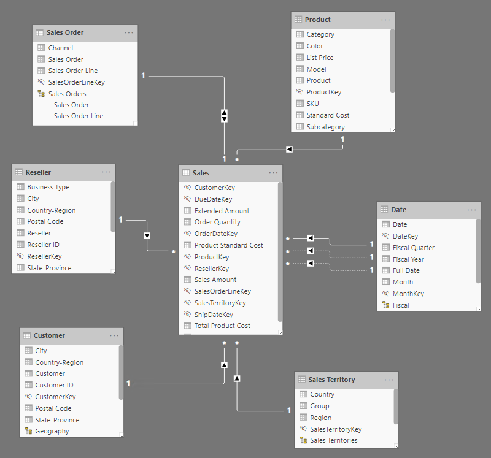
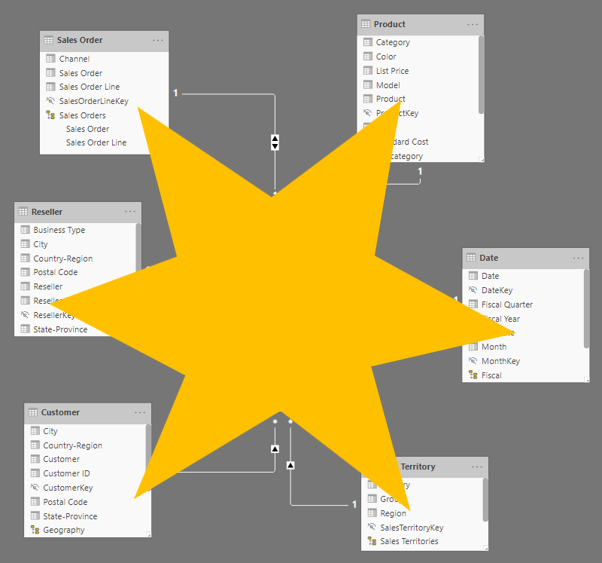

It's unusual for a Power BI data model to be comprised of a single table. A single-table model can be a simple design, perhaps one that's suitable for a data exploration task or proof of concept, but not one that's an optimal model design. An optimal model design adheres to *star schema* design principles. Star schema refers to a design approach that is commonly used by relational data warehouse designers because it presents a user-friendly structure and it supports high-performance analytic queries. 

This design principle is called a star schema because it classifies model tables as either *fact* or *dimension*. In a diagram, a fact table forms the center of a star, while dimension tables, when placed around a fact table, represent the points of the star.

## Fact tables

The role of a fact table is to store an accumulation of rows that represent observations or events that record a specific business activity. For example, events that are stored in a sales fact table could be sales orders and the order lines. You could also use a fact table to record stock movements, stock balances, or daily currency exchange rates. Generally, fact tables contain numerous rows. As time passes, fact table rows accumulate. In analytic queries (which will be defined later in this module), fact table data is summarized to produce values like sales and quantity.

## Dimension tables

Dimension tables describe your business entities, which commonly represent people, places, products, or concepts. A date dimension table, which contains one row for each date, is a common example of a concept dimension table. The columns in dimension tables allow filtering and grouping of fact table data.

Each dimension table must have a unique column, which is referred to as its key column. A unique column doesn't contain duplicate values and it should never have missing values. In a product dimension table, the column could be named **ProductKey** or **ProductID**. Likely, additional columns will store descriptive values, like the product name, subcategory, category, color, and so on. In analytic queries, these columns are used to filter and group data.

## Compare fact and dimension tables

The following figure compares characteristics of fact and dimension tables.

| Characteristic                       |     Dimension table                                                                 |     Fact table                                                                               |
|------------------------|-------------------------------------------------------------------------------------|----------------------------------------------------------------------------------------------|
|     Model purpose      |     Stores business entities                                                       |     Stores events or observations                                                             |
|     Table structure    |     Includes a key column and descriptive columns for filtering and grouping    |     Includes dimension key columns and numeric measure columns that can be summarized    |
|     Data volume        |     Typically, contains fewer rows (relative to fact tables)          |     Can contain numerous rows                                                  |
|     Query purpose      |     To filter and group                                                             |     To summarize                                                                             |

## Relate star schema tables

In the model, dimension tables are related to fact tables by using one-to-many relationships. The relationships allow filters and groups that are applied to dimension table columns to propagate to the fact table. This design pattern is common.

Dimension tables can be used to filter multiple fact tables, and fact tables can be filtered by multiple dimension tables. However, it's not a good practice to relate a fact table directly to another fact table.

To practice this concept, download the [**Adventure Works DW 2020 M01.pbix**](https://github.com/MicrosoftDocs/mslearn-dax-power-bi/raw/main/activities/Adventure%20Works%20DW%202020%20M01.pbix) file, open the file, and then switch to the model diagram.

> [!div class="mx-imgBorder"]
> 

Notice that the model is comprised of seven tables, one of which is named **Sales** and is the fact table. The remaining tables are dimension tables, and they have the following names:

-   Customer

-   Date

-   Product

-   Reseller

-   Sales Order

-   Sales Territory

Notice the relationships between the dimension and fact tables and that each relationship filter direction is pointing toward the fact table. As a result, when filters are applied to dimension table columns (to filter or group by column values), related facts are filtered and summarized.

If you examine the pattern, you might see a star shape.

> [!div class="mx-imgBorder"]
> 

For more information on star schemas, see [Understand star schema and the importance for Power BI](/power-bi/guidance/star-schema/?azure-portal=true).
