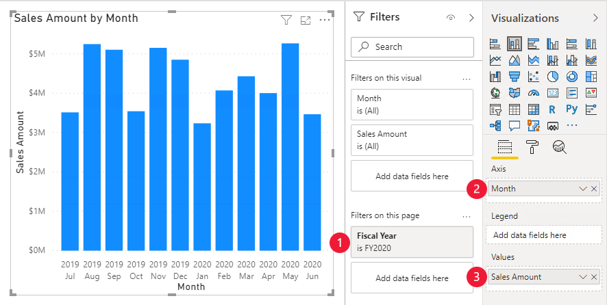
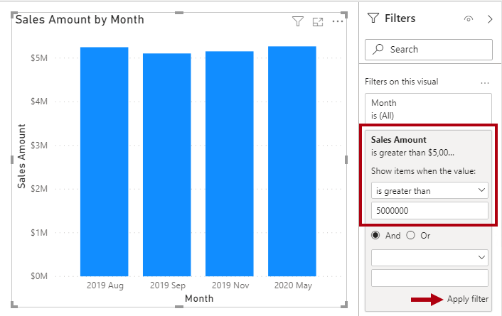

Report authors produce report designs by adding report visuals and other elements to pages. Other elements include text boxes, buttons, shapes, and images. Each of these elements are configured independently of dataset fields.

Let's focus on configuring report visuals. At design time, adding and configuring a report visual involves the following methodology:

1.  Select a visual type, like a bar chart.

1.  Map dataset fields, displayed in the **Fields** pane, to the visual field wells. For a bar chart, the wells are Axis, Legend, Values, and Tooltips.

1.  Configure mapped fields. It's possible to rename mapped fields or toggle the field to summarize or not summarize, if it summarizes, you can select the summarization method.

1.  Apply format options, like axis properties, data labels, and many others.

Let's work through an example of how to configure the analytic query for a report visual. Add a stacked column chart visual to a report page of the **Adventure Works DW 2020 M01.pbix** Power BI Desktop file, and then follow these steps:

1.  **Filter** the page using **Fiscal Year** from the **Date** table, selecting **FY2020**.

1.  **Group** the visual by adding **Month** from the **Date** table to the **Axis** field well.

1.  **Summarize** the visual by adding **Sales Amount** from the **Sales** table to the **Values** field well.

> [!div class="mx-imgBorder"]
> 

But what does the term *fields* mean? Fields is a collective term used to describe model resource *that can be used to configure a visual*. There are three different model resources that are fields:

-   Columns

-   Hierarchy levels

-   Measures

Each of these resource types can be used to configure a visual, which in the background configures an analytic query. Let's see how to use each of the model resources:

|     Model resource     |     Filter    |     Group    |     Summarize    |
|------------------------|---------------|--------------|------------------|
|     Column             |     X         |     X        |     X            |
|     Hierarchy level    |     X         |     X        |                  |
|     Measure            |     X         |              |     X            |

## Columns

Use columns to filter, group, and summarize column values. It's very common to summarize numeric columns, which can be done by using sum, count, distinct count, minimum, maximum, average, median, standard deviation, and variance. It's possible to summarize text columns, too, by using first (alphabetic order), last, count, and distinct count. In addition, it's possible to summarize date columns by using earliest, latest, count, and distinct count.

At design time, the data modeler can set the column default summarization property. It can be set to any of the supported summarization types or to "Do not summarize". The latter option means that the column, by default, is only to be used to group. If your data model has a numeric column that stores year values, it would be appropriate to set its default summarization to "Do not summarize". It's because the column will likely be used only for grouping or filtering, and that numeric summarization of years, like an average, doesn't produce a meaningful result.

## Hierarchy levels

While hierarchy levels are based on columns, they can be used to filter and group, but not to summarize. Of course, report authors can summarize the column that the hierarchy level is based on, providing it's visible in the **Fields** pane.

## Measures

Measures are specifically designed to summarize model data. They can't be used to group data. However, they can be used to filter data in one special case: It's possible to use a measure to filter a visual when the visual displays the measure, and the filter is a visual-level filter (so, not a report- or page-level filter). When used in this way, a measure filter is applied *after* the analytic query has summarized data. It's done to eliminate groups where the measure filter condition is not true. (For those familiar with SQL syntax, a measure used to filter a visual is like the HAVING clause in a SELECT statement.)

Let's adjust the stacked column visual to display groups (months) when sales amounts exceed $5M. It's done in the **Filters** pane by applying a filter to the **Sales Amount** field: Configure the filter to show items when the value *is greater than 5000000*. Don't forget to click **Apply Filter**, located at the bottom-right of the card.

Notice that there are only four groups (months) that have sales amounts exceeded $5M.

> [!div class="mx-imgBorder"]
> 