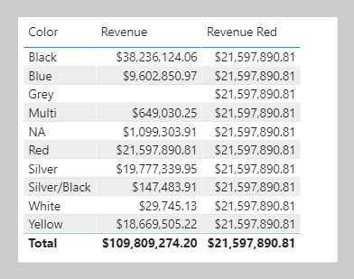

Use the [CALCULATE](https://docs.microsoft.com/dax/calculate-function-dax/?azure-portal=true) DAX function to modify filter context in your formulas. Its syntax is:

```dax
CALCULATE(<expression>, [[<filter1>], <filter2>]…)
```

The function requires passing in an expression that returns a scalar value and as many filters as you need. The expression can be a measure (after all, a measure is just a named expression) or any expression that can be evaluated in filter context.

Filters can be Boolean expressions or table expressions. It's also possible to pass in filter modification functions that provide additional control when modifying filter context. We'll introduce filter modification functions in Unit 3.

One last thing: When you have multiple filters, they're evaluated by using the AND logical operator. That means all conditions must be TRUE at the same time.

> [!NOTE]
> There's also the [CALCULATETABLE](https://docs.microsoft.com/dax/calculatetable-function-dax/?azure-portal=true) DAX function. It performs exactly the same functionality, except it modifies the filter context applied to an expression that returns a table object. In this module, our explanations and examples all use the CALCULATE function. Bear in mind they could also apply to the CALCULATETABLE function.

## Apply Boolean expression filters

A Boolean expression filter is an expression that evaluates to TRUE or FALSE. There are several rules that they must abide by:

-   They can reference only a single column

-   They cannot reference measures

-   They cannot use functions that scan or return a table, which includes aggregation functions like SUM, etc.

Let's now create a measure. First, download and open the [**Adventure Works DW 2020 M06.pbix*](https://github.com/MicrosoftDocs/mslearn-dax-power-bi/tree/main/activities)* file. Go ahead and add the following measure definition that filters the **Revenue** measure by using a Boolean expression filter for red products.

```dax
Revenue Red = CALCULATE([Revenue], 'Product'[Color] = "Red")
```

Then add the **Revenue Red** measure to the table visual found on **Page 1** of the report.

> [!div class="mx-imgBorder"]
> [](../media/dax-table-region-revenue-red-ss.png#lightbox)

Let's review some other example. The following measure filters the **Revenue** measure by multiple colors. Notice the use of the IN operator followed by a list of color values.

```dax
Revenue Red or Green = CALCULATE([Revenue], 'Product'[Color] IN {"Red", "Green"})
```

Here's one last example to review. The following measure filters the **Revenue** measure by expensive products. Expensive products are those with a list price greater than $1000.

```dax
Revenue Expensive Products = CALCULATE([Revenue], 'Product'[List Price] > 1000)
```

## Apply table expression filters

A table expression filter applies a table object as a filter. It could be a reference to a model table, but more likely it's a DAX function that returns a table object.

Commonly, you'll use the [FILTER](https://docs.microsoft.com/dax/filter-function-dax/?azure-portal=true) DAX function to apply complex filter conditions, including those that cannot be defined by a Boolean filter expression. The FILTER function is classed as an iterator function, and so you pass in a table or table expression, and an expression to evaluate for each row of that table.

The FILTER function returns a table object with exactly the same structure as the table passed in. Its rows are a subset of those passed in, being those where the expression evaluated as TRUE.

Let's see an example of table filter expression that uses the FILTER function:

```dax
Revenue High Margin Products =
CALCULATE(
	[Revenue],
	FILTER(
		'Product',
		'Product'[List Price] > 'Product'[Standard Cost] * 2
	)
)
```

In this example, the FILTER function filters all rows of the **Product** table that are in filter context. Each row for a product where its list price exceeds double its standard cost is output as a row of the filtered table. So, the **Revenue** measure is evaluated for all products returned by the FILTER function.

The fact is all filter expressions passed in to the CALCULATE function are table filter expressions. A Boolean filter expression is just a shorthand notation to improve the authoring and reading experience. Internally, Power BI translates Boolean filter expressions to table filter expressions. This is how it translates our **Revenue Red** measure definition.

```dax
Revenue Red =
CALCULATE(
	[Revenue],
	FILTER(
		'Product',
		'Product'[Color] = "Red"
	)
)
```

## Understand filter behavior

When you add filter expressions to the CALCULATE function, there are two possible standard outcomes:

-   If the columns (or tables) aren't in filter context, then new filters will be added to filter context to evaluate the CALCULATE expression.

-   If the columns (or tables) are already in filter context, the existing filters will be overwritten by the new filters to evaluate the CALCULATE expression.

Let's see how it works with some examples.

> [!NOTE]
> In each of the examples, there aren't any filters applied to the table visual.

As you did in the previous activity, the **Revenue Red** measure was added to a table visual that groups by region and displays revenue.

> [!div class="mx-imgBorder"]
> [](../media/dax-table-region-revenue-red-ss.png#lightbox)

Because there's no filter on the **Product** table **Color** column, the evaluation of the measure adds a new filter to filter context. In the first row, the value of $2,681,324.79 is for red products sold in the Australian region.

Now, let's switch the first column of the table visual from **Region** to **Color**. We now see a different result. It's because the **Product** table **Color** column is now in filter context.

> [!div class="mx-imgBorder"]
> [](../media/dax-table-color-revenue-red-ss.png#lightbox)

Remember, the **Revenue Red** measure formula evaluates the **Revenue** measure by adding a filter on the **Product** table **Color** column (to red). So, in this visual that groups by color, it overwrites the filter context with a new filter.

This result may or may not be what you want. In the next unit, we'll introduce the [KEEPFILTERS](https://docs.microsoft.com/dax/keepfilters-function-dax/?azure-portal=true) DAX function. It's a filter modification function you can use to preserve filters rather than overwrite them.
