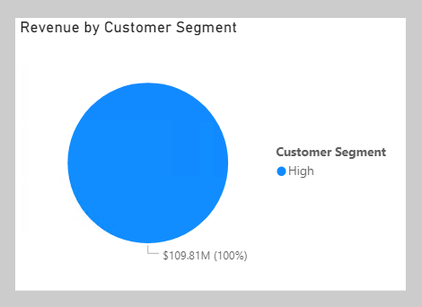
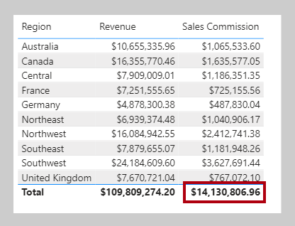

What happens when a measure or measure expression is evaluated within row context? This scenario can happen in a calculated column formula or when an expression in an iterator function is evaluated.

Let's now create a calculated column definition to the **Customer** table to classify customers into a loyalty class. It's a very simple scenario: When the revenue produced by the customer is less than $2500, they're classified as "Low"; otherwise they're "High".

```dax
Customer Segment =
VAR CustomerRevenue = SUM(Sales[Sales Amount])
RETURN
	IF(CustomerRevenue < 2500, "Low", "High")
```

On **Page 4** of the report, add the **Customer Segment** column as the legend of the pie chart.

> [!div class="mx-imgBorder"]
> [](../media/dax-pie-customer-segment-1-ss.png#lightbox)

Notice that there's only one **Customer Segment** value. It's because the calculated column formula produces an incorrect result: Each customer is assigned the value "High". It's because the expression `SUM(Sales[Sales Amount])` isn't evaluated in a filter context. So, each customer is assessed on the sum of *every* **Sales** table **Sales Amount** column value.

To force the evaluation of the `SUM(Sales[Sales Amount])` expression *for each customer*, a context transaction must take place that applies the row context column values to filter context. It's done by using the CALCULATE function without passing in filter expressions.

Modify the calculated column definition so that it produces the correct result.

```dax
Customer Segment =
VAR CustomerRevenue = CALCULATE(SUM(Sales[Sales Amount]))
RETURN
	IF(CustomerRevenue < 2500, "Low", "High")
```

In the pie chart visual, verify that there's now two pie segments.

> [!div class="mx-imgBorder"]
> [](../media/dax-pie-customer-segment-2-ss.png#lightbox)

In this case, the CALCULATE function applies row context values as filters. It's known as *context transition*. To be completely accurate, it doesn't quite work like that when there's a unique column on the table. When there's a unique column, it's enough to apply a filter on just that column to make the transition happen. So, in this case, Power BI applies a filter on the **CustomerKey** column for the value in row context.

One last note. If you reference measures in an expression that's evaluated in row context, context transition is automatic. So, there's no need to pass measure references to the CALCULATE function.

Modify the calculated column definition, which references the **Revenue** measure, and notice that it continues to produce the correct result.

```dax
Customer Segment = 
VAR CustomerRevenue = [Revenue]
RETURN
	IF(CustomerRevenue < 2500, "Low", "High")
```

Let's now complete the **Sales Commission** measure formula. To produce a total, we need to use an iterator function to iterate over all regions in filter context. The iterator function expression must use the CALCULATE function to transition the row context to the filter context. Notice that it no longer needs to text whether there's a single **Sales Territory** table **Country** column value in filter context, because it's known to be filtering by a single country (because it's iterating over the regions in filter context and a region belongs to only one country).

Switch to **Page 3** of the report, and then modify the **Sales Commission** measure definition to use the SUMX iterator function:

```dax
Sales Commission =
SUMX(
	VALUES('Sales Territory'[Region]),
	CALCULATE(
		[Revenue]
		* IF(
			VALUES('Sales Territory'[Country]) = "United States",
			0.15,
			0.1
		)
	)
)
```

The table visual now displays a sales commission total for all regions.

> [!div class="mx-imgBorder"]
> [](../media/dax-table-region-sales-commission-2-ssm.png#lightbox)
