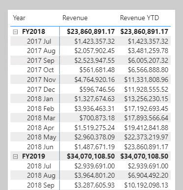

Time intelligence relates to calculations over time. Specifically, it relates to calculations over dates, months, quarters, or years, and possibly time. Rarely would you need to calculate over time in the sense of hours, minutes, or seconds.

In Data Analysis Expressions (DAX) calculations, time intelligence means *modifying the filter context for date filters*.

For example, at the Adventure Works company, their financial year begins on July 1 and ends on June 30 of the following year. They produce a table visual that displays monthly revenue and year-to-date (YTD) revenue.

> [!div class="mx-imgBorder"]
> 

The filter context for **2017 August** contains each of the 31 dates of August, which are stored in the **Date** table. However, the calculated year-to-date revenue for **2017 August** applies a different filter context. It's the first date of the year through to the last date in filter context. In this example, that's July 1, 2017 through to August 31, 2017.

Time intelligence calculations modify date filter contexts. They can help you answer these time-related questions:

-   What's the accumulation of revenue for the year, quarter, or month?

-   What revenue was produced for the same period last year?

-   What growth in revenue has been achieved over the same period last year?

-   How many new customers made their first order in each month?

-   What's the inventory stock on-hand value for the company's products?

This module describes how to create time intelligence measures to answer these questions.

