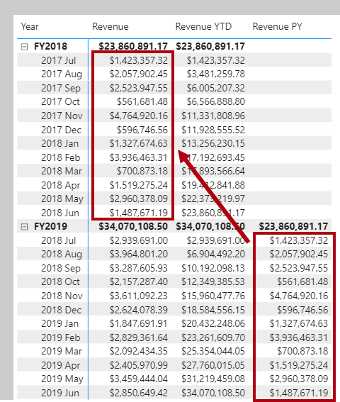
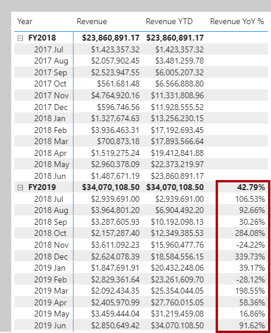

DAX includes many time intelligence functions to simplify modifying date filter context. Many time intelligence formulas could be written by using a CALCULATE function that modifies date filters, but that would create more work for you.

> [!NOTE]
> Many DAX time intelligence functions are concerned with standard date periods specifically years, quarters, and months. If you have irregular time periods (for example, financial months begin mid-way through the calendar month), or you need to work with weeks or time periods (hours, minutes, etc.), the DAX time intelligence functions can't help you. Instead, you'll need to use the CALCULATE function and pass in hand-crafted date or time filters.

### Date table requirement

To work with time intelligence DAX functions, there's a prerequisite model requirement: You must have at least one *date table* in your model. A date table is a table that meets the following requirements:

-   It must have a column of data type date (or date/time) known as the *date column*.

-   The date column must contain unique values.

-   The date column must not contain BLANKs.

-   The date column must not have any missing dates.

-   The date column must span full years. A year isn't necessarily a calendar year (January-December).

-   The date table must be marked as a date table.

For more information, see [Create date tables in Power BI Desktop](https://docs.microsoft.com/power-bi/guidance/model-date-tables/?azure-portal=true).

### Summarizations over time

One group of DAX time intelligence functions is concerned with summarizations over time. These functions are:

-   The [DATESTYD](https://docs.microsoft.com/dax/datesytd-function-dax/?azure-portal=true) DAX function, which returns a single-column table containing dates for the year-to-date (YTD), in the current filter context. There's also the [DATESMTD](https://docs.microsoft.com/dax/datesmtd-function-dax/?azure-portal=true) and [DATESQTD](https://docs.microsoft.com/dax/datesqtd-function-dax/?azure-portal=true) DAX functions, for month-to-date (MTD), and quarter-to-date (QTD). You can pass these functions as filters into the [CALCULATE](https://docs.microsoft.com/dax/calculate-function-dax/?azure-portal=true) DAX function.

-   The [TOTALYTD](https://docs.microsoft.com/dax/totalytd-function-dax/?azure-portal=true) DAX function, which evaluates an expression for YTD, in the current filter context. There's also the equivalent QTD and MTD DAX functions: [TOTALQTD](https://docs.microsoft.com/dax/totalqtd-function-dax/?azure-portal=true) and [TOTALMTD](https://docs.microsoft.com/dax/totalmtd-function-dax/?azure-portal=true).

-   The [DATESBETWEEN](https://docs.microsoft.com/dax/datesbetween-function-dax/?azure-portal=true) DAX function, which returns a table that contains a column of dates that begins with a given start date and continues until a given end date.

-   The [DATESINPERIOD](https://docs.microsoft.com/dax/datesinperiod-function-dax/?azure-portal=true) DAX function, which returns a table that contains a column of dates that begins with a given start date and continues for the specified number of intervals.

> [!NOTE]
> While the TOTALYTD function is easy to use, it's limited to passing in one filter expression. If you need to apply multiple filter expressions, use the CALCULATE function, and pass the DATESYTD function in as one of the filter expressions.

Let's now create our first time intelligence calculation. It'll use the TOTALYTD function. It's syntax is:

```dax
TOTALYTD(<expression>, <dates>, [, <filter>][, <year_end_date>])
```

The function requires an expression and as is common to all time intelligence functions a reference to the date column of a marked date table. Optionally, a single filter expression or the year end date can be passed in (required only when the year doesn't finish on December 31).

First, download and open the [**Adventure Works DW 2020 M07.pbix**](https://github.com/MicrosoftDocs/mslearn-dax-power-bi/raw/main/activities/Adventure%20Works%20DW%202020%20M07.pbix) file. Then, go ahead and add the following measure definition that calculates YTD revenue. Format the measure as currency with two decimal places.

```dax
Revenue YTD =
TOTALYTD([Revenue], 'Date'[Date], "6-30")
```

The year end date value "6-30" represents June 30.

On **Page 1** of the report, add the **Revenue YTD** measure to the matrix visual. Notice that it produces a summarization of the revenue amounts from the beginning of the year through to the filtered month.

> [!div class="mx-imgBorder"]
> [](../media/dax-matrix-revenue-ytd-activity-ssm.png#lightbox)

### Comparisons over time

Another group of DAX time intelligence functions is concerned with shifting time periods. These functions are:

-   The [DATEADD](https://docs.microsoft.com/dax/dateadd-function-dax/?azure-portal=true) DAX function, which returns a table that contains a column of dates, shifted either forward or backward in time by the specified number of intervals from the dates in the current filter context.

-   The [PARALLELPERIOD](https://docs.microsoft.com/dax/parallelperiod-function-dax/?azure-portal=true) DAX function, which returns a table that contains a column of dates that represents a period parallel to the dates in the specified dates column, in the current filter context, with the dates shifted a number of intervals either forward in time or back in time.

-   The [SAMEPERIODLASTYEAR](https://docs.microsoft.com/dax/sameperiodlastyear-function-dax/?azure-portal=true) DAX function, which returns a table that contains a column of dates shifted one year back in time from the dates in the specified dates column, in the current filter context.

-   And many helper DAX functions for navigating backwards or forwards for specific time periods, which return a table of dates. They include [NEXTDAY](https://docs.microsoft.com/dax/nextday-function-dax/?azure-portal=true), [NEXTMONTH](https://docs.microsoft.com/dax/nextmonth-function-dax/?azure-portal=true), [NEXTQUARTER](https://docs.microsoft.com/dax/nextquarter-function-dax/?azure-portal=true), [NEXTYEAR](https://docs.microsoft.com/dax/nextyear-function-dax/?azure-portal=true), and [PREVIOUSDAY](https://docs.microsoft.com/dax/previousday-function-dax/?azure-portal=true), [PREVIOUSMONTH](https://docs.microsoft.com/dax/previousmonth-function-dax/?azure-portal=true), [PREVIOUSQUARTER](https://docs.microsoft.com/dax/previousquarter-function-dax/?azure-portal=true), and [PREVIOUSYEAR](https://docs.microsoft.com/dax/previousyear-function-dax/?azure-portal=true).

Let's now add a measure definition that calculates revenue for the prior year by using the SAMEPERIODLASTYEAR function. Format the measure as currency with two decimal places.

```dax
Revenue PY =
VAR RevenuePriorYear = CALCULATE([Revenue], SAMEPERIODLASTYEAR('Date'[Date]))
RETURN
	RevenuePriorYear
```

Add the **Revenue PY** measure to the matrix visual. Notice that it produces results that are the same as the previous year's revenue amounts.

> [!div class="mx-imgBorder"]
> [](../media/dax-matrix-revenue-py-ssm.png#lightbox)

Let's now modify the measure by renaming it to **Revenue YoY %**, and updating the RETURN clause to calculate the change ratio. Be sure to change the format to a percentage with two decimals places.

```dax
Revenue YoY % =
VAR RevenuePriorYear = CALCULATE([Revenue], SAMEPERIODLASTYEAR('Date'[Date]))
RETURN
	DIVIDE(
		[Revenue] - RevenuePriorYear,
		RevenuePriorYear
	)
```

Notice that the **Revenue YoY %**, measure produces a ratio of change factor over the previous year's monthly revenue. For example, July 2018 represents a 106.53% *increase* over the previous year's monthly revenue. And, November 2018 represents a 24.22% *decrease* over the previous year's monthly revenue.

> [!div class="mx-imgBorder"]
> [](../media/dax-matrix-revenue-yoy-ssm.png#lightbox)

> [!NOTE]
> The **Revenue YoY %**, measure demonstrates a good use of DAX variables. First, it improves the readability of the formula. Second, it allowed you unit test part of the measure logic (by returning just the **RevenuePriorYear** variable value). And third, it's an optimal formula because it doesn't need to retrieve the prior year's revenue value twice. Having stored it once in a variable, the RETURN clause uses to the variable value twice.