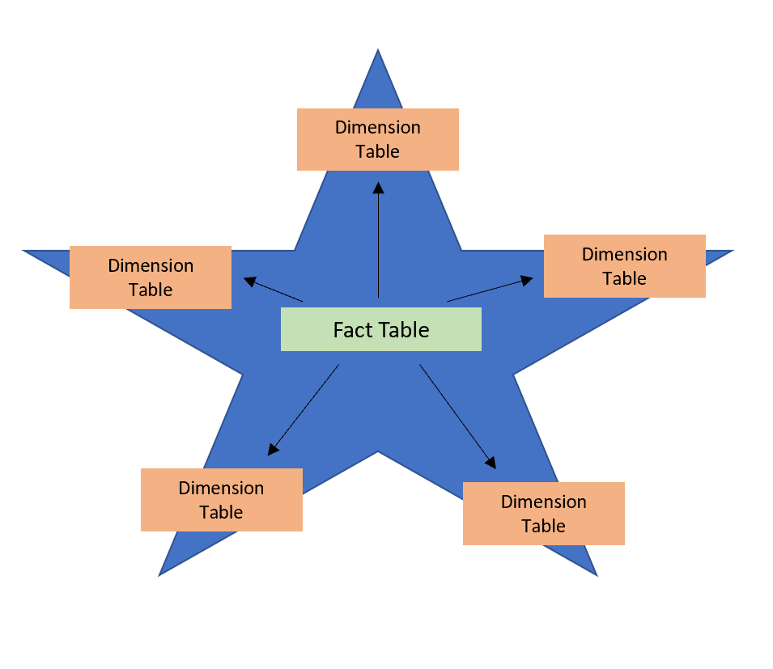
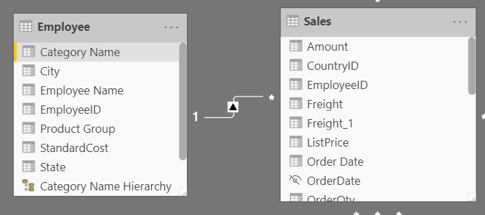
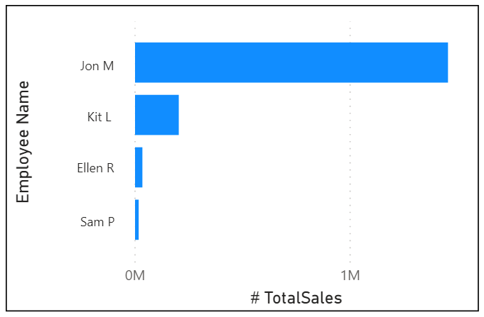

Creating a great data model is one of the most important tasks that a data analyst can perform in Microsoft Power BI. By doing this job well, you help make it easier for people to understand your data, which will make building valuable Power BI reports easier for them and for you.

> [!VIDEO https://www.microsoft.com/videoplayer/embed/RWG0L2]

A good data model offers the following benefits:

- Data exploration is faster.

- Aggregations are simpler to build.

- Reports are more accurate.

- Writing reports takes less time.

- Reports are easier to maintain in the future.

Providing set rules for what makes a good data model is difficult because all data is different, and the usage of that data varies. Generally, a smaller data model is better because it will perform faster and will be simpler to use. However, defining what a smaller data model entails is equally as problematic because it's a heuristic and subjective concept.

Typically, a smaller data model is comprised of fewer tables and fewer columns in each table that the user can see. If you import all necessary tables from a sales database, but the total table count is 30 tables, the user will not find that intuitive. Collapsing those tables into five tables will make the data model more intuitive to the user, whereas if the user opens a table and finds 100 columns, they might find it overwhelming. Removing unneeded columns to provide a more manageable number will increase the likelihood that the user will read all column names. To summarize, you should aim for simplicity when designing your data models.

The following image is an example data model. The boxes contain tables of data, where each line item within the box is a column. The lines that connect the boxes represent relationships between the tables. These relationships can be complex, even in such a simplistic model. The data model can become easily disorganized, and the total table count in the model can gradually increase. Keeping your data model simple, comprehensive, and accurate requires constant effort.

> [!div class="mx-imgBorder"]
> 

Relationships are defined between tables through primary and foreign keys. Primary keys are column(s) that identify each unique, non-null data row. For instance, if you have a Customers table, you could have an index that identifies each unique customer. The first row will have an ID of 1, the second row an ID of 2, and so on. Each row is assigned a unique value, which can be referred to by this simple value: the primary key. This process becomes important when you are referencing rows in a different table, which is what foreign keys do. Relationships between tables are formed when you have primary and foreign keys in common between different tables.

Power BI allows relationships to be built from tables with different data sources, a powerful function that enables you to pull one table from Microsoft Excel and another from a relational database. You would then create the relationship between those two tables and treat them as a unified dataset.

Now that you have learned about the relationships that make up the data schema, you'll be able to explore a specific type of schema design, the star schema, which is optimized for high performance and usability.

## Star schemas

You can design a star schema to simplify your data. It's not the only way to simplify your data, but it is a popular method; therefore, every Power BI data analyst should understand it. In a star schema, each table within your dataset is defined as a dimension or a fact table, as shown in the following visual.

> [!div class="mx-imgBorder"]
> 

**Fact tables** contain observational or event data values: sales orders, product counts, prices, transactional dates and times, and quantities. Fact tables can contain several repeated values. For example, one product can appear multiple times in multiple rows, for different customers on different dates. These values can be aggregated to create visuals. For instance, a visual of the total sales orders is an aggregation of all sales orders in the fact table. With fact tables, it is common to see columns that are filled with numbers and dates. The numbers can be units of measurement, such as sale amount, or they can be keys, such as a customer ID. The dates represent time that is being recorded, like order date or shipped date.

**Dimension tables** contain the details about the data in fact tables: products, locations, employees, and order types. These tables are connected to the fact table through key columns. Dimension tables are used to filter and group the data in fact tables. The dimension tables, by contrast, contain unique values, for instance, one row for each product in the Products table and one row for each customer in the Customer table. For the total sales orders visual, you could group the data so that you see total sales orders by product, in which product is data in the dimension table.

Fact tables are usually much larger than dimension tables because numerous events occur in fact tables, such as individual sales. Dimension tables are typically smaller because you are limited to the number of items that you can filter and group on. For instance, a year contains only so many months, and the United States is comprised of only a certain number of states.

Considering this information about fact tables and dimension tables, you might wonder how you can build this visual in Power BI.

The pertinent data resides in two tables, Employee and Sales, as shown in the following data model. Because the Sales table contains the sales order values, which can be aggregated, it is considered a fact table. The Employee table contains the specific employee name, which filters the sales orders, so it would be a dimension table. The common column between the two tables, which is the primary key in the Employee table, is **EmployeeID**, so you can establish a relationship between the two tables based on this column.

> [!div class="mx-imgBorder"]
> 

When creating this relationship, you can build the visual according to the requirements, as shown in the following figure. If you did not establish this relationship, while keeping in mind the commonality between the two tables, you would have had more difficulty building your visual.

> [!div class="mx-imgBorder"]
> 

Star schemas and the underlying data model are the foundation of organized reports; the more time you spend creating these connections and design, the easier it will be to create and maintain reports.
